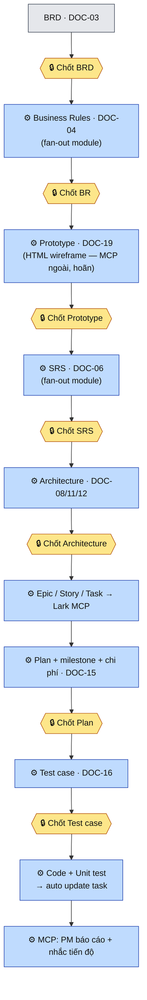
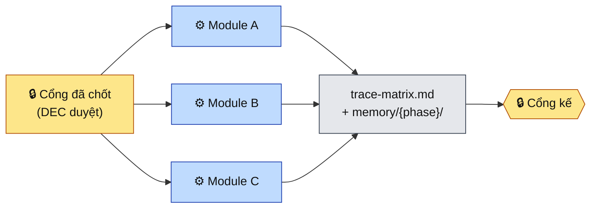

# Minipower — Gated Fan-out Execution (pivot thực thi)

| | |
|---|---|
| **Ngày** | 2026-07-20 |
| **Trạng thái** | 🟢 A + B + C xong. A: pivot §0 + approval_gates + DOC-19. B: skill [fan-out](../minipower/skills/fan-out/SKILL.md) (BR + SRS). C: fan-out Prototype khung (HTML wireframe qua MCP ngoài — hoãn, Q2). Q1/Q2/Q3 chốt (§6). Test **204 pass**, `gen:check` xanh. **D & E ⏸️ chờ SOP Lark** từ người dùng |
| **Phạm vi** | `minipower/` — pivot triết lý §0 + vá pipeline (approval gate, prototype, thứ tự phase) |
| **Nối tiếp** | [ADR 2026-07-17](2026-07-17-danh-gia-minipower-va-chien-luoc-phat-trien.md) (P0–P4, R1–R6) · **supersede §0** của [ADR 2026-07-20 định hướng](2026-07-20-dinh-huong-minipower-ai-ho-tro-ra-quyet-dinh.md) |
| **Mục đích** | Chốt hướng cho tầm nhìn 8 bước (BRD→BR→Prototype→SRS→Task→Plan→Test→Code→Report); ghi lại quyết định kiến trúc và lộ trình A→E |

---

## §0. Pivot triết lý — thay thế §0 của ADR "định hướng"

ADR định hướng (2026-07-20) chốt ranh giới bất biến: *"Minipower KHÔNG xây đội Agent tự thực hiện; Roles = lăng kính hỗ trợ, không phải agent tự chạy."* Tầm nhìn 8 bước **cố ý vượt ranh giới đó** — nên đây là một **pivot có chủ đích**, không phải làm tiếp. ADR này **supersede riêng §0** của ADR định hướng; các phần còn lại (§1–§6, N1–N6) vẫn giữ nguyên giá trị.

**Ranh giới mới — Gated Fan-out Execution:**

```
Con người = người quyết định tại MỖI CỔNG (chốt BRD, chốt BR, chốt Prototype, chốt SRS…)
AI        = thực thi FAN-OUT song song GIỮA hai cổng, theo từng module
Cổng      = bắt buộc, có thật, ghi vào decision-log (DEC) trước khi qua bước sau
```

Ba mệnh đề giữ lại từ triết lý cũ (không đổi):

1. **Người là người quyết định cuối.** AI không tự ý qua cổng. Không có cổng = không qua.
2. **Không sinh artifact cuối khi tiền đề chưa đủ.** Readiness-gate (N1) vẫn là kháng thể chống hallucination — nay áp cho cả bước thực thi fan-out.
3. **Co lại trước khi mở rộng.** Fan-out dùng **sub-agent per-module** của harness sẵn có; **không thêm nền tảng thứ tư**, không thêm runtime mới. Mọi thứ mới có SSOT + golden test.

Điều **thay đổi** so với §0 cũ:

| Cũ (superseded) | Mới |
|---|---|
| "AI KHÔNG xây đội agent tự thực hiện" | AI **được fan-out sub-agent** để sinh song song — **nhưng chỉ giữa hai cổng người-chốt** |
| "Roles = lăng kính, con người điều phối giữa vai trò" | Roles vẫn là lăng kính khi *tư duy*; khi *thực thi* một phase đã chốt, AI được đóng vai để **sinh artifact** cho phase đó |
| Parallel-work = multi-BA/SA **con người** | Parallel-work = **AI fan-out theo module** + con người review tại cổng; quy tắc một-owner-một-module giữ nguyên (owner giờ là *một artifact*, một agent phụ trách) |

**Định vị dài hạn không đổi:** *AI Project Intelligence* — Knowledge + Memory là tài sản model-agnostic; thêm nay một **lớp Execution có cổng** đẩy giá trị tới tận task/code/report.

---

## §1. Bối cảnh — tầm nhìn 8 bước vs hiện trạng

Luồng mục tiêu (mỗi 🔒 là **một cổng người-chốt**; mỗi ⚙️ là **AI fan-out theo module**):



**Fan-out là gì** — mỗi khi qua một cổng, AI sinh song song theo *bounded context (module)*, tổng hợp về `trace-matrix.md` rồi mới tới cổng kế:



Mức phủ hiện tại (đọc repo, không nói vo):

| Bước | Đã có | Thiếu | Phủ |
|---|---|---|---|
| 1 BR ∥module | DOC-04, phase requirements, parallel-work, readiness-gate | Fan-out AI, cổng chốt formal | 🟡 60% |
| 2 Prototype ∥module | *(không có)* | Toàn bộ: DOC, template, cơ chế sinh | 🔴 5% |
| 3 SRS ∥module | DOC-05/06/07/13, trace matrix | Fan-out; reorder SRS *sau* prototype | 🟡 60% |
| 4 Epic/Story/Task → Lark | DOC-14 WBS, complexity-rubric | Agile hierarchy, **Lark MCP (0 hit)** | 🔴 20% |
| 5 Plan + milestone + chi phí | DOC-14/15, 3-tầng cost, planning skill | Chi phí định lượng, milestone↔task | 🟢 70% |
| 6 Test case | DOC-16, DOC-07 Gherkin, intent `test` | Test case chi tiết per-FR | 🟡 50% |
| 7 Code + unit test → update task | Gate `implement`, context auto-load | Lớp thực thi, auto-update task | 🔴 15% |
| 8 MCP báo cáo + nhắc | *(không có)* | Toàn bộ | 🔴 5% |

**Hai lỗ hổng cấu trúc trong chính danh sách 8 bước:**
- **Prototype (b2) chưa tồn tại** trong 18 DOC — năng lực mới hoàn toàn.
- **Architecture bị bỏ qua** giữa SRS (b3) và Task (b4), nhưng bước 7 (code) *bắt buộc* cần DOC-08/11/12 (`implement` requires 06,07,08,11,12). Phải chèn Architecture làm cổng bắt buộc trước task-breakdown/code.

---

## §2. Quyết định kiến trúc (chốt trước khi code)

| # | Quyết định | Nội dung |
|---|---|---|
| **QĐ-1** | Pivot §0 | Chuyển sang Gated Fan-out Execution (§0). ADR này là văn bản chốt. |
| **QĐ-2** | Cơ chế fan-out | **Sub-agent per-module** của harness. Không nền tảng mới. Mỗi agent sở hữu 1 artifact/module, tổng hợp về `trace-matrix.md` + `memory/{phase}/`. Quy tắc song song trong [parallel-work.md](../minipower/docs/parallel-work.md) giữ nguyên. |
| **QĐ-3** | Tách lớp tích hợp ngoài | Lark/MCP (b4,7,8) = **lớp adapter riêng**, không nhét vào core skill. Rủi ro & lệ thuộc ngoài cao nhất → làm sau cùng (giai đoạn E). |

---

## §3. Giai đoạn A — chi tiết

> Nguyên tắc: mọi thay đổi `rules.json` phải kèm golden test + `npm run gen:check` xanh (kỷ luật từ ADR 2026-07-17).

### A1 — ADR pivot §0  ✅ (văn bản này)
Chốt §0 mới + QĐ-1/2/3 + lộ trình §4. Là tiền đề chặn đường mọi giai đoạn sau.

### A2 — Approval gate formal  ✅ (đã triển khai)
Cổng người-chốt hiện là *ngầm* (readiness-gate soát tiền đề đầu vào, không phải cổng ký giữa phase). Cần cổng ký **có thật, ghi decision-log**.

**Đã làm:** khối `approval_gates` trong [rules.json](../minipower/hooks/lib/rules.json) — mỗi cổng khai `id · label · approve (DOC) · unlocks (bước sau)`. Cổng theo **artifact người-chốt** (mịn hơn phase-transition), khớp tầm nhìn "sau khi con người chốt X thì làm Y" — gồm cả cổng nội-phase (BR→Prototype→SRS):

```jsonc
"approval_gates": [
  { "id": "brd",           "label": "Chốt BRD",            "approve": "03", "unlocks": "Business Rules — fan-out theo module" },
  { "id": "business-rules","label": "Chốt Business Rules", "approve": "04", "unlocks": "Prototype / Wireframe — fan-out theo module" },
  { "id": "prototype",     "label": "Chốt Prototype",      "approve": "19", "unlocks": "SRS — fan-out theo module" },
  { "id": "srs",           "label": "Chốt SRS",            "approve": "06", "unlocks": "Architecture (SAD / Data / API)" },
  { "id": "architecture",  "label": "Chốt Architecture",   "approve": "08", "unlocks": "Epic / Story / Task → tạo task (Lark)" },
  { "id": "plan",          "label": "Chốt Project Plan",   "approve": "15", "unlocks": "Test case + Code" },
  { "id": "test-cases",    "label": "Chốt Test case",      "approve": "16", "unlocks": "Code + Unit test → cập nhật task" }
]
```

- Guardrail [agents/approval-gate.md](../minipower/agents/approval-gate.md) (bảng sinh qua `npm run gen`): giao thức **AI soạn DEC nháp → người duyệt → mở khoá** (Q3). Không có DEC chốt = không qua cổng; fan-out chỉ nằm *giữa* hai cổng.
- Phân biệt với readiness-gate: approval-gate soát *người đã chốt bước trước chưa*; readiness-gate soát *tiền đề đầu vào đủ chưa*.
- Golden test `approval_gates` trong [rules.test.js](../minipower/hooks/test/rules.test.js); `gen:check` phủ bảng mới.

### A3 — Chèn Prototype + đúng thứ tự phase  ✅ (đã triển khai)
1. **DOC-19 "Prototype / Wireframe"** (chốt Q1: nối đuôi, không đánh số lại) → `phase_by_doc` + `doc_short`, thuộc phase `requirements`. Template [DOC-19-prototype.md](../minipower/templates/DOC-19-prototype.md).
2. **Thứ tự requirements:** `Actor/UC(05) → BR(04) → Prototype(19) → FR/SRS(06) → NFR(13) → AC(07)` — cập nhật [requirements SKILL](../minipower/skills/requirements/SKILL.md) + [pipeline.md](../minipower/docs/pipeline.md) (luồng module + gate).
3. **Routing SSOT:** `auto-routing.js` `normalizeDocNum` nay lấy bound từ `PHASE_BY_DOC` thay vì hardcode `≤18` → tự hỗ trợ DOC-19 và mọi DOC tương lai.
4. **prereq_by_intent:** thêm intent `prototype` (requires DOC-04); intent `implement` nay requires cả DOC-19 (UI cần prototype đã chốt).
5. **Architecture là cổng bắt buộc trước code:** cổng `architecture` (approve DOC-08) trong `approval_gates` mở khoá task-breakdown — vá lỗ hổng "8 bước quên architecture".

**Xác minh giai đoạn A:** **204 test pass** (`node --test`, +2 test cho approval_gates/prototype); `npm run gen:check` xanh (6 bảng đồng bộ rules.json, gồm approval-gate.md mới).

---

## §3′. Giai đoạn B & C — chi tiết (đã triển khai)

**Quyết định gộp B và C thành MỘT cơ chế.** B (fan-out BR + SRS) và C (fan-out Prototype) khác nhau chỉ ở DOC target và phần render — bản chất điều phối per-module giống hệt. Thay vì 3 skill trùng lặp → **một skill [fan-out](../minipower/skills/fan-out/SKILL.md)** tham số hoá theo DOC, uỷ quyền nội dung cho [requirements SKILL](../minipower/skills/requirements/SKILL.md) + template (nguyên tắc "co lại trước khi mở rộng").

| # | Việc | Deliverable | Trạng thái |
|---|------|-------------|-----------|
| **B1** | Fan-out Business Rules (bước 1) | Áp bảng "Áp dụng cho" của skill fan-out: DOC-04, phase requirements | ✅ |
| **B2** | Fan-out SRS (bước 3) | Cùng skill, DOC-06 — tái dùng, không code mới | ✅ |
| **C** | Fan-out Prototype (bước 2) | Cùng skill, DOC-19; **render HTML wireframe HOÃN** → MCP ngoài (Q2). Fan-out chỉ sinh khung màn hình/luồng + ghi nợ `TBD: wireframe` | ✅ (khung) · 🔜 (HTML) |

**Cơ chế fan-out (skill):** ① kiểm **DEC cổng trước đã chốt** (approval-gate) — chưa thì dừng; ② đọc module in-scope từ DOC-03; ③ **một artifact = một owner**, mỗi module một luồng (sub-agent nếu host hỗ trợ, không thì tuần tự giữ ranh giới); ④ tuân quy tắc [parallel-work](../minipower/docs/parallel-work.md) (không sửa file chung đồng thời); ⑤ tổng hợp trace-matrix/doc-registry/memory; ⑥ **AI soạn DEC nháp** trình cổng kế.

**Wiring:** router [SKILL.md](../minipower/SKILL.md) (frontmatter cross-phase + bảng trigger) + tham chiếu [parallel-work.md](../minipower/docs/parallel-work.md). Không thêm dữ liệu rules.json (fan-out là skill cross-phase, khai trigger ở router như deliberation/doc-review — không phải map DOC→phase).

**Ranh giới §0 giữ chặt:** fan-out **chỉ giữa hai cổng**; không tự qua cổng kế (chỉ soạn DEC nháp); không bịa module ngoài DOC-03.

---

## §4. Lộ trình tổng thể A→E (tham chiếu)

| GĐ | Nội dung | Bước phủ | Rủi ro | Trạng thái |
|---|---|---|---|---|
| **A** | Chốt hướng + vá pipeline (ADR, approval gate, prototype, thứ tự) | nền | thấp | ✅ xong |
| **B** | Fan-out sinh tài liệu song song (BR, SRS) | 1, 3 | thấp — tận dụng 60% | ✅ xong |
| **C** | Prototype (fan-out khung; HTML wireframe qua MCP ngoài) | 2 | trung — năng lực mới | ✅ khung · 🔜 HTML |
| **D** | Epic/Story/Task hierarchy + chi phí định lượng + test case per-FR | 5, 6, ½·4 | trung | ⏸️ **chờ SOP Lark** |
| **E** | Lark MCP adapter · code+unit test → update task · MCP báo cáo/nhắc | 4, 7, 8 | **cao** — lệ thuộc ngoài, làm sau cùng | ⏸️ **chờ SOP Lark** |

> **⏸️ D & E tạm dừng — chờ người dùng đưa SOP trên Lark.** Lý do: cách chia Epic/Story/Task, quy ước trường/trạng thái, và luồng báo cáo/nhắc tiến độ phải bám **SOP thực tế của tổ chức trên Lark** — làm trước sẽ phải đập đi. Khi có SOP: chốt data model task (D) rồi mới dựng Lark MCP adapter (E). E vẫn phụ thuộc **Lark MCP (chưa có)** và cần A→D xong mới có dữ liệu để đẩy lên.

---

## §5. Việc KHÔNG làm (ranh giới giữ lại)

| ❌ | Vì sao |
|---|---|
| AI tự qua cổng không có DEC chốt | Trái §0 mới — người quyết tại mỗi cổng |
| Thêm nền tảng/runtime thứ tư cho fan-out | Dùng sub-agent harness sẵn có (QĐ-2) |
| Nhét Lark/MCP vào core skill | Phải tách adapter (QĐ-3); tránh drift & lệ thuộc |
| Thay đổi `rules.json` không kèm test | Kỷ luật SSOT + golden test (ADR 2026-07-17) |
| Sinh code/prototype khi tiền đề chưa đủ | Readiness-gate (N1) vẫn hiệu lực |

---

## §6. Quyết định — đã chốt

| # | Câu hỏi | Chốt |
|---|---|---|
| **Q1** | Mã DOC prototype | **DOC-19** (nối đuôi). Chấp nhận label requirements thành `04–07, 13, 19`; đổi lại renumber 18 DOC đắt hơn. |
| **Q2** | Định dạng prototype | **HTML wireframe** — nhưng **cơ chế sinh HOÃN**: sẽ tích hợp **MCP ngoài** để vẽ wireframe (giai đoạn sau). Giai đoạn A chỉ đăng ký DOC-19 làm cổng + khung template; chưa build generator. |
| **Q3** | Cổng ký (A2) | **AI soạn DEC nháp → người duyệt** (không tự viết từ đầu). Nguyên tắc chung: **mọi thứ AI thực hiện, con người chỉ review**. |
