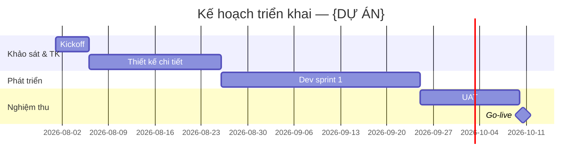

# Proposal — skill `proposal-timeline` (Kế hoạch triển khai)

| | |
|---|---|
| **Ngày** | 2026-07-25 |
| **Trạng thái** | 🗂️ **Đã gộp (merged)** → [proposal-suite §5](ADR-008-2026-07-25-minipower-proposal-suite.md). Giữ làm lịch sử — không cập nhật tiếp. |
| **ADR cha** | [ADR-004-2026-07-25-minipower-proposal-skills.md](ADR-004-2026-07-25-minipower-proposal-skills.md) |
| **Nguồn** | DOC-14 WBS · DOC-15 roadmap · GPKT III.3 |
| **Skill (dự kiến)** | `minipower/skills/proposal-timeline/SKILL.md` |
| **Mục đích** | Timeline milestone **KH-facing** + **mermaid Gantt** — distill, không thay `planning` |

> 🗂️ **Đã gộp vào [ADR-008-2026-07-25-minipower-proposal-suite.md](ADR-008-2026-07-25-minipower-proposal-suite.md) §5** (2026-07-26). Bản lịch sử.

---

## §0. Quyết định riêng skill này

| # | Chốt |
|---|------|
| **L1** | Output = bảng milestone + khối `mermaid` `gantt` |
| **L2** | Input chính: `proposal-scope.json` → `milestones[]`; distill DOC-15 khi đã có |
| **L3** | **Bắt buộc** `start` hoặc `duration_days` — hỏi user, **không đoán** ngày |
| **L4** | **5–8 milestone** KH-facing (kickoff → UAT → go-live), không dump WBS nội bộ |
| **L5** | SSOT milestone dùng chung GPKT III.3 — inject hoặc file riêng (theo Q1 ADR cha) |

---

## §1. Bối cảnh

`planning` skill produce DOC-14/15 cho quản trị dự án. Khách hàng cần **lịch trình trình bày** (Gantt) — ngôn ngữ hợp đồng, ít chi tiết WBS.

Skill này **không** viết lại WBS — chọn và rút gọn milestone từ DOC-15 hoặc elicit với PM.

**Khác ULNL sheet *Plan*:** *Plan* trong Excel mẫu ULNL là lịch giai đoạn — skill timeline có thể align nhưng output là markdown + mermaid cho gói chào.

---

## §2. Input / output

### Input

| Nguồn | Khi nào |
|-------|---------|
| `proposal-scope.json` → `milestones[]` | SSOT sau khi PM/BA điền |
| DOC-15 project plan | Distill khi đã có planning phase |
| User prompt | `start_date`, duration từng giai đoạn, dependency |

**Tiền đề routing:** DOC-03; khuyến nghị DOC-15 (`requires: ["03"]`; `15` khuyến nghị).

### Output

| File | Nội dung |
|------|----------|
| `assets/public/DX-Timeline-vX.Y.md` | Bảng milestone + mermaid gantt |
| (optional) cập nhật `proposal-scope.json` | `milestones[]` nếu vừa elicit |

### Schema `milestones[]` (trong scope)

```json
{
  "id": "M1",
  "title": "Kickoff",
  "outcome": "Scope + RACI ký",
  "start": "2026-08-01",
  "duration_days": 5,
  "depends_on": []
}
```

Hoặc `end` thay `duration_days` — tool chuẩn hóa một representation.

---

## §3. Workflow skill (dự kiến)

```text
1. Đọc milestones[] từ proposal-scope hoặc distill DOC-15
2. Nếu thiếu start/duration → hỏi trọn gói một lượt
3. Lọc milestone KH-facing (L4); gộp WBS chi tiết thành giai đoạn (PT, Dev, UAT…)
4. Chạy timeline-to-mermaid.js (hoặc inline trong skill) → gantt block
5. Ghi DX-Timeline-vX.Y.md
6. Nếu Q1 = gói 1 file GPKT → export section III.3 cho technical inject
```

### Tool (R4)

| File | Vai trò |
|------|---------|
| `minipower/tools/proposal/bin/timeline-to-mermaid.js` | `milestones[]` → mermaid `gantt` string |

Ví dụ output mermaid:



---

## §4. Liên kết skill khác

| Liên kết | Quy tắc |
|----------|---------|
| → **proposal-technical** | III.3 lấy từ cùng `milestones[]` |
| → **proposal-quotation** | Lịch không ảnh hưởng MH; có thể note milestone “chốt ULNL lần 2” |
| ← **planning** | DOC-15 upstream; không sửa DOC từ timeline skill |

---

## §5. Lộ trình (R4)

| Bước | Deliverable | Xác minh |
|------|-------------|----------|
| R4.1 | Schema `milestones[]` trong `proposal-scope` doc/sample | JSON validate |
| R4.2 | `timeline-to-mermaid.js` + fixture | mermaid parse được |
| R4.3 | `skills/proposal-timeline/SKILL.md` + README | Workflow §3 |
| R4.4 | Template section DX-Timeline | Render từ fixture |

**Phụ thuộc nhẹ:** ADR cha §3 schema scope (có thể làm song song R2 quotation).

---

## §6. Việc KHÔNG làm (skill này)

| ❌ | Vì sao |
|---|--------|
| Dump toàn bộ WBS DOC-14 vào file KH | Quá chi tiết |
| Đoán ngày không hỏi user | Sai cam kết hợp đồng |
| Viết timeline độc lập khi đã có `milestones[]` | Duplicate GPKT III.3 |
| Thay DOC-15 | Chỉ distill |

---

## §7. Rủi ro

| Rủi ro | Giảm thiểu |
|--------|------------|
| Mermaid gantt lỗi syntax | Tool + test fixture |
| Milestone không khớp effort báo giá | Ghi chú “ước lượng theo ULNL vX” trong timeline |
| Timezone / ngày nghỉ | Ghi assumption “ngày làm việc” |

---

## §8. Câu hỏi mở

| # | Câu hỏi |
|---|---------|
| **L-Q1** | File timeline tách hay chỉ section trong GPKT? (Q1 ADR cha) |
| **L-Q2** | `dateFormat` cố định `YYYY-MM-DD` hay hỗ trợ tuần (2026-W32)? |
| **L-Q3** | Có đồng bộ ngược milestone từ GPKT đã viết tay vào scope không? |

---

## §9. Tham chiếu

- [ADR cha](ADR-004-2026-07-25-minipower-proposal-skills.md)
- [proposal-technical](ADR-006-2026-07-25-proposal-technical.md) · [proposal-quotation](ADR-005-2026-07-25-proposal-quotation.md)
- [`SOPs/GiaiPhapKyThuat-KHUNG.md`](../SOPs/GiaiPhapKyThuat-KHUNG.md) — III.3
- [`minipower/skills/planning/SKILL.md`](../minipower/skills/planning/SKILL.md) — upstream DOC-15
