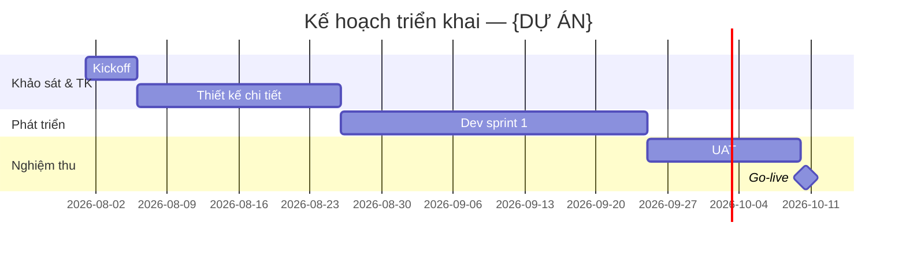

# Minipower — Proposal Suite (GPKT · Báo giá · Timeline)

| | |
|---|---|
| **Ngày** | 2026-07-25 |
| **Trạng thái** | 📋 **Đề xuất** — chốt hướng; triển khai từng phần theo lộ trình R* (§6) |
| **Phạm vi** | `minipower/` — 3 skill cross-phase + `proposal-scope.json` + tool ULNL/assembler |
| **Nối tiếp** | [ADR 2026-07-20 định hướng](ADR-002-2026-07-20-dinh-huong-minipower-ai-ho-tro-ra-quyet-dinh.md) (§0, N5) · [ADR gated-fanout](ADR-003-2026-07-20-minipower-gated-fanout-execution.md) |
| **Gộp từ** | ADR cha `proposal-skills` + 3 ADR con `proposal-quotation` / `-technical` / `-timeline` (2026-07-25) — xem §10 |
| **Mục đích** | Một ADR tổng quát cho **gói chào khách hàng**: quyết định chung + chi tiết từng skill, thay cho cụm 4 ADR cha–con |

---

## §0. Bối cảnh & TL;DR

Gói chào khách hàng gồm **ba deliverable** tùy dự án — **không** phải gate bắt buộc DOC-01→18:

1. **Đề xuất Giải pháp Kỹ thuật (GPKT)** → skill `proposal-technical`
2. **Báo giá (ULNL)** → skill `proposal-quotation`
3. **Kế hoạch triển khai (timeline)** → skill `proposal-timeline`

Ba skill **cross-phase** (như `fan-out` / `doc-review`), chỉ **distill / assemble** artifact đã có trong `docs/` — **không** thay `planning` / `architecture`, **không** sinh DOC baseline mới. Nguyên tắc xuyên suốt: **code deterministic trước, LLM sau**; mọi con số MH/MD/tiền do **tool** tính; **người duyệt** trước khi gửi khách hàng (đặc biệt báo giá) — đúng §0 ADR định hướng (không auto-gửi / auto-chốt giá).

Trước đây tách thành 4 ADR (1 cha + 3 con). Nay **gộp về một ADR tổng quát** để mọi quyết định chung và chi tiết từng skill nằm cùng chỗ; 4 file cũ giữ lại ở trạng thái `merged` làm lịch sử (§10).

---

## §1. Quyết định chung (P1–P6)

| # | Quyết định | Áp dụng |
|---|------------|---------|
| **P1** | **Ba skill phẳng** — `proposal-technical`, `proposal-quotation`, `proposal-timeline`; cross-phase như `fan-out` / `doc-review`; **không** skill cha discoverable | Cả bộ |
| **P2** | **Không** DOC-20; export = **TPL phụ trợ** (N5), không baseline / trace-matrix bắt buộc | Cả bộ |
| **P3** | **`proposal-scope.json`** tại `{project}/assets/internal/` — SSOT functions / NFR / milestones cho cả ba skill | Cả bộ |
| **P4** | **Code trước, LLM sau** — mức độ khác nhau từng skill (xem §3–§5) | Cả bộ |
| **P5** | Catalog ULNL: default + override; **đơn giá tiền** không commit repo | Chủ yếu quotation |
| **P6** | **Không** phase thứ 7; proposal skill chỉ **distill**, không thay `planning` / `architecture` | Cả bộ |

**Phương án đã loại:**

| Phương án | Lý do loại |
|-----------|------------|
| Một skill LLM generate cả 3 file | Hallucination; lệch số GPKT ↔ báo giá |
| Skill cha `proposal` + 3 con | Lệch convention router `/minipower` |
| Gộp vào `architecture` / `planning` | Nhầm produce DOC vs export KH |

---

## §2. Kiến trúc chung & `proposal-scope.json`

```text
                    ┌── DOC-01…17 (SSOT trong docs/) ──┐
                    │  discovery → requirements →       │
                    │  architecture → planning → …      │
                    └──────────────┬────────────────────┘
                                   │ distill / assemble
                    ┌──────────────▼────────────────────┐
                    │  proposal-scope.json (internal)    │
                    └──┬────────────┬────────────┬──────┘
              proposal-technical  proposal-quotation  proposal-timeline
                    │              │                    │
                    ▼              ▼                    ▼
              DX-GPKT-vX.Y    DX-BaoGia-vX.Y      DX-Timeline-vX.Y
              (public)        + quotation.json    (public)
                              (internal)
```

| Thư mục | Vai trò |
|---------|---------|
| `docs/` | SSOT kỹ thuật — **sửa tại đây**, không sửa export |
| `assets/internal/` | `proposal-scope.json`, `quotation-*.json`, catalog/rates |
| `assets/public/` | File sắp gửi / đã share KH |

**Phân tầng:** mặc định **light**; **full** + deliberation khi chốt phương án kiến trúc lớn (technical Phần III). **Gate pipeline:** không thêm approval-gate; **người duyệt** trước khi gửi KH.

**Schema tối thiểu `proposal-scope.json`** (hợp đồng giữa 3 skill):

```json
{
  "meta": { "version": "0.1", "project": "…" },
  "functions": [
    { "id": "F001", "subsystem": "…", "group": "…", "name": "…",
      "trace": ["{MOD}-FR-NNN"], "type_code": "DS2" }
  ],
  "nfr": [{ "code": "TP", "name": "…", "trace": ["DOC-13#…"], "included": true }],
  "milestones": [
    { "id": "M1", "title": "Kickoff", "outcome": "…", "start": "2026-08-01", "duration_days": 5 }
  ]
}
```

| Field | Consumer chính |
|-------|----------------|
| `functions[]` | technical II.2 · quotation `functional_lines` |
| `nfr[]` | technical II.3–II.8 · quotation `nfr_lines` |
| `milestones[]` | timeline · GPKT III.3 (inject, không viết hai nơi) |

**Luật:** cập nhật scope → regenerate export; không chỉnh tay DX-* khi DOC đã đổi.

---

## §3. Skill `proposal-quotation` (Báo giá ULNL)

**Nguồn:** [`SOPs/ULNL.md`](../SOPs/ULNL.md) · **Skill:** `minipower/skills/proposal-quotation/SKILL.md` · **Deliverable:** `quotation-vX.Y.json` (internal) + `DX-BaoGia-vX.Y.md` (public).

### Quyết định (Q0–Q4)

| # | Chốt |
|---|------|
| **Q0** | Công thức & catalog MH = **ULNL SOP**; implement **rules-as-data** (`catalog-default.json`) |
| **Q1** | **Tool** `quotation-calc.js` tính Σ MH, MD, tiền, ROM — **LLM không được tự cộng** |
| **Q2** | Hỏi **một lượt:** dùng CSDL mặc định? / catalog riêng? / override từng mã? |
| **Q3** | `rate_md`, margin, VAT → **người cung cấp**; không commit repo |
| **Q4** | AI: gán **mã loại** §6 ULNL; liệt kê dòng chức năng; flag dòng `*4` + câu hỏi làm rõ |

### Tool `quotation-calc` — vị trí & SSOT

| File | Vai trò |
|------|---------|
| `minipower/tools/proposal/catalog-default.json` | CSDL §7–8 ULNL (mặc định pack) |
| `minipower/tools/proposal/catalog-template.json` | User copy → project khi không dùng default |
| `minipower/tools/proposal/bin/quotation-calc.js` | Engine tính |
| `{project}/assets/internal/quotation-catalog.json` | Catalog override project (optional) |
| `{project}/assets/internal/quotation-rates.json` | Đơn giá MD — **local / gitignore** |

**Công thức (không đổi SOP):**

```text
MH_dòng = (GP + PT + KT) × (1 − reuse_pct) × (1 + adjust_pct)   # |adjust_pct| ≤ 0.10
Tổng_MD = Tổng_MH / mh_per_md    # mặc định 7.5
Chi_phí = Tổng_MD × rate_md      # + contingency, VAT (policy ngoài repo)
```

### Workflow (dự kiến)

```text
1. Đọc proposal-scope.json → functions[], nfr[] (hoặc distill từ DOC-06 / list chức năng)
2. Hỏi catalog + rates (một lượt: default? / path catalog? / override mã? / mh_per_md, rate_md, contingency? / ROM ±10% hay scale *4?)
3. AI gán type_code từng dòng (§6 ULNL); mơ hồ → *4 + open_question
4. Ghi quotation-vX.Y.json (functional_lines, nfr_lines)
5. node quotation-calc.js quotation-vX.Y.json [--catalog …]
6. Render DX-BaoGia-vX.Y.md từ JSON + summary
7. Người duyệt trước gửi KH
```

**Output KH** `DX-BaoGia-vX.Y.md`: (1) Phạm vi In/Out · (2) Tóm tắt MH theo nhóm (có thể ẩn GP/PT/KT) · (3) Phi chức năng/NFR · (4) Tổng MD + thành tiền + ROM · (5) Assumption · (6) Điều khoản ULNL lần 1. Nội bộ tùy chọn `PL-ChiTiet-MH-vX.Y.md` (bảng đầy đủ §9 ULNL). Schema `quotation-vX.Y.json` đầy đủ: xem [ADR merged](ADR-005-2026-07-25-proposal-quotation.md) §4.

**Golden test (R2):** ví dụ §12 ULNL — ba chức năng + TP → **77 MH**, **≈10.3 MD**.

### Việc KHÔNG làm / Rủi ro

- ❌ LLM tự cộng MH/MD/tiền · invent mã loại mới không phê duyệt (ULNL §5) · điều chỉnh dòng > ±10% không ghi lý do · commit `rate_md` · thay DOC-14 WBS baseline.
- ⚠️ Gán mã sai (CN_WEB vs DS) → rubric §6.8 + human review · nhiều dòng `*4` → ROM rộng + assumption · catalog drift → `catalog_id` + version trong meta.

---

## §4. Skill `proposal-technical` (Đề xuất GPKT)

**Nguồn:** [`SOPs/GiaiPhapKyThuat-KHUNG.md`](../SOPs/GiaiPhapKyThuat-KHUNG.md) · **Skill:** `minipower/skills/proposal-technical/SKILL.md` · **Deliverable:** `assets/public/DX-GPKT-vX.Y.md`.

### Quyết định (T1–T5)

| # | Chốt |
|---|------|
| **T1** | Khung output = SOP `GiaiPhapKyThuat-KHUNG.md` → pack: `templates/TPL-technical-solution-proposal.md` |
| **T2** | **Hybrid:** bảng/cây STT / stack / integration → **tool assemble**; hiện trạng, luồng tiêu biểu, tóm tắt → **LLM distill** (có ID nguồn, thiếu → `TBD`) |
| **T3** | **Không** generate nguyên file 600+ dòng bằng LLM |
| **T4** | Điền **dần** theo phần: I sau discovery; II khi có requirements; III khi có architecture/planning |
| **T5** | QC **II ↔ III** — mỗi mục III phải trace về II (slice doc-review) |

### Input / output

| Phạm vi GPKT | DOC / nguồn tối thiểu |
|--------------|------------------------|
| Meta, Phần I | DOC-01–03 · `README` dự án |
| Phần II | DOC-03–07, 13 · `proposal-scope.json` → `functions[]`, `nfr[]` |
| Phần III | DOC-08–12, 14–17 · mockup/UI pack nếu có |

**Tiền đề routing:** DOC-03 (`requires: ["03"]`); từng phần có thể thiếu — ghi `TBD` + `memory/{phase}/open-questions.md`. **Output:** `DX-GPKT-vX.Y.md` đúng Phần I–III + checklist cuối khung SOP.

### Workflow + Code vs LLM

```text
1. Chọn phạm vi: I only | II | III | full | cập nhật 1 section
2. Đọc proposal-scope.json + DOC theo bảng ánh xạ SOP
3. Chạy assembler (bảng II.2, III.2 stack, integration, glossary…) — khi có tool
4. LLM distill prose (I.1 pain point, III.1.4 luồng tiêu biểu…) — trích ID, không bịa
5. Gap list một lượt (readiness-style) cho mục còn TBD
6. QC slice II↔III
7. Ghi DX-GPKT + version trong memory
```

| Loại nội dung | Cơ chế |
|---------------|--------|
| Bảng II.2 (cây STT), II.4 tích hợp, III.2.2 stack, in/out | Parser DOC + `proposal-scope.json` + template inject |
| I.1 hiện trạng, III.1.4 luồng, kết luận | LLM distill + nguồn DOC-01 / UC |
| Sơ đồ kiến trúc | Link/đính kèm từ DOC-08 hoặc placeholder `[Đính kèm]` |

**Assembler (R5):** `minipower/tools/proposal/gpkt-assemble.js` + template `minipower/templates/TPL-technical-solution-proposal.md`. Ưu tiên `tools/` (không cần hook IDE).

### Việc KHÔNG làm / Rủi ro

- ❌ Sửa FR/SRS trong GPKT thay vì DOC-06 (phá trace) · chốt kiến trúc mới chỉ trong GPKT (SSOT = DOC-08/09) · zero-LLM cho cả file · bỏ QC II↔III.
- ⚠️ Parser DOC-06 không ổn định → convention bảng template + gap list · lệch II.2 vs báo giá → cùng `proposal-scope.functions[]` · file quá dài → chế độ phần (I/II/III).

---

## §5. Skill `proposal-timeline` (Kế hoạch triển khai)

**Nguồn:** DOC-14 WBS · DOC-15 roadmap · GPKT III.3 · **Skill:** `minipower/skills/proposal-timeline/SKILL.md` · **Deliverable:** `assets/public/DX-Timeline-vX.Y.md` (bảng milestone + mermaid gantt).

### Quyết định (L1–L5)

| # | Chốt |
|---|------|
| **L1** | Output = bảng milestone + khối `mermaid` `gantt` |
| **L2** | Input chính: `proposal-scope.json` → `milestones[]`; distill DOC-15 khi đã có |
| **L3** | **Bắt buộc** `start` hoặc `duration_days` — hỏi user, **không đoán** ngày |
| **L4** | **5–8 milestone** KH-facing (kickoff → UAT → go-live), không dump WBS nội bộ |
| **L5** | SSOT milestone dùng chung GPKT III.3 — inject hoặc file riêng (theo Q1 §9) |

### Input / output / workflow

**Input:** `proposal-scope.json` → `milestones[]` (SSOT) · DOC-15 (distill khi có) · user prompt (`start_date`, duration, dependency). **Tiền đề:** DOC-03; khuyến nghị DOC-15. Schema `milestones[]`: `{id, title, outcome, start | duration_days, depends_on[]}` (hoặc `end` thay `duration_days` — tool chuẩn hóa một representation).

```text
1. Đọc milestones[] từ proposal-scope hoặc distill DOC-15
2. Nếu thiếu start/duration → hỏi trọn gói một lượt
3. Lọc milestone KH-facing (L4); gộp WBS chi tiết thành giai đoạn (PT, Dev, UAT…)
4. Chạy timeline-to-mermaid.js (hoặc inline) → gantt block
5. Ghi DX-Timeline-vX.Y.md
6. Nếu Q1 = gói 1 file GPKT → export section III.3 cho technical inject
```

**Tool (R4):** `minipower/tools/proposal/bin/timeline-to-mermaid.js` — `milestones[]` → mermaid `gantt` string. Ví dụ:



### Việc KHÔNG làm / Rủi ro

- ❌ Dump toàn bộ WBS DOC-14 vào file KH · đoán ngày không hỏi user · viết timeline độc lập khi đã có `milestones[]` (duplicate GPKT III.3) · thay DOC-15.
- ⚠️ Mermaid gantt lỗi syntax → tool + fixture · milestone không khớp effort báo giá → ghi chú "ước lượng theo ULNL vX" · timezone/ngày nghỉ → assumption "ngày làm việc".

---

## §6. Lộ trình tổng (R1→R6)

| Phase | Nội dung | Chi tiết |
|-------|----------|----------|
| **R1** | Bộ ADR (nay đã gộp thành file này) | §10 |
| **R2** | `catalog-default.json` + `quotation-calc.js` + test §12 | §3 |
| **R3** | `skills/proposal-quotation/SKILL.md` + render markdown | §3 |
| **R4** | Schema `milestones[]` + `timeline-to-mermaid.js` + `skills/proposal-timeline/SKILL.md` | §5 |
| **R5** | TPL GPKT + `gpkt-assemble.js` + `skills/proposal-technical/SKILL.md` | §4 |
| **R6** | Router `SKILL.md` + `prereq_by_intent` + README/FAQ | §7 |

**Thứ tự ưu tiên implement:** R2 → R3 → R4 → R5 → R6. `proposal-quotation` (R2–R3) làm đầu tiên — ROI cao, test được. R4 timeline có thể chạy song song R2.

---

## §7. Routing chung (R6 — chưa wire)

Thêm vào `minipower/SKILL.md` và `rules.json` → `prereq_by_intent` khi đủ skill:

| Intent id | Skill file | Keywords (gợi ý) | requires |
|-----------|------------|------------------|----------|
| `proposal-technical` | `skills/proposal-technical/SKILL.md` | de xuat giai phap, gpkt, technical proposal | `03` |
| `proposal-quotation` | `skills/proposal-quotation/SKILL.md` | bao gia, ulnl, quotation | `03`; `06` khuyến nghị |
| `proposal-timeline` | `skills/proposal-timeline/SKILL.md` | timeline, milestone, gantt, ke hoach trien khai | `03`; `15` khuyến nghị |

`name` frontmatter: `proposal-*` (không prefix `minipower-`).

---

## §8. Rủi ro chéo & việc KHÔNG làm (cả bộ)

| Rủi ro chéo skill | Giảm thiểu |
|--------|------------|
| Lệch số GPKT vs báo giá | Bắt buộc `proposal-scope.json` (cùng `functions[]`) |
| Timeline vs GPKT III.3 khác nhau | Một SSOT `milestones[]` |
| README mục 3 (SAD = proposal) | R6: tách SSOT vs export KH |

| ❌ Cả bộ | Vì sao |
|---|--------|
| DOC-20 trong baseline | Duplicate FR; phá SSOT DOC-06 |
| LLM tự cộng MH/MD/tiền | Không test; lệch ULNL (§3) |
| Commit đơn giá / margin | Nhạy cảm thương mại |
| Skill cha `proposal` discoverable | Thêm lớp routing không cần |
| Thay `planning` / `architecture` | Proposal chỉ distill |
| Auto-gửi KH / auto-chốt giá | Trái §0 ADR định hướng |
| Generate nguyên GPKT 600+ dòng bằng LLM | §4 (T3) |

---

## §9. Câu hỏi mở

| # | Câu hỏi | Ảnh hưởng |
|---|---------|-----------|
| **Q1** | Gói KH: 3 file tách hay 1 GPKT + phụ lục? | Cả technical + quotation + timeline (SSOT `milestones[]` inject hay file riêng) |
| **Q-Q4** | ROM ±10% cố định hay scale theo số dòng `*4`? | quotation |
| **Q-Q5** | Cần `TPL-quotation.md` riêng hay render thuần từ JSON schema? | quotation |
| **Q-Q6** | Tách đơn giá theo role (GP/PT/KT) hay một `rate_md`? (ULNL §10.1) | quotation |
| **T-Q2** | `T-SHIRT.md` — GPKT tham chiếu nhưng chưa có trong repo | technical |
| **T-Q3** | Assembler đặt `tools/` hay `hooks/`? (ưu tiên `tools/`) | technical |
| **L-Q2** | `dateFormat` cố định `YYYY-MM-DD` hay hỗ trợ tuần (2026-W32)? | timeline |
| **L-Q3** | Đồng bộ ngược milestone từ GPKT viết tay vào scope? | timeline |

---

## §10. Lịch sử gộp & tham chiếu

ADR này **gộp và thay** cụm 4 ADR cha–con (2026-07-25), nay giữ ở trạng thái `merged` làm lịch sử:

- [merged — proposal-skills (ADR cha, chỉ mục & quyết định chung)](ADR-004-2026-07-25-minipower-proposal-skills.md)
- [merged — proposal-quotation (chi tiết Q, schema JSON đầy đủ)](ADR-005-2026-07-25-proposal-quotation.md)
- [merged — proposal-technical (chi tiết T, assembler)](ADR-006-2026-07-25-proposal-technical.md)
- [merged — proposal-timeline (chi tiết L)](ADR-007-2026-07-25-proposal-timeline.md)

**Tham chiếu:**
- [`SOPs/ULNL.md`](../SOPs/ULNL.md) · [`SOPs/GiaiPhapKyThuat-KHUNG.md`](../SOPs/GiaiPhapKyThuat-KHUNG.md)
- [`minipower/SKILL.md`](../minipower/SKILL.md) · [`minipower/docs/pipeline.md`](../minipower/docs/pipeline.md)
- [`minipower/skills/planning/SKILL.md`](../minipower/skills/planning/SKILL.md) · [`minipower/skills/architecture/SKILL.md`](../minipower/skills/architecture/SKILL.md) — upstream DOC-14/15, DOC-08
