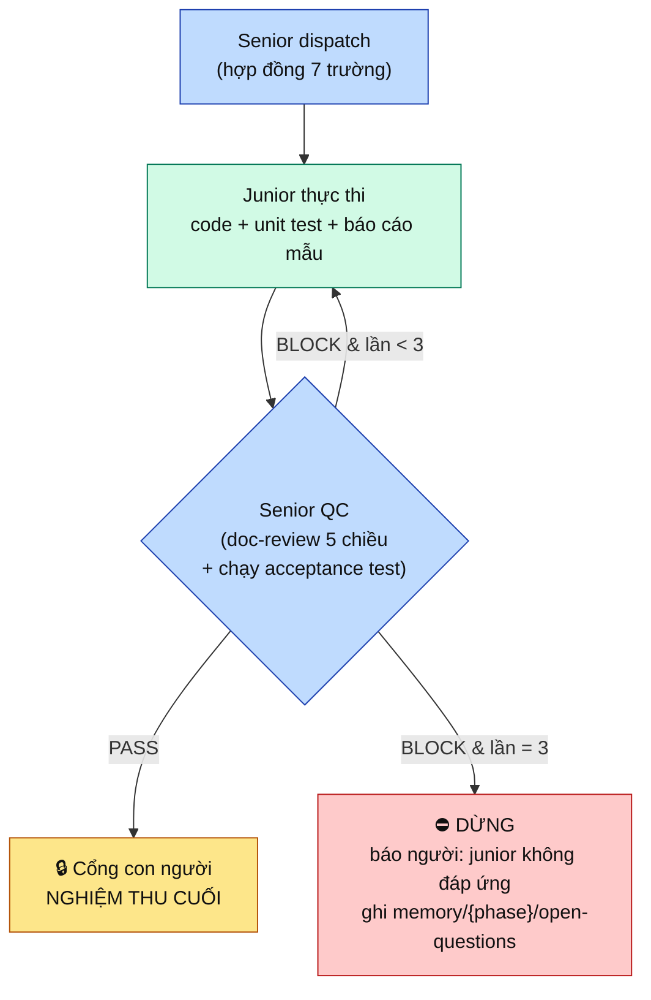
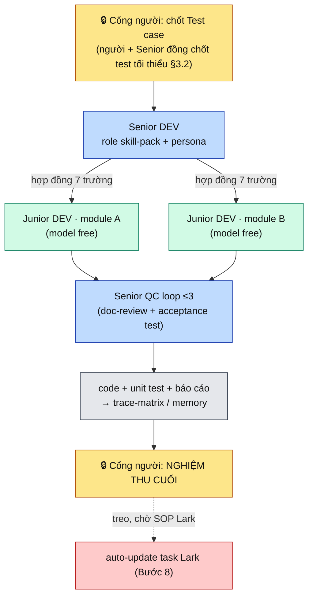

# Minipower — Senior/Junior Delegation trong Gated Fan-out (đợt đầu: DEV code-gen)

| | |
|---|---|
| **Ngày** | 2026-07-26 |
| **Trạng thái** | 🟣 **CANCEL** (2026-08-20) — cơ chế lõi là **QC loop chặn ≤3** + cổng người nghiệm thu, trái [ADR-019](ADR-019-2026-08-20-minipower-harness-khong-gate.md). **Kế thừa:** hợp đồng giao việc 7 trường (§3.1) + governance test-case (§3.2) như *khuyến nghị*, không phải cổng. Giữ làm lịch sử. *(nguyên văn)* 📋 **Phân tích — hướng đã chốt, implementation CHƯA mở.** Kiểu `deliberation`. Người đã chốt 3 nhánh bản lề (§0.1); còn câu hỏi §9 trước khi có ADR triển khai. |
| **Phạm vi** | `minipower/` — tinh chỉnh **cơ chế fan-out** (QĐ-2 của gated-fanout) + **mở lại một lát Giai đoạn E** (Bước 7: code + unit test). **Chưa** chạm code. |
| **Nối tiếp** | [gated-fanout §0/QĐ-2/§4](ADR-003-2026-07-20-minipower-gated-fanout-execution.md) (§0 đang hiệu lực) · [orchestrator-analysis](ADR-009-2026-07-25-minipower-orchestrator-analysis.md) (Trục A "role skill-pack") · [checkpoint tạm dừng E](ADR-010-2026-07-25-tam-dung-gated-fanout-checkpoint.md) |
| **Mục đích** | Ghi lại ý tưởng "Senior AI điều phối — Junior AI thực thi — Senior QC có vòng lặp chặn" và định hình nó **trong** §0 gated-fanout: người vẫn là người nghiệm thu cuối, không sinh nền tảng thứ tư. |

---

## §0. TL;DR — Verdict: **PROCEED-reshape (trong khuôn §0 gated-fanout)**

- Ý tưởng **không phá §0 hiện hành.** §0 đã được pivot bởi [gated-fanout](ADR-003-2026-07-20-minipower-gated-fanout-execution.md): *"Người quyết tại **mỗi cổng** · AI **fan-out sub-agent** thực thi song song **giữa hai cổng**."* Cấu trúc Senior→Junior chỉ là **một tinh chỉnh của cơ chế fan-out (QĐ-2)**, cộng ba thứ mới có giá trị.
- **Ba đóng góp mới** (chưa có trong repo):
  1. **Hợp đồng giao việc 7 trường** (Senior → Junior) — formalize dispatch thành template chuẩn.
  2. **Phân tầng Senior/Junior + Junior chạy model free** — quyết định kinh tế học, hợp định vị model-agnostic.
  3. **Vòng lặp QC có chặn (tối đa 3 lần)** — `doc-review` áp *bên trong* fan-out, có bound hội tụ.
- **Lằn ranh §0 được giữ** nhờ lựa chọn của người quyết (§0.1): Senior nghiệm thu là **QC pre-filter**, **trách nhiệm nghiệm thu cuối cùng vẫn của con người**. Kèm **governance test-case** chống ảo giác (đồng chốt test tối thiểu · Senior bổ sung ≤10% · phủ 100% BR/FR/NFR).
- **Chi phí phải trả:** đợt đầu = **DEV code-gen**, tức **mở lại một lát Giai đoạn E** (đang ⏸️ tạm dừng). Chỉ mở phần **không lệ thuộc Lark** (sinh code + unit test + báo cáo artifact); phần "auto-update task lên Lark / nhắc tiến độ" (Bước 8) **vẫn treo**.

### §0.1. Ba nhánh bản lề — người đã chốt (2026-07-26)

| Nhánh | Chốt của người quyết |
|-------|----------------------|
| **Vai trò nghiệm thu của Senior AI** | **Pre-filter, người nghiệm thu cuối.** Cụ thể: người + Senior **đồng chốt bộ test case tối thiểu** đảm bảo các BR/FR/NFR chính; Senior **được bổ sung** test case mới (cái người chưa nghĩ ra) **nhưng ≤ 10%** tổng số test đã chốt — chặn ảo giác sinh **trùng / không liên quan / phủ định** test cũ; **mọi test phải phủ 100% BR/FR/NFR đã chốt**. Senior chỉ "chốt" **trong phạm vi đã trao đổi với người**. Nghiệm thu cuối = **con người**. |
| **Phạm vi đợt đầu** | **DEV code-gen** — mở lại Bước 7 của Giai đoạn E. |
| **Bước tiếp theo** | Viết ADR deliberation này (chưa implement). |

---

## §1. Ý tưởng như user mô tả (tóm tắt trung thực)

> Minipower đóng vai **điều phối** cho các agent role PM / BA / DEV / SA / QC / DevOps / Support… Mỗi role ở mức **senior**: biết tiếp nhận, lưu trữ, quản lý, phân tích, báo cáo theo nguyên tắc đã thiết lập. Để giảm chi phí, mỗi role có thêm **agent junior chạy model free**. Khi senior giao việc, gói giao phải đủ: **lý do · nội dung yêu cầu · phạm vi · các test case cần thực hiện · kế hoạch thực thi chi tiết · bộ tiêu chí đáp ứng · báo cáo mẫu**. Junior nhận → thực thi theo kế hoạch → phân tích → tự viết unit test kiểm thử → báo cáo theo mẫu. Senior review để **nghiệm thu**; không đạt thì yêu cầu junior làm lại, **lặp tối đa 3 lần**; sau 3 lần junior vẫn không đáp ứng thì **dừng**.

---

## §2. Định vị trong §0 gated-fanout — vì sao KHÔNG phá triết lý

Phản xạ thường gặp: "senior giao junior = agent-tự-bàn-giao-agent → trái §0". **Sai**, vì §0 hiện hành **không còn** cấm fan-out agent — [gated-fanout §0](ADR-003-2026-07-20-minipower-gated-fanout-execution.md) đã supersede điều đó:

| §0 gated-fanout (đang hiệu lực) | Ý tưởng Senior/Junior khớp thế nào |
|---|---|
| "AI được **fan-out sub-agent** để sinh song song — **nhưng chỉ giữa hai cổng người-chốt**" | Senior→Junior là **fan-out có điều phối viên**: Senior là agent điều phối, Junior là sub-agent thực thi. Cả cụm nằm **giữa hai cổng**. |
| "Roles = lăng kính khi *tư duy*; khi *thực thi* phase đã chốt, AI được đóng vai để **sinh artifact**" | Senior/Junior chính là **role đóng vai để sinh artifact** cho một phase đã mở cổng. |
| Q3: "mọi thứ AI thực hiện, **con người chỉ review**" | Senior QC = pre-filter; **người nghiệm thu cuối** (đúng §0.1). |
| "Co lại trước khi mở rộng — dùng sub-agent harness sẵn có, **không nền tảng thứ tư**" | Junior = sub-agent harness; **không** thêm runtime multi-agent (LangGraph/CrewAI). |

**Chốt:** ý tưởng là **evolution của QĐ-2** (sub-agent per-module), thêm lớp **persona 2 tầng + QC loop + dispatch contract**. Không phải hướng "autonomous multi-agent" mà [orchestrator-analysis §5 PA A](ADR-009-2026-07-25-minipower-orchestrator-analysis.md) đã loại.

**Điểm phải canh (nếu trôi sẽ vượt §0):** nếu có lúc để **Senior AI nghiệm thu là chốt cuối** (bỏ người ở khâu đó) → *đó* mới là pivot §0 lần nữa. §0.1 đã khoá: **không** đi hướng đó.

---

## §3. Ba cơ chế mới — đặc tả

### §3.1. Hợp đồng giao việc (Senior → Junior) — 7 trường bắt buộc

Mỗi lần Senior dispatch Junior phải kèm gói đủ 7 trường; thiếu trường = không dispatch (kỷ luật kiểu `readiness-gate` "hỏi trọn gói một lượt"):

| # | Trường | Nguồn / neo về máy sẵn có |
|---|--------|---------------------------|
| 1 | **Lý do** (vì sao có việc này) | Trace về FR/UC/DEC cổng trước |
| 2 | **Nội dung yêu cầu** | Slice công việc (1 module/1 artifact — *một owner*) |
| 3 | **Phạm vi** (in/out) | Bounded context theo [parallel-work](../minipower/docs/parallel-work.md) |
| 4 | **Test case cần thực hiện** | **Bộ acceptance test Senior sở hữu** (xem §3.2) |
| 5 | **Kế hoạch thực thi chi tiết** | Các bước Junior phải theo |
| 6 | **Bộ tiêu chí đáp ứng** | Definition of Done + rubric chấm của Senior |
| 7 | **Báo cáo mẫu** | Template Junior điền khi trả việc |

> Đây là **input tối thiểu** của một handoff nội bộ Senior→Junior — cùng tinh thần "input tối thiểu là hợp đồng" của [COORDINATION.md](../contracts/README.md).

### §3.2. Governance test-case — kháng thể chống ảo giác (chốt của người, §0.1)

Đây là phần **quan trọng nhất** giữ cho vòng lặp không trôi:

1. **Người + Senior đồng chốt** bộ **test case tối thiểu** đảm bảo các **BR / FR / NFR chính**. Đây là *nguồn chân lý nghiệm thu*.
2. Senior **được bổ sung** test case mới (cái người chưa nghĩ ra) — **nhưng tổng bổ sung ≤ 10%** số test đã chốt. Mục đích: chặn AI sinh test **trùng · không liên quan · phủ định** test đã chốt.
3. **Mọi test case phải phủ 100% BR/FR/NFR đã chốt** — trace `test → {MOD}-FR/BR/NFR-NNN` (khớp trace spine UC→FR→AC→Test của [COORDINATION.md](../contracts/README.md)).
4. Senior chỉ "chốt" **trong phạm vi đã trao đổi với người**.
5. **Phân biệt hai loại test** (chống gaming):
   - **Acceptance test** = do Senior+người sở hữu (mục 1–2) → **thẩm quyền nghiệm thu**.
   - **Unit test Junior tự viết** = vệ sinh dev, để Junior tự kiểm → **không** phải thẩm quyền chấm. Senior chấm Junior theo **acceptance test của Senior**, không theo test Junior tự chấm mình.
6. **Nếu Senior thấy cần > 10% test mới** để phủ đủ → đó là tín hiệu **BR/FR/NFR còn thiếu** → **escalate lên người**, *không* âm thầm vượt trần (xem §9 Q2).

### §3.3. Vòng lặp QC có chặn (≤ 3 lần)

- Senior QC = tái dùng [doc-review](../minipower/skills/doc-review/SKILL.md) (5 chiều, verdict PASS/BLOCK) + **chạy bộ acceptance test** §3.2.
- **Bound = 3.** Hết 3 lần vẫn BLOCK → **dừng**, không lặp vô hạn; ghi nợ vào `memory/{phase}/open-questions.md` để người xử.
- **PASS của Senior ≠ nghiệm thu.** PASS chỉ đưa artifact tới **cổng người** — người mới nghiệm thu cuối.

---

## §4. Ánh xạ vào bộ máy đã có (không làm lại)

| Thành phần | Neo về | Trạng thái |
|---|---|---|
| Senior/Junior persona | [`roles/`](../minipower/roles/) (DEV/BA/SA/QC/PM/DevOps/Support) — thêm tầng senior/junior | Mở rộng |
| Fan-out điều phối | QĐ-2 gated-fanout + [skill fan-out](../minipower/skills/fan-out/SKILL.md) | Mở rộng |
| Senior QC loop | [doc-review](../minipower/skills/doc-review/SKILL.md) (PASS/BLOCK, context sạch) | Tái dùng |
| Hợp đồng 7 trường | [readiness-gate](../minipower/skills/readiness-gate/SKILL.md) (hỏi trọn gói) + template mới | Mới (template) |
| Cổng nghiệm thu người | `approval_gates` trong [rules.json](../minipower/hooks/lib/rules.json) | Tái dùng |
| Chặn đốt token (junior free × 3) | [token-guard](../minipower/docs/token-guard.md) | Tái dùng |
| "Agent nào có skill nào / tầng nào" | khai trong `rules.json` → `npm run gen` (rules-as-data) | Mới (dữ liệu) |

---

## §5. Rủi ro & cách chặn (thiết kế, không phải chặn lúc chạy)

| # | Rủi ro | Cách chặn |
|---|--------|-----------|
| R1 | Junior tự viết test rồi tự pass = **gaming** | §3.2.5 — chấm theo **acceptance test của Senior**, không theo test junior |
| R2 | Senior chấm chính việc mình giao = **thiên kiến xác nhận** | doc-review "context sạch": agent chấm tách khỏi agent giao, hoặc **rubric cứng** (trường 6) |
| R3 | Junior model-free yếu × 3 vòng = **đốt token sinh code trông-đúng-mà-sai** | token-guard + bound 3 + **cổng người cuối** làm kháng thể |
| R4 | Ảo giác test-case (trùng/lệch/phủ định) | Governance §3.2: trần ≤10%, phủ 100%, trace về ID |
| R5 | DevOps/Support/PM-tạo-ticket là **L2/L3 side-effect ra ngoài** | **Không** để junior tự chạy; dừng ở cổng người ([orchestrator-analysis §4/§8](ADR-009-2026-07-25-minipower-orchestrator-analysis.md)). Pattern này chỉ cho **role sinh artifact L1** (DEV code, BA/SA doc) |
| R6 | Trôi dần sang "Senior AI nghiệm thu cuối" | §0.1 khoá cứng; nếu muốn đổi → **phải pivot §0 bằng ADR mới**, không lặng lẽ |

---

## §6. Phạm vi đợt đầu — DEV code-gen & quan hệ với Giai đoạn E (đang tạm dừng)

Đợt đầu đóng vào **DEV role** (Bước 7: *code + unit test*). Bước 7 nằm trong **Giai đoạn E — ⏸️ tạm dừng** ([checkpoint 2026-07-25](ADR-010-2026-07-25-tam-dung-gated-fanout-checkpoint.md)). Phải tách rạch ròi phần mở được:

| Lát của Bước 7/8 | Lệ thuộc Lark? | Đợt này |
|---|---|---|
| Senior dispatch → Junior sinh **code** trace về FR/AC | Không | ✅ **Mở** |
| Junior viết **unit test** + Senior chạy **acceptance test** | Không | ✅ **Mở** |
| Junior điền **báo cáo mẫu**, Senior QC + cổng người | Không | ✅ **Mở** |
| **Auto-update task lên Lark** / nhắc tiến độ (Bước 8) | **Có** | ⏸️ **Vẫn treo** — chờ SOP Lark |

> Nghĩa là: cụm **sinh + kiểm + báo cáo** (artifact văn bản, L1) mở được **ngay** vì không đụng hệ ngoài; chỉ phần **ghi ngược lên Lark** mới treo. Điều này **không** mâu thuẫn lý do tạm dừng E (lý do treo là *data model Lark*, không phải bản thân việc sinh code).
>
> **Điều kiện tiên quyết bất biến:** code-gen chỉ chạy **sau cổng người chốt Test case** (`approval_gates.test-cases`) và khi `readiness-gate` intent `implement` đủ tiền đề (SRS, AC, API spec, data model). Không đủ tiền đề = không dispatch junior.

---

## §7. Việc KHÔNG làm (ranh giới)

| ❌ | Vì sao |
|---|--------|
| Senior AI nghiệm thu là chốt cuối (bỏ người) | Trái §0.1 · phải pivot §0 nếu muốn |
| Junior tự chạy L2/L3 (deploy, tạo ticket, gửi mail) | Trái §0 · [orchestrator-analysis §8](ADR-009-2026-07-25-minipower-orchestrator-analysis.md) |
| Thêm runtime multi-agent framework (LangGraph/CrewAI) | Trái "không nền tảng thứ tư" · dùng sub-agent harness |
| Mở lại phần Lark của Giai đoạn E | Vẫn treo chờ SOP Lark ([checkpoint](ADR-010-2026-07-25-tam-dung-gated-fanout-checkpoint.md)) |
| Vòng lặp junior không chặn / > 3 lần | Trái bound §3.3 · đốt token |
| Senior bổ sung test > 10% mà không escalate | Trái governance §3.2 |
| Làm lại planning/requirements/architecture dưới tên "agent mới" | Trùng SSOT ([orchestrator-analysis §4](ADR-009-2026-07-25-minipower-orchestrator-analysis.md)) |

---

## §8. Hình dạng đề xuất (chưa implement)

---

## §9. Câu hỏi mở — cần người quyết trước ADR triển khai

| # | Câu hỏi | Vì sao quan trọng |
|---|---------|-------------------|
| **Q1** | "Junior chạy model free" — **model nào**, và **hạn mức token** cho tối đa 3 vòng/việc? | Chặn R3; ràng vào token-guard |
| **Q2** | Khi Senior cần **> 10% test mới** để phủ đủ → escalate người **giữa chừng** hay ghi nợ open-questions rồi tiếp? | Vẽ chính xác điểm dừng §3.2.6 |
| **Q3** | "Agent" = **cách gom rules.json** (tầng senior/junior khai bằng dữ liệu) hay có **prompt/persona file riêng** mỗi tầng? | Định hình topology; tránh phình file |
| **Q4** | Senior QC và Senior dispatch là **cùng một agent** hay **tách** (chống R2)? | Đánh đổi chi phí vs khách quan |
| **Q5** | Báo cáo mẫu (trường 7) — **một template chung** hay **mỗi role một mẫu**? | Chống trùng lặp template |
| **Q6** | Sau DEV, role kế tiếp áp pattern này là gì (BA/SA doc-gen L1?) — hay dừng ở DEV để chứng minh trước? | Chống ôm đồm |

---

## §10. ADR con dự kiến (mở sau khi §9 chốt)

| ADR con | Nội dung |
|---|---|
| `…-senior-junior-topology` | Khai tầng senior/junior + hợp đồng 7 trường trong `rules.json`; golden test |
| `…-dispatch-contract-template` | Template 7 trường + báo cáo mẫu (trường 7) |
| `…-dev-codegen-loop` | Skill code-gen: readiness-gate → dispatch → junior → doc-review loop ≤3 → cổng người; **không** đụng Lark |

---

## §11. Tham chiếu

- [gated-fanout §0/QĐ-2/§4](ADR-003-2026-07-20-minipower-gated-fanout-execution.md) — §0 hiện hành, fan-out giữa hai cổng, lộ trình A→E
- [checkpoint tạm dừng E](ADR-010-2026-07-25-tam-dung-gated-fanout-checkpoint.md) — lý do treo Giai đoạn D/E
- [orchestrator-analysis](ADR-009-2026-07-25-minipower-orchestrator-analysis.md) — Trục A "role skill-pack", phân loại L1/L2/L3
- [doc-review](../minipower/skills/doc-review/SKILL.md) · [readiness-gate](../minipower/skills/readiness-gate/SKILL.md) · [fan-out](../minipower/skills/fan-out/SKILL.md) · [token-guard](../minipower/docs/token-guard.md) · [parallel-work](../minipower/docs/parallel-work.md)
- [roles/DEV.md](../minipower/roles/DEV.md) — lăng kính DEV, "chỉ bắt đầu khi tài liệu đủ rõ"
