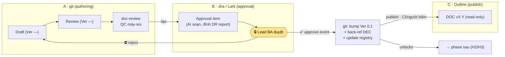

# Minipower — Phê duyệt trên Jira/Lark + publish lên Outline

| | |
|---|---|
| **Ngày** | 2026-07-29 |
| **Trạng thái** | 🟣 **CANCEL** (2026-08-20) — Jira/Lark rời lộ trình theo [ADR-017](ADR-017-2026-08-20-minipower-toolchain-openproject-github-outline-slack.md) QĐ-3; Q1 "Jira hay Lark" mất nghĩa. Mô hình **3 mặt phẳng** được viết lại tại [ADR-018](ADR-018-2026-08-20-minipower-phe-duyet-openproject-publish-outline.md). Giữ làm lịch sử — không cập nhật tiếp. |
| **Phạm vi** | `minipower/` — cơ chế **cổng ký (chữ ký)** và **publish tài liệu**. Không đổi nội dung/luồng phase. |
| **Nối tiếp** | [gated-fanout 2026-07-20](ADR-003-2026-07-20-minipower-gated-fanout-execution.md) (§0 approval-gate, D/E chờ SOP Lark) · [checkpoint 2026-07-25](ADR-010-2026-07-25-tam-dung-gated-fanout-checkpoint.md) · [COORDINATION §4](../contracts/cross-repo-bridge.md) (cross-repo bridge) |
| **Mục đích** | Bắt đầu định nghĩa "SOP Lark/Jira/Outline" cho **chiều phê duyệt + publish** — biến "chữ ký" từ tick-markdown thành **event duyệt trên công cụ quy trình thật**, rồi doc bump version + publish lên Outline. |
| **Ảnh hưởng** (khi accepted) | [approval-gate.md](../sdlc/agents/approval-gate.md) — "chữ ký" = event ngoài, không còn chỉ DEC-markdown · [doc-versioning.md](../sdlc/docs-skeleton/00-governance/doc-versioning.md) — version bump kích bởi approval event · [doc-registry.md](../sdlc/docs-skeleton/05-traceability/doc-registry.md) — đổi vai thành **bảng ánh xạ** DOC↔Jira↔Lark↔Outline · [parallel-work.md](../sdlc/docs/parallel-work.md) — phân vai Author vs Approver. **Không** sửa `rules.json` trong ADR này (chỉ đề xuất; sửa khi có skill/adapter thật). |

---

## §0. Vấn đề

Kịch bản: **Lead BA** nhận yêu cầu tổng quan → giao **BA A / BA B** khảo sát từng module → khi có tài liệu module, Lead BA **đọc và phê duyệt** → **ký xong** tài liệu mới đi sang stage sau.

Cơ chế "ký" hiện tại là **tick trong markdown** (mục Approval trong DOC + cột Sign-off trong `doc-registry.md`, và ở nhánh gated-fanout là **DEC "đã chốt"** trong decision-log). Người dùng muốn thay bằng:

> **Phê duyệt trên quy trình Jira / Lark. Sau khi duyệt, tài liệu chỉ đổi version và push lên Outline.**

Tức **dời "chữ ký" ra hệ thống ngoài** (có audit trail thật: ai duyệt, khi nào, comment), và **Outline là bản đọc đã duyệt** — không sửa nội dung trên Outline.

Đây **không phải** cơ chế mới đè lên pipeline: nó là **hiện thực hoá cột "người chốt" của [approval-gate](../sdlc/agents/approval-gate.md)** bằng công cụ ngoài, đúng nhánh **D/E đang paused** (§4 gated-fanout) — chỉ khác: ta mở **riêng chiều phê duyệt + publish**, chưa động tới task-hierarchy.

---

## §1. Nguyên tắc giữ nguyên (không đổi hướng)

| # | Nguyên tắc | Áp vào đây |
|---|---|---|
| 1 | **Người là người quyết định cuối** (§0 triết lý) | Lead BA **duyệt trên Jira/Lark**. Chưa có event duyệt hợp lệ = doc **không** qua cổng. AI không tự duyệt. |
| 2 | **AI soạn, người review** (Q3 gated-fanout) | AI soạn DOC + tạo *approval item* (đính doc-review report + tóm tắt) → Lead BA chỉ bấm duyệt/trả lại. |
| 3 | **Tách lớp adapter** (QĐ-3 gated-fanout) | Jira/Lark/Outline = **adapter riêng**, không nhét vào core skill. Core chỉ biết trạng thái "đã duyệt / chưa". |
| 4 | **Co lại trước khi mở rộng** | Giai đoạn đầu cho phép **thủ công/CLI** (người dán ref duyệt), tự động webhook làm sau. Không thêm runtime thứ tư khi chưa cần. |
| 5 | **Repo tự mô tả, model-agnostic** | Dù chữ ký sống ở Jira/Lark, repo **vẫn giữ back-reference** (DEC ghi "approved via {ref} @ {date}") — không có công cụ ngoài vẫn đọc được lịch sử duyệt. |
| 6 | **Cross-repo bridge** ([COORDINATION §4](../contracts/cross-repo-bridge.md)) | "Pin version + back-reference, **không copy tay hai nơi**." Áp cho git↔Outline và Jira/Lark↔git. |

---

## §2. Mô hình 3 mặt phẳng — "chữ ký ở ngoài, nội dung ở git, bản đọc ở Outline"

| Mặt phẳng | Công cụ | Là SSOT của | Ai tác động |
|---|---|---|---|
| **A. Authoring** | **git (markdown)** | **Nội dung** — draft, diff, version control | BA A/B soạn (một module = một owner) |
| **B. Approval** | **Jira / Lark** | **Trạng thái phê duyệt** ("chữ ký", audit) | **Lead BA** duyệt (gatekeeper) |
| **C. Publish** | **Outline** | **Bản đã duyệt để đọc** (rendered, read-mostly) | Chỉ nhận từ git (một chiều) |

Điểm mấu chốt: **doc-registry.md đổi vai** — từ *nơi ký* → thành **bảng ánh xạ / mirror**: `DOC ↔ Jira key ↔ Lark instance ↔ Outline URL ↔ version đã publish`. SSOT trạng thái duyệt nằm ở mặt phẳng B; registry chỉ **cache + trỏ**.

---

## §3. Vòng đời một DOC module (per-module, song song)

**Các bước (khớp [approval-gate](../sdlc/agents/approval-gate.md) — chỉ đổi *nơi ký*):**

1. **Soạn (git)** — BA A/B viết draft `03-modules/{module}/`; `Status=Draft`, `Version=—`.
2. **Self-QC** — chạy [doc-review](../sdlc/skills/doc-review/SKILL.md) đối kháng 5 chiều; sửa Blocker; chuyển `Status=Review`.
3. **Tạo approval item (AI soạn)** — adapter tạo/ cập nhật một *item duyệt* trên Jira/Lark cho **cổng tương ứng** (`approval_gates`), đính: link commit/PR + **doc-review report** + DEC nháp (đã làm · cần quyết · TBD).
4. **Lead BA duyệt (người chốt)** — đọc → **approve / reject** trên Jira/Lark. **Đây là chữ ký.**
5. **Approve event → git** — bump `Version 0.1`, `Status=Baseline`; ghi **back-ref DEC** "approved via {Jira key / Lark ref} @ {date}"; cập nhật `doc-registry` (Jira key, Outline URL, version, ngày).
6. **Publish → Outline** — bản đã duyệt lên Outline (read-only). **Hành động ra-ngoài** → do **CI hoặc người bấm**; AI chuẩn bị nội dung, **không** tự publish nội dung chưa duyệt.
7. **Mở khoá** — chỉ sau (5)/(6), doc mới vượt [boundary H2/H3](../contracts/handoff.md) sang Architecture/Planning. **Reject** → về Draft, ghi nợ `memory/{phase}/open-questions.md` ([readiness-gate](../sdlc/skills/readiness-gate/SKILL.md)).

**Fan-out:** BA A và BA B là **hai luồng độc lập**. Lead BA **duyệt từng module khi module đó đủ** — không gom chờ cả hai (luật "input tối thiểu là hợp đồng, không phải toàn bộ").

---

## §4. Tái dùng primitive sẵn có (không phát minh lại)

| Primitive sẵn có | Vai trò cũ | Vai trò sau ADR này |
|---|---|---|
| `approval_gates` (rules.json) | 7 cổng người-chốt, ký = DEC markdown | Mỗi cổng ↔ **một approval template** trên Jira/Lark (qua adapter). Danh sách cổng **không đổi**. |
| [doc-review](../sdlc/skills/doc-review/SKILL.md) | QC đối kháng trước sign-off | Chạy **trước khi tạo approval item**; report là **bằng chứng** cho Lead BA duyệt. |
| [doc-versioning](../sdlc/docs-skeleton/00-governance/doc-versioning.md) | Version chỉ sau sign-off | Giữ nguyên — chỉ khác: "sign-off" giờ = **approve event ngoài**, không phải tick markdown. |
| `doc-registry.md` | Nơi ký (Sign-off cột) | **Bảng ánh xạ** DOC↔Jira↔Lark↔Outline↔version (mirror; SSOT duyệt ở ngoài). |
| DEC (decision-log) | Chữ ký nội-repo | **Back-reference**: "approved via {ref}" — giữ repo tự mô tả. |
| [COORDINATION §4](../contracts/cross-repo-bridge.md) bridge | git-docs ↔ git-code | Tổng quát cho git ↔ Outline + Jira/Lark ↔ git. |

---

## §5. Ranh giới an toàn (KHÔNG làm)

| ❌ | Vì sao |
|---|---|
| AI tự **approve** thay người | Trái §0 — người quyết tại cổng. |
| AI tự **publish** nội dung chưa có approve event hợp lệ | Publish = hành động ra-ngoài; phải sau chữ ký + (CI/người bấm). |
| Cho **sửa nội dung trực tiếp trên Outline** | Vỡ trace + git không còn là SSOT. Sửa → git → re-approve → re-publish (đúng luật "đổi baseline → CR"). |
| Nhét Jira/Lark/Outline SDK vào **core skill** | QĐ-3 — phải là adapter riêng; tránh drift & lệ thuộc ngoài. |
| Build webhook/tự-động-hoá đầy đủ ngay | "Co lại trước khi mở rộng" — giai đoạn đầu thủ công/CLI; tự động sau khi luồng ổn. |
| Mở lại **task-hierarchy (D/E)** trong ADR này | Ngoài phạm vi — ADR này chỉ mở **chiều phê duyệt + publish**. |

---

## §6. Quyết định MỞ — cần bạn chốt để chuyển proposed → accepted

| # | Câu hỏi | Đề xuất (mặc định) | Vì sao cần bạn quyết |
|---|---|---|---|
| **Q1** | **Jira và Lark — ai làm gì?** Hai công cụ trùng chức năng duyệt. | **Lark = nơi duyệt** (ký, notify, mobile — UX nhanh); **Jira = đơn vị công việc + ID neo** (issue key trace về `{MOD}-FR`). Hoặc chỉ dùng **một** cái. | Quyết định bề mặt adapter phải build; tránh làm cả hai vô ích. |
| **Q2** | **SSOT nội dung sau publish + sửa trên Outline?** | **git một chiều → Outline; Outline read-only.** Sửa nội dung phải về git → re-approve → re-publish. | Nếu cho sửa trực tiếp Outline → hai nguồn lệch, vỡ trace. Cần bạn xác nhận chấp nhận read-only. |
| **Q3** | **Trigger publish + mức tự động?** | Adapter/CI phát hiện approve → chuẩn bị → **người bấm** (giai đoạn đầu) / CI (sau). AI không tự publish. Phát hiện: **manual/CLI trước, webhook sau**. | Cân bằng an toàn (ra-ngoài) vs tiện; ảnh hưởng có cần hook runtime không. |
| **Q4** | **Số version đến từ đâu?** | **Tự tăng trong git/registry** theo doc-versioning hiện tại (0.1, 0.2…); Jira/Outline chỉ tham chiếu. | Giữ một nguồn version; tránh Jira/Outline tự đánh số lệch. |
| **Q5** | **Đây có phải mở lại một phần D/E paused?** | **Có — chỉ nhánh phê duyệt + publish** (nhẹ, ít lệ thuộc); task-hierarchy (Epic/Story/Task→Lark) **vẫn paused**. | Checkpoint 2026-07-25 dặn không làm D/E "cho xong" thiếu SOP — cần xác nhận đây là SOP-một-phần có chủ đích. |

---

## §7. Nếu accepted — việc sẽ làm (chưa làm bây giờ)

1. Bổ sung phân vai **Author (BA module) vs Approver (Lead BA)** vào [parallel-work.md](../sdlc/docs/parallel-work.md) + [roles/BA.md](../sdlc/roles/BA.md).
2. Ghi luồng "Review → approval event → bump version → publish" vào [doc-versioning.md](../sdlc/docs-skeleton/00-governance/doc-versioning.md); đổi `doc-registry.md` thành bảng ánh xạ (thêm cột Jira key / Outline URL).
3. Cập nhật [approval-gate.md](../sdlc/agents/approval-gate.md): "chữ ký" = approve event ngoài + back-ref DEC (giữ bảng `approval_gates` — sinh từ rules.json).
4. **Adapter riêng** (`minipower/install/…` hoặc pack adapter) cho Jira/Lark/Outline — **sau** khi chốt Q1–Q3; kèm ranh giới QĐ-3.
5. Cập nhật §4 gated-fanout: đánh dấu nhánh **approval+publish** đã tách ra khỏi "chờ SOP Lark".

---

## §8. Tham chiếu

| Tài liệu | Vai trò |
|---|---|
| [approval-gate.md](../sdlc/agents/approval-gate.md) | 7 cổng người-chốt (nền để ánh xạ ra Jira/Lark) |
| [gated-fanout ADR](ADR-003-2026-07-20-minipower-gated-fanout-execution.md) §4 | Lộ trình D/E — nơi Lark integration đang paused |
| [checkpoint 2026-07-25](ADR-010-2026-07-25-tam-dung-gated-fanout-checkpoint.md) | Ranh giới "không làm D/E thiếu SOP" |
| [doc-versioning.md](../sdlc/docs-skeleton/00-governance/doc-versioning.md) | Quy tắc version chỉ-sau-sign-off |
| [parallel-work.md](../sdlc/docs/parallel-work.md) | Fan-out theo module, một-owner |
| [COORDINATION.md §4](../contracts/cross-repo-bridge.md) | Cross-repo bridge — pin + back-reference |
</content>
</invoke>
