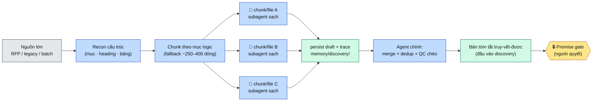

# Minipower — Tóm tắt tài liệu nguồn lớn ở phase Discovery (vượt context window)

| | |
|---|---|
| **Ngày** | 2026-08-02 |
| **Trạng thái** | 📝 **Proposed** — thiết kế trên giấy, chờ chốt các Quyết định mở (§6). **Chưa** đụng file pipeline. |
| **Phạm vi** | `minipower/` — bước **nạp/tiêu hoá nguồn** *đầu vào* của [discovery](../sdlc/skills/discovery/SKILL.md) (đọc tài liệu painpoint/legacy/RFP lớn trước DOC-01–03). **Không** đổi nội dung/luồng 6 phase, **không** thêm phase mới. |
| **Nối tiếp** | [token-guard](../sdlc/docs/token-guard.md) (một-slice, đọc theo lớp) · [doc-review](../sdlc/skills/doc-review/SKILL.md) (fan-out đọc/QC, context sạch, dedup) · [parallel-work](../sdlc/docs/parallel-work.md) (một-owner) · [fan-out ADR](ADR-003-2026-07-20-minipower-gated-fanout-execution.md) (ranh giới fan-out giữa hai cổng) |
| **Mục đích** | Định nghĩa **cách agent tiêu hoá tài liệu nguồn cỡ lớn** (≥ context một phiên) thành bản tóm tắt truy-vết-được, làm **đầu vào tin cậy** cho Premise gate + elicit của discovery — mà **không** one-shot, **không** mất số liệu/trace, **không** phụ thuộc memory phiên. |
| **Ảnh hưởng** (khi accepted) | [discovery/SKILL.md](../sdlc/skills/discovery/SKILL.md) — thêm **Bước 0: Ingest nguồn lớn** (recon → chunk/fan-out → merge) trước Bước 1 · [token-guard.md](../sdlc/docs/token-guard.md) — nới ngoại lệ "đọc cả file lớn" khi có kế hoạch chunk + persist · một **agent/skill mới `source-ingest`** (recon·chunk·merge·rollup) nếu chốt chuẩn hoá (Q8) · `memory/discovery/` — thêm quy ước lưu **artifact tóm tắt trung gian** (chunk draft + rollup). **Không** sửa `rules.json` trong ADR này (chỉ đề xuất; sửa khi có skill thật). |

---

## §0. Vấn đề

Ở **phase discovery**, đầu vào thật hiếm khi gọn: khách gửi **RFP / tài liệu nghiệp vụ / hệ thống legacy** dài hàng nghìn dòng, hoặc **batch nhiều file** (~8.000 dòng, ~150k–300k token). Agent cần **tóm tắt** (~1:15 → 1:30) để có bản đọc-được làm nền cho [Premise gate](../sdlc/skills/deliberation/SKILL.md) và elicit (≤10 câu hỏi).

> **Không thể nạp toàn bộ nguồn vào một context window.** Đọc cắt giữa chừng → mất mục giữa/cuối file; token nguồn **chiếm chỗ** reasoning/output → chất lượng tóm tắt giảm; nén mạnh → **hallucinate**, mất số liệu/ngưỡng/tên hệ thống; chunk hoá → **trace** phức tạp thêm.

```text
Input: N file lớn (~8k dòng, ~150k–300k token)
   ↓  nạp hết vào 1 context
tràn / truncate
   ↓
Output: thiếu mục · mất số liệu · mất trace · rủi ro bịa
```

Đây **không phải** một phase mới hay cơ chế đè lên pipeline. Nó là **bước nạp đầu vào (ingest)** đứng *trước* Bước 1 của discovery — và về hình dạng, nó là **fan-out đọc/QC** (giống [doc-review](../sdlc/skills/doc-review/SKILL.md)), **không** phải fan-out sinh artifact.

---

## §1. Nguyên tắc giữ nguyên (không đổi hướng)

| # | Nguyên tắc (§0 triết lý) | Áp vào đây |
|---|---|---|
| 1 | **Người là người quyết định cuối** | Tóm tắt chỉ là **đầu vào chuẩn bị**; verdict PROCEED/RESHAPE/STOP vẫn do người ra tại [Premise gate](../sdlc/skills/deliberation/SKILL.md). AI **không** tự kết luận "đáng làm" từ bản tóm tắt. |
| 2 | **Không nhảy giải pháp sớm** | Ingest chỉ **nén + trace**, tuyệt đối **không** suy diễn UC/FR/kiến trúc từ nguồn. Tóm tắt là *dữ kiện đã đọc*, không phải *đề xuất*. |
| 3 | **Fan-out đọc/QC — không tự sửa của owner khác** | Reuse mẫu doc-review: **1 subagent / file (hoặc / chunk)**, context sạch (1 slice), **agent chính dedup + merge**. Subagent **chỉ đọc & rút gọn**, không viết DOC. |
| 4 | **Một-owner, một-slice** ([token-guard](../sdlc/docs/token-guard.md) · [parallel-work](../sdlc/docs/parallel-work.md)) | Mỗi file/chunk có một luồng xử lý; không hai luồng đè cùng vùng. Ingest là ngoại lệ *có kế hoạch* của token-guard (được đọc file lớn **vì** có chunk + persist), không phải quét lan man. |
| 5 | **Không phụ thuộc memory phiên** | Draft chunk + rollup **persist ra file** (`memory/discovery/`) để phiên merge/resume sau đọc lại — không dựa context cũ (T4). |
| 6 | **Trace được (UC→FR→AC→Test bắt đầu từ nguồn)** | Mỗi ý tóm tắt **gắn vị trí nguồn** ngay từ draft cục bộ (`{file}#{dòng/mục}`) — trace không thể vá sau khi đã nén. |
| 7 | **Co lại trước khi mở rộng** | **Không** thêm "nền tảng thứ tư" (không DB vector, không index engine ngoài) khi chunk + memory-file đã đủ. Tự động hoá/song song bật **có ngưỡng**, không mặc định. |

---

## §2. Định vị trong pipeline — "Bước 0: Ingest" của discovery



Ingest **kết thúc trước** Premise gate — nó chuẩn bị dữ kiện, **không** vượt cổng thay người.

---

## §3. Các phương án đã phác (chưa chốt)

| Phương án | Mô tả | Ưu | Nhược |
|---|---|---|---|
| **A. Map-reduce chunk** (1 agent tuần tự) | recon → chunk → draft cục bộ + trace → persist → merge → (rollup batch) | Context nhất quán 1 luồng · trace từng bước · điều phối đơn giản | Nhiều phiên · wall-clock dài · cần storage trung gian |
| **B. Fan-out N-agent** (N subagent + 1 merge) | 1 subagent / file (hoặc / chunk), context sạch → agent chính merge + QC chéo | Rút wall-clock · scale theo số file · **đã có mẫu doc-review** | Subagent không share memory · cần template chuẩn hoá · rủi ro mâu thuẫn thuật ngữ giữa luồng |
| **C. Index-first + chunk gap** | đọc index/tóm tắt có sẵn → xác định phần chưa cover → chỉ chunk-read gap → merge | Giảm token đọc · nhanh hơn full-read | Phụ thuộc chất lượng index · vẫn phải verify gap |
| **D. Hybrid** | recon + index + chunk selective, bật fan-out có ngưỡng | Cân bằng | Chi tiết chưa thiết kế |

### Ma trận so sánh

| Tiêu chí (trọng số) | A · chunk tuần tự | B · fan-out N-agent | C · index-first |
|---|---|---|---|
| Độ tin cậy / traceability **(cao)** | Cao | Cần QC chéo | Phụ thuộc index |
| Resume & persist **(cao)** | Cao | Trung bình | Trung bình |
| Tái dùng pipeline **(cao)** | Cao | Trung bình | Trung bình |
| Wall-clock (TB) | Chậm | Nhanh | Trung bình |
| Effort điều phối (TB) | Thấp | Cao | Trung bình |
| Tiết kiệm token (TB) | Trung bình | Trung bình | Cao |

---

## §4. Tái dùng primitive sẵn có (không phát minh lại)

| Primitive sẵn có | Vai trò cũ | Vai trò trong ingest |
|---|---|---|
| [doc-review](../sdlc/skills/doc-review/SKILL.md) fan-out | 1 subagent/chiều-hoặc-module, context sạch, agent chính dedup | **Khuôn mẫu** cho fan-out đọc: 1 subagent/file(chunk) → merge + dedup theo `{file}#{mục}` |
| [token-guard](../sdlc/docs/token-guard.md) | Chặn đọc lan man, một-slice | Ingest = **ngoại lệ có kế hoạch**: được đọc file lớn *vì* có chunk + persist; vẫn cấm quét cả `docs/` không mục đích |
| `memory/{phase}/` | Persist DEC, open-questions | Thêm **artifact trung gian**: chunk draft + rollup → resume/merge không phụ thuộc context phiên (T4) |
| [deliberation](../sdlc/skills/deliberation/SKILL.md) Premise gate | Verdict PROCEED/RESHAPE/STOP | Bản tóm tắt là **đầu vào** cho gate — không thay gate |
| ID ổn định (§0 quy ước) | `{MOD}-FR-`, `DEC-{PHASE}-` | Trace nguồn: mỗi ý ↔ `{file}#{dòng/mục}` từ bước draft |

---

## §5. Ranh giới an toàn (KHÔNG làm)

| ❌ | Vì sao |
|---|---|
| AI tự kết luận "đáng làm / không" từ bản tóm tắt | Trái §0 — verdict là của người tại Premise gate |
| Suy diễn UC/FR/kiến trúc từ nguồn trong lúc ingest | "Không nhảy giải pháp sớm" — ingest chỉ nén + trace |
| Merge/nén mà **bỏ trace** rồi vá sau | Trace phải gắn từ draft cục bộ; vá sau = bịa vị trí |
| Để subagent **sửa DOC** hay ghi đè slice của owner khác | Đây là fan-out **đọc/QC**, không phải sinh artifact |
| Thêm **index engine / vector DB ngoài** khi chưa cần | "Co lại trước khi mở rộng" — chunk + memory-file đủ cho quy mô hiện tại |
| Chỉ giữ tóm tắt trong context, **không persist** | Vỡ T4 (resume); phiên merge sau mất ngữ cảnh |
| Bật N-agent song song **mặc định** cho mọi input | Overhead điều phối vô ích với 1 file nhỏ; song song phải **có ngưỡng** (Q4) |

---

## §6. Quyết định MỞ — cần bạn chốt để chuyển proposed → accepted

| # | Câu hỏi | Đề xuất (mặc định) | Vì sao cần bạn quyết |
|---|---|---|---|
| **Q1** | **Chunk boundary** — theo dòng cố định hay theo mục logic? | **Recon trước → chunk theo mục logic**; dòng cố định chỉ là *fallback* khi nguồn không có cấu trúc | Cắt giữa đơn vị nghĩa → mất mạch; nhưng recon tốn 1 lượt đọc — cân bằng |
| **Q2** | **Kích thước chunk** | **~250–400 dòng** làm mặc định, cho phép giãn theo mục logic | Cần con số neo cho skill; có thể không hợp mọi loại nguồn |
| **Q3** | **Format artifact trung gian** | **Markdown có front-matter tối thiểu** (`source`, `range`, `chunk_id`) — người đọc được, agent parse được; **không** JSON nặng | Ảnh hưởng resume + QC; giữ model-agnostic, repo tự mô tả |
| **Q4** | **Ngưỡng bật fan-out N-agent** (A hay B) | **Mặc định A (tuần tự)**; bật B khi **≥ 3 file** *hoặc* **> ~6.000 dòng tổng** | Song song rút wall-clock nhưng thêm rủi ro mâu thuẫn + effort |
| **Q5** | **Merge strategy** | **2-pass**: draft cục bộ → refine/dedup ở agent chính (giữ số liệu, gộp trùng) | 1-pass rẻ hơn nhưng dễ sót/lặp ở quy mô lớn |
| **Q6** | **Index-first** — khi nào đủ tin để bỏ đọc nguồn? | **Chỉ dùng index để định tuyến gap, luôn verify gap bằng chunk-read**; không bao giờ bỏ hẳn đọc nguồn cho phần then chốt | Index có thể thiếu/cũ → mất số liệu (vỡ T6) |
| **Q7** | **QC tự động** | **Có** — 1 subagent review **context sạch** spot-check tóm tắt ↔ nguồn (số liệu, ràng buộc, tên hệ thống); giống chiều QC của doc-review | Không có verify → khó bắt hallucinate (§3.6); nhưng thêm 1 lượt |
| **Q8** | **Chuẩn hoá thành skill/rule tái dùng?** | **Có — skill `source-ingest`** (recon·chunk·merge·rollup) gọi từ Bước 0 discovery; đăng ký trigger ở router | "Kéo về pipeline tái dùng, có SSOT + test" (§0); nhưng là bề mặt mới phải bảo trì |

---

## §7. Nếu accepted — việc sẽ làm (chưa làm bây giờ)

1. Thêm **Bước 0: Ingest nguồn lớn** vào [discovery/SKILL.md](../sdlc/skills/discovery/SKILL.md) (recon → chunk/fan-out → merge → tóm tắt truy-vết-được) — *trước* Bước 1, **không** đổi Bước 1–2.
2. Ghi quy ước **artifact trung gian** trong `memory/discovery/` (front-matter Q3) + luật persist/resume (T4).
3. Nới ngoại lệ trong [token-guard.md](../sdlc/docs/token-guard.md): đọc file lớn được phép **khi** khai kế hoạch chunk + persist (không phải quét lan man).
4. (Nếu Q8=Có) tạo **skill `source-ingest`** + agent guardrail; khai trigger ở router [minipower/SKILL.md](../sdlc/SKILL.md); nếu đụng `rules.json` → theo vòng lặp `gen → test → gen:check`.
5. **Pilot 1 file lớn** → đo T1–T6 → điều chỉnh chunk size / ngưỡng song song **trước khi** scale batch (§10 problem-doc).

---

## §8. Success criteria (kỹ thuật)

| # | Tiêu chí | Đo được |
|---|---|---|
| **T1** | Tóm tắt file lớn **không one-shot** | Artifact cuối tồn tại, đủ section |
| **T2** | Tỷ lệ nén kiểm soát được | ~1:15 – 1:30 so nguồn |
| **T3** | Traceability | Mỗi ý chính gắn `{file}#{dòng/mục}` |
| **T4** | Resume giữa phiên | Draft/rollup persist; không phụ thuộc context cũ |
| **T5** | Rollup batch | N tóm tắt con → 1 bản gộp không trùng lặp |
| **T6** | Không mất số liệu/ràng buộc then chốt | Spot-check (QC context sạch) so nguồn |

---

## §9. Tham chiếu

| Tài liệu | Vai trò |
|---|---|
| [discovery/SKILL.md](../sdlc/skills/discovery/SKILL.md) | Nơi gắn Bước 0 Ingest (trước Premise gate + elicit) |
| [doc-review/SKILL.md](../sdlc/skills/doc-review/SKILL.md) | Mẫu fan-out đọc/QC: subagent context sạch, agent chính dedup |
| [token-guard.md](../sdlc/docs/token-guard.md) | Một-slice, đọc theo lớp — ingest là ngoại lệ có kế hoạch |
| [parallel-work.md](../sdlc/docs/parallel-work.md) | Một-owner, tránh đè slice khi song song |
| [fan-out ADR](ADR-003-2026-07-20-minipower-gated-fanout-execution.md) | Ranh giới: fan-out **sinh** artifact chỉ giữa hai cổng (phân biệt với fan-out **đọc** ở đây) |
| [deliberation/SKILL.md](../sdlc/skills/deliberation/SKILL.md) | Premise gate — người quyết, dùng tóm tắt làm đầu vào |
