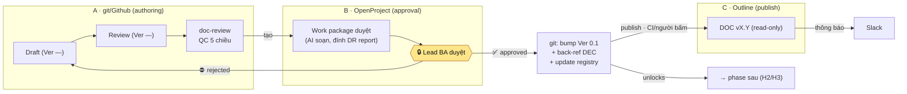

# Minipower — Phê duyệt trên OpenProject + publish lên Outline

| | |
|---|---|
| **Ngày** | 2026-08-20 |
| **Trạng thái** | 🟣 **CANCEL** (2026-08-20, cùng ngày viết) — vẫn viết theo kiểu *"chưa duyệt = không qua cổng"*, trái [ADR-019](ADR-019-2026-08-20-minipower-harness-khong-gate.md). **Kế thừa:** mô hình 3 mặt phẳng (authoring/approval/publish) + luồng publish Outline + back-ref DEC. |
| **Phạm vi** | `minipower/` — cơ chế **cổng ký** và **publish tài liệu**. Không đổi nội dung/luồng phase |
| **Nối tiếp** | **Thay** [ADR-015](ADR-015-2026-07-29-minipower-phe-duyet-jira-lark-publish-outline.md) (cancel — neo vào Jira/Lark) · [ADR-017](ADR-017-2026-08-20-minipower-toolchain-openproject-github-outline-slack.md) QĐ-2 (toolchain) · [ADR-003](ADR-003-2026-07-20-minipower-gated-fanout-execution.md) §0 (approval-gate) |
| **Mục đích** | Biến "chữ ký" từ tick-markdown thành **event duyệt trên OpenProject**, rồi bump version + publish lên **Outline**, báo **Slack** |
| **Ảnh hưởng** (khi làm) | [approval-gate.md](../minipower/agents/approval-gate.md) — chữ ký = event ngoài + back-ref DEC · [doc-versioning.md](../minipower/docs-skeleton/00-governance/doc-versioning.md) — version bump kích bởi approval event · `doc-registry.md` — đổi vai thành **bảng ánh xạ** DOC↔OpenProject↔Outline · [parallel-work.md](../minipower/docs/parallel-work.md) — phân vai Author vs Approver |

---

## §0. Vấn đề

Kịch bản: **Lead BA** giao BA A / BA B khảo sát từng module → có tài liệu module → Lead BA đọc và **phê duyệt** → ký xong tài liệu mới sang stage sau.

Cơ chế ký hiện tại là **tick trong markdown** (mục Approval trong DOC + cột Sign-off trong `doc-registry.md`; nhánh gated-fanout là DEC "đã chốt"). Cần dời chữ ký ra hệ có **audit trail thật** (ai duyệt, khi nào, comment), và Outline là **bản đọc đã duyệt**.

ADR-015 đã thiết kế đúng mô hình này nhưng neo vào Jira/Lark — [ADR-017](ADR-017-2026-08-20-minipower-toolchain-openproject-github-outline-slack.md) QĐ-3 loại cả hai. ADR này **giữ nguyên mô hình, đổi công cụ**.

---

## §1. Nguyên tắc giữ nguyên

| # | Nguyên tắc | Áp vào đây |
|---|---|---|
| 1 | **Người là người quyết định cuối** | Lead BA duyệt trên OpenProject. Chưa có event duyệt hợp lệ = doc **không** qua cổng |
| 2 | **AI soạn, người review** | AI soạn DOC + tạo work package duyệt (đính doc-review report + DEC nháp) → người bấm duyệt/trả lại |
| 3 | **Wrap MCP, không tự build adapter** | [ADR-017](ADR-017-2026-08-20-minipower-toolchain-openproject-github-outline-slack.md) QĐ-5 |
| 4 | **Co lại trước khi mở rộng** | Giai đoạn đầu **thủ công/CLI** (người dán ref duyệt); webhook làm sau |
| 5 | **Repo tự mô tả** | Dù chữ ký sống ở OpenProject, repo giữ **back-reference** DEC: "approved via {WP#} @ {date}" |
| 6 | **Không copy tay hai nơi** | Pin version + back-reference ([COORDINATION.md](../contracts/README.md) §4) |

---

## §2. Mô hình 3 mặt phẳng

| Mặt phẳng | Công cụ | Là SSOT của | Ai tác động |
|---|---|---|---|
| **A. Authoring** | **git / Github** | **Nội dung** — draft, diff, version control | BA A/B soạn (một module = một owner) |
| **B. Approval** | **OpenProject** | **Trạng thái phê duyệt** (chữ ký, audit) | **Lead BA** duyệt |
| **C. Publish** | **Outline** | **Bản đã duyệt để đọc** (read-only) | Chỉ nhận từ git, một chiều |
| *(phụ)* | **Slack** | Không SSOT gì — chỉ **thông báo** | Bot báo "đã duyệt / cần duyệt" |

`doc-registry.md` **đổi vai**: từ *nơi ký* → **bảng ánh xạ** `DOC ↔ OpenProject WP# ↔ Outline URL ↔ version đã publish`. SSOT trạng thái duyệt nằm ở mặt phẳng B; registry chỉ cache + trỏ.

---

## §3. Vòng đời một DOC module

1. **Soạn (git)** — BA viết draft `03-modules/{module}/`; `Status=Draft`, `Version=—`.
2. **Self-QC** — chạy [doc-review](../minipower/skills/doc-review/SKILL.md); sửa Blocker; `Status=Review`.
3. **Tạo work package duyệt** — MCP OpenProject tạo/cập nhật WP cho **cổng tương ứng** (`approval_gates`), đính link commit/PR Github + doc-review report + DEC nháp.
4. **Lead BA duyệt** — approve / reject trên OpenProject. **Đây là chữ ký.**
5. **Approve event → git** — bump `Version 0.1`, `Status=Baseline`; ghi back-ref DEC "approved via WP#{id} @ {date}"; cập nhật `doc-registry`.
6. **Publish → Outline** — bản đã duyệt, read-only. Ra-ngoài ⇒ **CI hoặc người bấm**, AI không tự publish.
7. **Thông báo Slack** — một chiều, sau khi publish.
8. **Mở khoá** — chỉ sau (5)/(6) mới vượt [boundary H2/H3](../contracts/handoff.md). Reject → về Draft, ghi nợ `memory/{phase}/open-questions.md`.

**Fan-out:** Lead BA duyệt **từng module khi module đó đủ** — không gom chờ cả hai (luật "input tối thiểu là hợp đồng").

---

## §4. Tái dùng primitive sẵn có

| Primitive | Vai trò cũ | Vai trò sau ADR này |
|---|---|---|
| `approval_gates` (rules.json) | 7 cổng, ký = DEC markdown | Mỗi cổng ↔ **một loại work package** OpenProject. Danh sách cổng **không đổi** |
| [doc-review](../minipower/skills/doc-review/SKILL.md) | QC trước sign-off | Chạy **trước** khi tạo WP; report là bằng chứng để duyệt |
| [doc-versioning](../minipower/docs-skeleton/00-governance/doc-versioning.md) | Version sau sign-off | Giữ nguyên; "sign-off" = approve event OpenProject |
| `doc-registry.md` | Nơi ký | **Bảng ánh xạ** DOC↔WP#↔Outline URL↔version |
| DEC (decision-log) | Chữ ký nội-repo | **Back-reference** "approved via WP#" |

---

## §5. Ranh giới an toàn (KHÔNG làm)

| ❌ | Vì sao |
|---|---|
| AI tự **approve** thay người | Trái §0 |
| AI tự **publish** khi chưa có approve event hợp lệ | Publish = ra-ngoài; sau chữ ký + (CI/người bấm) |
| Sửa nội dung trực tiếp trên Outline | Vỡ trace; sửa → git → re-approve → re-publish |
| Tự viết SDK OpenProject/Outline trong core skill | Wrap MCP ([ADR-017](ADR-017-2026-08-20-minipower-toolchain-openproject-github-outline-slack.md) QĐ-5) |
| Build webhook đầy đủ ngay | Giai đoạn đầu thủ công/CLI |
| Mở task-hierarchy (ADR-003 GĐ-D) trong ADR này | Ngoài phạm vi — đây chỉ là **chiều phê duyệt + publish** |

---

## §6. Quyết định mở

| # | Câu hỏi | Đề xuất mặc định |
|---|---|---|
| **Q1** | Cổng duyệt = **work package riêng** hay **status transition** của WP tài liệu? | WP riêng loại "Approval" — audit rõ, không lẫn với task thực thi |
| **Q2** | Sửa trên Outline: khoá hẳn read-only? | **Có** — git một chiều → Outline |
| **Q3** | Trigger publish + mức tự động | Phát hiện approve **thủ công/CLI trước**, webhook sau; **người bấm** publish giai đoạn đầu |
| **Q4** | Số version đến từ đâu? | **git/registry** theo doc-versioning; OpenProject/Outline chỉ tham chiếu |
| **Q5** | Slack thông báo ở bước nào? | Sau publish (6) và khi có WP chờ duyệt quá hạn |

---

## §7. Nếu chốt — việc sẽ làm

1. Phân vai **Author (BA module) vs Approver (Lead BA)** vào [parallel-work.md](../minipower/docs/parallel-work.md) + [roles/BA.md](../minipower/roles/BA.md).
2. Ghi luồng "Review → approve event → bump version → publish → notify" vào [doc-versioning.md](../minipower/docs-skeleton/00-governance/doc-versioning.md); `doc-registry.md` thêm cột WP# / Outline URL.
3. Cập nhật [approval-gate.md](../minipower/agents/approval-gate.md): chữ ký = approve event ngoài + back-ref DEC (bảng `approval_gates` vẫn sinh từ rules.json).
4. Guardrail MCP OpenProject/Outline/Slack — **sau** khi chốt Q1–Q3; đọc tự do, ghi qua cổng người.
5. Cập nhật [ADR-003](ADR-003-2026-07-20-minipower-gated-fanout-execution.md) §4: nhánh approval+publish đã tách khỏi phần chờ SOP.

---

## §8. Tham chiếu

| Tài liệu | Vai trò |
|---|---|
| [ADR-017](ADR-017-2026-08-20-minipower-toolchain-openproject-github-outline-slack.md) | Toolchain 4 công cụ, wrap MCP |
| [ADR-015](ADR-015-2026-07-29-minipower-phe-duyet-jira-lark-publish-outline.md) (cancel) | Bản gốc của mô hình 3 mặt phẳng |
| [approval-gate.md](../minipower/agents/approval-gate.md) | 7 cổng người-chốt |
| [doc-versioning.md](../minipower/docs-skeleton/00-governance/doc-versioning.md) | Version chỉ-sau-sign-off |
| [COORDINATION.md](../contracts/README.md) §4 | Cross-repo bridge — pin + back-reference |
