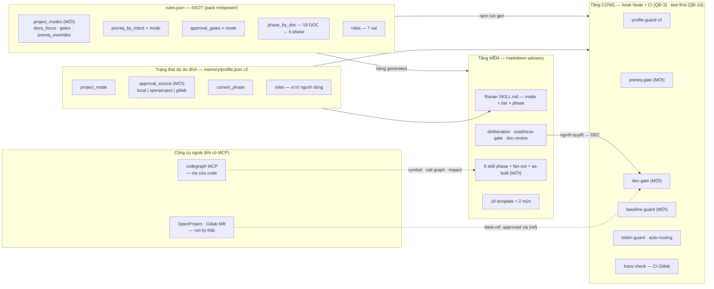
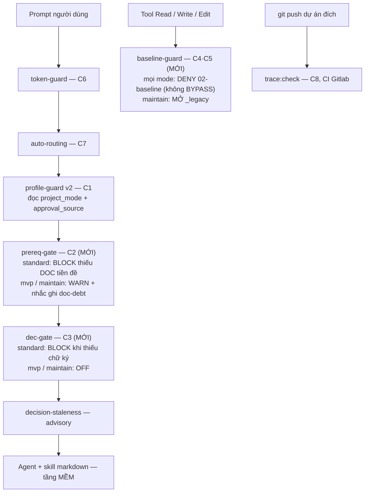
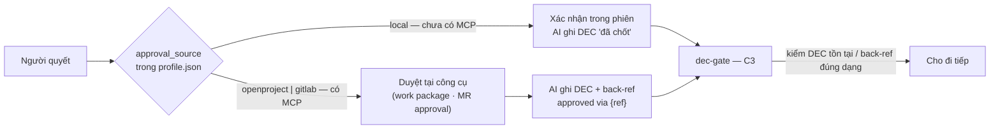

# Minipower — 3 chế độ dự án, điều kiện cứng bằng hook

| | |
|---|---|
| **Ngày** | 2026-08-20 |
| **Trạng thái** | ⚪ **Todo** — định hướng đã chốt (§0), **chưa** chạm code. Còn §9 |
| **Phạm vi** | Toàn `minipower/` — **giữ kiến trúc pipeline hiện tại** (6 phase / 19 DOC / phân tầng / rules-as-data / **một cấu trúc folder duy nhất**), thêm chiều thứ hai **`project_mode`** (3 chế độ) chỉ chi phối *nội dung nào được điền* và *gate nào bật*, và chuyển nguyên tắc cưỡng chế sang **"cứng bằng máy, mềm bằng lời"** |
| **Nối tiếp** | **Huỷ** [ADR-019](ADR-019-2026-08-20-minipower-harness-khong-gate.md) (kế thừa QĐ-5 advisory · QĐ-6 `trace:check` · §3 ánh xạ vai→công cụ) · khôi phục một phần tinh thần [ADR-003](ADR-003-2026-07-20-minipower-gated-fanout-execution.md) — DEC-cổng trước fan-out trở lại **cho riêng mode `standard`, bằng hook thay vì câu chữ** · khôi phục **back-ref "approved via {ref}"** của [ADR-018](ADR-018-2026-08-20-minipower-phe-duyet-openproject-publish-outline.md) làm nền cho QĐ-9 · khôi phục **test-first** ([ADR-014](ADR-014-2026-07-28-minipower-spine-tong-hop-wrap-not-build.md) P2) cho riêng tầng hook (QĐ-10) · **giữ** ADR-014 (wrap-not-build) · [ADR-008](ADR-008-2026-07-25-minipower-proposal-suite.md) · [ADR-016](ADR-016-2026-08-02-minipower-discovery-tom-tat-tai-lieu-lon.md) |
| **Mục đích** | Một bộ minipower phục vụ được 3 tình huống thật: **MVP** (chạy được, tài liệu cơ bản) · **Chuẩn chỉnh** (sản phẩm mới / outsource, tài liệu đầy đủ) · **Maintain legacy** (tài liệu cũ rời rạc, vào code trước) — **không phân mảnh cấu trúc**, và mọi điều kiện cứng còn lại phải là **code kiểm được**, không phải markdown nhờ agent tự giác |
| **Ảnh hưởng** | [AGENTS.md](../AGENTS.md) §0 + mục gatekeeper (diễn đạt lại theo mode) · [rules.json](../minipower/hooks/lib/rules.json) (+`project_modes`, `prereq_by_intent`×mode, `approval_gates`×mode) · [minipower/SKILL.md](../minipower/SKILL.md) (init câu 6–7, bảng mode×tier, trigger `as-built`) · `hooks/lib` + `hooks/bin` (3 hook mới, 2 hook nâng cấp, **test viết trước** — QĐ-10) · 3 skill gate + [fan-out](../minipower/skills/fan-out/SKILL.md) + [change-control](../minipower/skills/change-control/SKILL.md) · skill **mới** `as-built` (wrap **codegraph** — QĐ-6) · [templates/](../minipower/templates/) (nhãn 2 mức) · [project-skeleton](../minipower/project-skeleton/) (+`assets/archive/`, +`memory/doc-debt.md`) · `install/*` (**bỏ** `permissions.deny` tĩnh) · [COORDINATION.md](../COORDINATION.md) H1–H6 |

---

## §0. Quyết định

| # | Nội dung |
|---|---|
| **QĐ-1** | **Giữ kiến trúc, thêm chiều `project_mode`.** Pipeline 6 phase / 19 DOC / phân tầng micro-light-full / rules-as-data giữ nguyên. Thêm thuộc tính **per-project** `project_mode ∈ {mvp, standard, maintain}` — sống ở `memory/profile.json` (schema **v2**), hỏi ở **câu 6** của init, đổi mode là sự kiện có nghi thức (QĐ-7) |
| **QĐ-2** | **MỘT cấu trúc folder cho cả 3 mode — mode chỉ đổi *nội dung được điền*, không đổi *khung*.** Init luôn copy đủ `docs/` 7 folder + `memory/` 6 folder ở **mọi** mode; folder chưa dùng thì **rỗng có README nêu lý do**, không bị cắt. Lý do: (a) **tương thích ngược** với dự án đã cài bản cũ; (b) `mvp` và `maintain` **rồi sẽ phải bổ sung đủ tài liệu** — cắt folder hôm nay là tạo việc di trú ngày mai; (c) một khung = một exit checklist = một bộ test, không phân mảnh. `project_modes` vì thế khai **`docs_focus`** (DOC nào cần điền ở mode này) chứ **không** khai `skeleton_skip` |
| **QĐ-3** | **"Cứng bằng máy, mềm bằng lời."** Mọi điều kiện CỨNG phải được cưỡng chế bằng **code** (hook Node hoặc CI) đọc `rules.json` + `profile.json`; markdown chỉ mô tả hành vi **advisory** + tri thức. Điều kiện cứng chỉ gồm thứ **máy kiểm được**: tồn tại file DOC, trạng thái DEC, đường dẫn, ID. Phán đoán ngữ nghĩa (5 chiều doc-review, verdict deliberation, "đủ tạm") **vĩnh viễn advisory** — người quyết; quyết định vật chất hoá thành **DEC** để máy kiểm sự tồn tại (C3, §4). **BYPASS** là đường thoát có chủ đích ở mọi block trừ baseline-guard |
| **QĐ-4** | **Bộ hook:** 3 hook **MỚI** (`prereq-gate`, `dec-gate`, `baseline-guard`) + `profile-guard` v2 (`baseline-guard` thay `token-guard-read`). **Bỏ `permissions.deny` tĩnh** khỏi `install/*` — dồn toàn bộ cưỡng chế về hook (một SSOT cưỡng chế; hết lệch giữa kênh plugin và kênh settings). Tái dùng hạ tầng sẵn có: `matchIntents` ([lib/rules.js](../minipower/hooks/lib/rules.js) — hiện chưa ai gọi) và `parseEntries` ([decision-staleness](../minipower/hooks/lib/decision-staleness.js)) |
| **QĐ-5** | **`trace:check` + CI** (kế thừa nguyên vẹn ADR-019 QĐ-6): script Node thuần trong `hooks/`, golden test, chạy trong CI Gitlab dự án đích. **Fail** khi ID trỏ sai / trùng · **warn** khi FR thiếu AC hoặc AC thiếu Test. Mode `mvp`/`maintain` chỉ kiểm ID trong tài liệu **đang có** — không phạt vì tài liệu chưa viết |
| **QĐ-6** | **Mode `maintain` có đường brownfield — skill `as-built` (người trigger, wrap công cụ).** *As-built* = **bản vẽ hoàn công**: tài liệu mô tả hệ thống **đã xây**, ngược chiều tài liệu đặc tả cái **sắp xây**. Skill này **wrap [codegraph](https://github.com/colbymchenry/codegraph)** (tree-sitter → SQLite FTS5, 40+ ngôn ngữ, có sẵn **MCP server** + CLI, chạy local) làm tầng tra cứu cấu trúc code — đúng **wrap-not-build** (ADR-014), và giảm token đúng tinh thần `token-guard`. Codegraph **không thay được** `as-built`: nó trả *cấu trúc* (symbol, call graph, impact), skill trả *tài liệu có ID trace được, có người xác nhận* (business rule, quyết định, runbook). **Optional dependency:** không có codegraph → skill degrade về Read/Grep, không hỏng |
| **QĐ-7** | **Chuyển mode là luồng có nghi thức** qua `change-control`: `mvp → standard` = trả nợ theo sổ **`memory/doc-debt.md`** (backfill BR/UC/SRS từ artifact MVP) + chốt baseline đầu tiên; `maintain → standard` = as-built đủ `docs_focus` rồi chốt baseline. Mọi lần đổi `project_mode` phải kèm DEC — chặn "tự nhận mvp để né gate" (R3) |
| **QĐ-8** | **Huỷ ADR-019.** Khác cốt lõi: ADR-019 bỏ mọi gate + bỏ phân tầng; ADR-020 **giữ cả hai** nhưng tham-số-hoá theo mode, và chuyển phần "cứng" từ câu chữ sang code |
| **QĐ-9** | **Phê duyệt: local trước, MCP sau — cùng một hợp đồng.** Thêm `approval_source ∈ {local, openproject, gitlab}` vào `profile.json` v2 (hỏi ở **câu 7** init, đổi được bất cứ lúc nào). **`local`** (chưa có MCP): người xác nhận trong phiên, AI ghi DEC "đã chốt" → `dec-gate` kiểm DEC. **`external`** (`openproject`/`gitlab`): minipower **không hỏi confirm nữa** — phê duyệt sống ở công cụ; AI ghi DEC kèm **back-ref `approved via {ref}`** (kế thừa ADR-018) → `dec-gate` kiểm **back-ref có mặt và đúng dạng**, không tự phán duyệt/chưa duyệt. **DEC tồn tại ở cả hai chế độ** (bản ghi local + đầu vào `trace:check`); chỉ *nguồn chân lý của chữ ký* dời ra ngoài. Bật MCP = đổi một trường, không phải viết lại skill (§4d) |
| **QĐ-10** | **Test trước, hook sau — không ngoại lệ.** Mọi thay đổi ở `hooks/lib` + `hooks/bin` phải: (1) viết test **đỏ** mô tả hành vi đúng cho **cả 3 mode** trước; (2) mới viết/sửa hook cho xanh; (3) `npm run gen && npm test && npm run gen:check` cả ba xanh. Hook là tầng duy nhất **chặn được việc của người dùng** — sai một nhánh là chặn oan hoặc thủng gate, nên nó chịu kỷ luật cao nhất repo (khôi phục *test-first* của ADR-014 P2 cho riêng tầng này) |

---

## §1. Ba chế độ — nhìn một bảng

| | **`mvp`** | **`standard`** | **`maintain`** |
|---|---|---|---|
| Tình huống | Chỉ cần chạy được, tài liệu cơ bản | Sản phẩm mới / outsource; hoặc MVP "lên đời" | Sản phẩm chạy nhiều năm, tài liệu cũ rời rạc |
| Điểm vào | Discovery **rút gọn** (DOC-03 lõi) | Discovery đầy đủ (như hiện tại) | **`as-built`** — người trigger, wrap codegraph (QĐ-6) |
| **Cấu trúc folder** | **Đủ 7 folder `docs/` + 6 folder `memory/`** | **Y hệt** | **Y hệt** |
| `docs_focus` — DOC cần điền | 01 (lõi) · **03** · 06 (mục 3 FR) · 07 · 09 · 17 (rút) | Đủ 19 DOC | 04 (rule khai quật) · 08 · 09 · 10 · 11 · 12 · 17 · 18 |
| DOC còn lại | Folder **có sẵn, rỗng** — nợ ghi `doc-debt.md` | — | Folder **có sẵn, rỗng** — điền dần theo vùng chạm |
| Baseline | Chưa chốt (`02-baseline/` rỗng) | `docs/02-baseline/vX.Y/` | Chưa chốt → chốt khi as-built đủ (QĐ-7) |
| Tài liệu cũ / rời rạc | — | — | **`assets/archive/`** — nguồn tham chiếu, không phải artifact |
| Gate cứng (hook) | prereq **warn** · dec **off** | prereq **block** · dec **block** | prereq **warn** (bộ riêng) · dec **off** · `_legacy` mở |
| Gate mềm (markdown) | doc-review rút chiều · deliberation gọi khi cần | Đủ 5 chiều, ≥3 góc nhìn | doc-review "vùng chạm" · Blocker = chặn merge |
| Lối ra | → `standard` qua backfill (QĐ-7) | Bàn giao / vận hành | → `standard` khi as-built đủ |

**ID ổn định (`{MOD}-FR-`, `DEC-`, `ADR-`) dùng từ ngày đầu ở CẢ 3 mode** — rẻ lúc viết, là thứ khiến bước lên `standard` khả thi và `trace:check` có cái để kiểm.

---

## §2. Sơ đồ 1 — Cấu trúc folder

### 2a. Pack `minipower/` (chỉ vẽ phần MỚI / SỬA)

```
minipower/
├── SKILL.md                          SỬA  init câu 6 (mode) + câu 7 (approval_source)
│                                          · bảng mode × tier · trigger as-built
├── hooks/
│   ├── hooks.json                    (generated) 6 hook UserPromptSubmit + 1 PreToolUse
│   ├── test/                         ⚠ VIẾT TRƯỚC (QĐ-10) — mọi hành vi × 3 mode
│   │   ├── prereq-gate.test.js       MỚI  đỏ trước, hook sau
│   │   ├── dec-gate.test.js          MỚI  gồm nhánh approval_source local | external
│   │   ├── baseline-guard.test.js    MỚI
│   │   ├── project-mode.test.js      MỚI  fail-open khi thiếu profile.json (R2)
│   │   └── rules.test.js · bin.test.js · plugin-hooks.test.js   SỬA  per-mode (R1)
│   ├── bin/
│   │   ├── prereq-gate.js            MỚI  shim UserPromptSubmit
│   │   ├── dec-gate.js               MỚI  shim UserPromptSubmit
│   │   └── baseline-guard.js         MỚI  shim PreToolUse Read|Write|Edit
│   └── lib/
│       ├── rules.json                SỬA  + project_modes (docs_focus, KHÔNG skeleton_skip)
│       ├── project-mode.js           MỚI  đọc project_mode + approval_source (dùng chung)
│       ├── prereq-gate.js            MỚI  tái dùng matchIntents (rules.js)
│       ├── dec-gate.js               MỚI  tái dùng parseEntries · quét memory/*/decision-log.md
│       ├── baseline-guard.js         MỚI  thay token-guard-read + permissions.deny tĩnh
│       ├── profile-guard.js          SỬA  schema v2 (+ project_mode, + approval_source)
│       └── trace-check.js            MỚI  QĐ-5
├── skills/
│   ├── as-built/SKILL.md             MỚI  người trigger · wrap codegraph (MCP|CLI)
│   │                                      · degrade Read/Grep khi không có
│   ├── readiness-gate/ · doc-review/ · deliberation/   SỬA  hành vi per-mode
│   ├── fan-out/ · change-control/    SỬA  biến thể mode + luồng chuyển mode (QĐ-7)
│   └── ...6 skill phase              GIỮ  (discovery thêm nhánh trỏ as-built)
├── templates/                        SỬA  nhãn 2 mức「lõi ▸ full」DOC-06·08·13·15·16·17
├── docs-skeleton/                    GIỮ NGUYÊN — một cây, copy ĐỦ ở mọi mode (QĐ-2)
├── project-skeleton/                 SỬA  + assets/archive/ · + memory/doc-debt.md
└── install/{claude,cursor,opencode}/ SỬA  BỎ permissions.deny tĩnh (dồn về baseline-guard)
```

### 2b. Dự án đích — **một cây duy nhất cho cả 3 mode** (QĐ-2, QĐ-4 của người dùng)

Khung giống hệt nhau; **mode chỉ đổi cột "ai điền gì trước"**. Không mode nào bị cắt folder.

```
{project}/                                    ┌──────────── ĐIỀN Ở MODE ────────────┐
├── AGENTS.md · CLAUDE.md · README.md · FAQ.md│  mvp    standard   maintain          │
├── memory/                                   │                                      │
│   ├── profile.json   v2: project_mode + approval_source (QĐ-1, QĐ-9)              │
│   ├── memory.md                             │   ●        ●          ●             │
│   ├── doc-debt.md          MỚI — sổ nợ tài liệu, điều kiện vào luồng lên standard  │
│   └── {6 folder chủ đề}/   discovery · requirements · architecture ·               │
│                            planning · delivery · change-control   (GIỮ — §3c)      │
├── assets/                                   │                                      │
│   ├── public/ · internal/                   │                                      │
│   └── archive/            MỚI — tài liệu cũ, rời rạc, không rõ còn đúng            │
│                           (mode maintain đổ vào đây; nguồn tham chiếu,             │
│                            KHÔNG phải artifact — as-built distill ra docs/)        │
├── brainstorm/                               │                                      │
└── docs/                    ← 7 folder ĐỦ Ở MỌI MODE, folder chưa dùng thì rỗng     │
    ├── 00-governance/       DOC-15 · 18 · doc-versioning · baseline-history         │
    ├── 01-project/          DOC-01 · 02 · 03        │  01,03    tất cả    khi cần   │
    ├── 02-baseline/vX.Y/    READ-ONLY — hook deny mọi mode; rỗng đến khi chốt       │
    ├── 03-modules/{mod}/    DOC-04 · 05 · 06 · 07 · 16 │ 06,07  tất cả  04 + vùng chạm│
    ├── 04-platform/         DOC-08…14 · 17 · 09-adr/  │ 09,17  tất cả  08,10,11,12,17│
    ├── 05-traceability/     trace-matrix · doc-registry · overview                  │
    └── 06-changes/                                                                  │
        ├── CR-xxx/          CR                        │  —      sau BL   đơn vị chính│
        └── incident/        MỚI — chỗ đứng chính thức của TPL-incident · postmortem │
```

**Hệ quả có chủ đích:** khi `mvp` hoặc `maintain` lên `standard`, **không có bước di trú cấu trúc** — chỉ điền tiếp vào folder đã có và chốt baseline. Đó là lý do QĐ-2 chọn không cắt.

---

## §3. Sơ đồ 2 — Thành phần × giai đoạn dự án × vị trí

### 3a. Kiến trúc thành phần: một SSOT, hai tầng, một trạng thái



Mũi tên đặc là chốt của kiến trúc: **skill mềm đưa người đến quyết định; quyết định vật chất hoá thành DEC; hook cứng chỉ kiểm DEC có tồn tại** — máy kiểm chữ ký, người ký. Hai mũi tên **đứt** là phần tuỳ chọn: có MCP thì chữ ký đến từ công cụ ngoài (QĐ-9) và tra cứu code đến từ codegraph (QĐ-6); **không có thì hệ vẫn chạy đủ**.

### 3b. Giai đoạn (phase) × chế độ — *folder luôn có; đây là thứ tự ưu tiên điền*

| Phase | `standard` | `mvp` | `maintain` |
|---|---|---|---|
| discovery | ✅ Full (deliberation + verdict) | 🔽 DOC-03 lõi + DOC-01 rút | 🔍 `as-built` khảo sát → điền ngược DOC-01/03 khi cần |
| requirements | ✅ BR → UC → Prototype → SRS → AC | 🔽 FR catalog + AC | 🔍 vùng chạm — DOC-04 khai quật, FR/AC cho thay đổi mới |
| architecture | ✅ SAD đủ 4+1 view | 🔽 ADR + ERD tối thiểu | 🔍 as-built (08/10/11/12) + ADR cho quyết định mới |
| planning | ✅ WBS + SPMP | 🔽 milestone | ➖ theo CR |
| delivery | ✅ | ✅ DOC-17 rút | ✅ **runbook = giá trị cao nhất** |
| change-control | ✅ sau baseline | 🔽 chưa baseline — đổi tự do + ghi `doc-debt.md` | ✅ **CR = đơn vị công việc chính** |

### 3c. `memory/` có cần cấu trúc lại không? — **Không** *(trả lời câu hỏi #2, đóng Q2 cũ)*

Sáu folder `memory/` **không phải trình tự, mà là chủ đề** — chính `memory.md` gọi chúng là "Memory theo chủ đề". Làm song song **không** đòi phẳng hoá; nó đòi **một-owner-một-vùng-ghi**, và folder theo chủ đề cho đúng điều đó: BA ghi `requirements/`, SA ghi `architecture/` cùng lúc, không tranh file. Phẳng hoá thành một sổ chung sẽ **tăng** xung đột ghi khi fan-out — đi ngược [parallel-work.md](../minipower/docs/parallel-work.md).

Vậy giữ nguyên 6 folder, chỉ thêm **hai thứ**, đều ở cấp gốc `memory/` vì chúng **cắt ngang mọi phase**:

| Thêm | Vì sao ở cấp gốc |
|---|---|
| `memory/doc-debt.md` | Nợ tài liệu của `mvp`/`maintain` không thuộc phase nào — nó là *bản đồ đường lên `standard`* (QĐ-7) |
| `dec-gate` **quét toàn bộ** `memory/*/decision-log.md` | Không tạo sổ DEC phẳng thứ hai — đó sẽ là bản sao và sẽ drift ([ADR-001](ADR-001-2026-07-17-danh-gia-minipower-va-chien-luoc-phat-trien.md)). Máy quét 6 file rẻ hơn người đồng bộ 2 nguồn |

### 3d. Vị trí (7 vai) × chế độ — mọi vai dùng được mọi mode, khác trọng tâm

| | BA | PM | SA | DEV | QC | DevOps | Support |
|---|---|---|---|---|---|---|---|
| `mvp` | ● FR/AC gọn | ○ milestone | ○ ADR | **●** code sớm | ○ AC-as-test | ○ deploy | — |
| `standard` | **●** chủ lực | **●** chủ lực | **●** chủ lực | ● theo cổng | ● per-FR | ● | ○ |
| `maintain` | ○ khai quật rule | ○ CR | ● as-built | **●** chủ lực | **●** regression | **●** runbook | **●** incident |

---

## §4. Sơ đồ 3 — Điều kiện cứng → hook (QĐ-3, QĐ-4, QĐ-10)

### 4a. Bảng điều kiện cứng — mỗi dòng là CODE có test, không phải câu chữ

| # | Điều kiện cứng | Máy kiểm gì | Hook / CI | `standard` | `mvp` | `maintain` | BYPASS |
|---|---|---|---|---|---|---|---|
| **C1** | `profile.json` v2 hợp lệ trước việc minipower | file + schema (mode, approval_source) | `profile-guard` v2 | block | block | block | có |
| **C2** | Tiền đề DOC trước intent thực thi | tồn tại file DOC theo `prereq_by_intent`×mode | `prereq-gate` **MỚI** | **block** | warn + nhắc ghi `doc-debt` | warn (bộ vùng chạm) | có |
| **C3** | Chữ ký trước fan-out / bước sau cổng | `local`: DEC "đã chốt"<br/>`external`: DEC có **back-ref** đúng dạng | `dec-gate` **MỚI** | **block** | off | off | có |
| **C4** | Không đọc/sửa `docs/02-baseline/` trực tiếp | path + tool | `baseline-guard` **MỚI** (Read\|Write\|Edit) | **deny** | **deny** (folder rỗng) | **deny** | **không** |
| **C5** | `_legacy` | path + mode | `baseline-guard` | deny trừ migrate | deny trừ migrate | **allow** | không |
| **C6** | Không `@` cả thư mục `docs/` (token) | path | `token-guard` | block | block | block | có |
| **C7** | Phase khai ≠ phase của DOC tag | prompt vs DOC | `auto-routing` | block | block | block | có |
| **C8** | Trace ID đúng (UC→FR→AC→Test) | script đối chiếu ID | `trace:check` — **CI Gitlab** | fail sai/trùng · warn thiếu | warn (chỉ DOC đang có) | fail vùng chạm |  |

**Ở lại markdown (advisory vĩnh viễn — không máy-kiểm được):** 5 chiều doc-review, verdict PROCEED/RESHAPE/STOP, phán đoán "đủ tạm", chọn góc nhìn, chất lượng nội dung DOC. Đầu ra của chúng — nếu thành quyết định — ghi DEC và rơi vào C3.

C4 nay **deny ở cả 3 mode** (nhất quán với QĐ-2: folder tồn tại ở mọi mode, rỗng thì deny vô hại) — đơn giản hơn phiên bản trước, và ít nhánh test hơn.

### 4b. Chuỗi hook khi một prompt / một tool call đi qua



### 4c. Phác thảo `project_modes` trong `rules.json` (chốt schema ở §8.1)

```json
"project_modes": {
  "standard": { "label": "Chuẩn chỉnh",
    "docs_focus": "all",
    "gates": { "prereq": "block", "dec": "block", "baseline": "deny", "legacy_read": "deny" } },
  "mvp": { "label": "MVP",
    "docs_focus": ["01", "03", "06", "07", "09", "17"],
    "prereq_overrides": { "implement": ["03", "06", "07"], "deploy": ["17"] },
    "gates": { "prereq": "warn", "dec": "off", "baseline": "deny", "legacy_read": "deny" } },
  "maintain": { "label": "Maintain legacy",
    "docs_focus": ["04", "08", "09", "10", "11", "12", "17", "18"],
    "prereq_overrides": { "implement": [], "test": ["07"], "deploy": ["17"] },
    "gates": { "prereq": "warn", "dec": "off", "baseline": "deny", "legacy_read": "allow" } }
}
```

Không có `skeleton_skip` — **cấu trúc không phụ thuộc mode** (QĐ-2).

### 4d. Đường đi của một chữ ký: `local` hôm nay → MCP ngày mai (QĐ-9)



**Ba tính chất khiến việc bật MCP không phải viết lại gì:**

| | |
|---|---|
| **Hợp đồng không đổi** | Cả hai chế độ đều kết ở **DEC trong `memory/{phase}/decision-log.md`**. `dec-gate` luôn kiểm DEC; chỉ *tiêu chí hợp lệ* đổi (đã-chốt ⇢ có back-ref) |
| **Minipower không tự phán duyệt** | Ở `external`, minipower **không hỏi "anh duyệt chưa?"** — hỏi thế là giả vờ làm nơi ký trong khi nơi ký là OpenProject. Nó chỉ **đọc ref người dán vào** và ghi lại |
| **Bật/tắt = một trường** | Đổi `approval_source` (qua "Cập nhật profile"), không đụng skill/hook. `decision-staleness` nhắc khi `external` mà DEC thiếu back-ref |

Chưa có MCP nào → `local`, hệ chạy đủ. Đây là cùng một nguyên tắc với codegraph ở QĐ-6: **công cụ ngoài là nơi đến, không phải điều kiện** (kế thừa ADR-019 §3).

---

## §5. Cái KHÔNG đổi

| | |
|---|---|
| **§0 `AI = trợ lý · Người quyết cuối`** | Hook block đều có BYPASS (trừ C4) = người mở cổng bằng hành động tường minh; DEC vẫn là chữ ký người |
| **Không skill nào tự hành** | `as-built` **do người trigger**, như mọi skill khác — không hook nào tự gọi nó, không có "agent quét code nền" (§6 R5) |
| **Rules-as-data + golden test + `gen → test → gen:check`** | Mở rộng, không thay. Riêng tầng hook thêm kỷ luật **test-first** (QĐ-10) |
| **Phân tầng micro / light / full** | **Giữ** (khác ADR-019) — tier per-task; mode đặt mặc định và trần cho tier |
| **Một-owner-một-module khi fan-out** | [parallel-work.md](../minipower/docs/parallel-work.md) giữ nguyên — cũng là lý do `memory/` giữ 6 folder chủ đề (§3c) |
| **Wrap-not-build · không nền tảng thứ tư** | [ADR-014](ADR-014-2026-07-28-minipower-spine-tong-hop-wrap-not-build.md) — codegraph được **wrap**, không tự viết parser; và là **optional**, không thành nền tảng bắt buộc |
| **Hành động ra thế giới thật cần người bấm** | Gửi Slack, mở MR, publish Outline — ràng buộc an toàn của harness chạy AI, ngoài phạm vi ADR |

---

## §6. Rủi ro & cách chặn

| # | Rủi ro | Cách chặn |
|---|---|---|
| **R1** | **Golden test vỡ hàng loạt** — test hiện mã hoá pipeline nghiêm thành assert cứng (`implement` PHẢI requires DOC-19, gate prototype approve='19', `approval_gates ≥5`, plugin đúng 5 hook) | Viết lại test **per-mode ngay bước 1** (§8): assert theo `project_modes.standard` giữ nguyên giá trị cũ, thêm assert cho `mvp`/`maintain`; số hook plugin 5 → 7 |
| **R2** | **Hook không tìm thấy `profile.json`** — resolve root qua `MP_PROJECT_ROOT \|\| cwd`, chưa có bảo đảm cwd là root dự án đích | `project-mode.js` **fail-open**: không đọc được → coi như `standard` **chỉ WARN**, không block; test riêng cho nhánh này (QĐ-10) + smoke 3 nền tảng |
| **R3** | **Mode-drift** — tự khai `mvp` để né gate, hoặc quên rời `maintain` khi tài liệu đã đủ | Đổi mode phải kèm DEC (QĐ-7); `decision-staleness` nhắc khi `mvp` sống quá lâu (số CR/commit vượt ngưỡng) |
| **R4** | **`mvp`/`maintain` thành vùng vô luật** — folder có sẵn nhưng rỗng mãi | `doc-debt.md` là **điều kiện vào** luồng lên `standard`; `trace:check` vẫn chạy CI mỗi lần push để nợ hiện hình; README trong folder rỗng ghi rõ "chưa điền vì mode X" |
| **R5** | **`as-built` bị hiểu thành agent tự khảo cổ** — quét code nền, tự sinh DOC hàng loạt | **Chỉ là skill, người trigger khi cần** (QĐ-6, §5) — không hook nào tự gọi, không chạy nền, không batch cả repo. Mỗi lần chạy: **một vùng chạm**, đầu ra là **nháp + câu hỏi**, người xác nhận mới thành DOC; rule khai quật phải trỏ file/line làm bằng chứng |
| **R6** | **Phụ thuộc codegraph** — dự án chưa index / Node < 22.5 / không cài | Optional (QĐ-6): skill kiểm khả dụng, không có thì degrade Read/Grep. **Không** hook nào require codegraph — nó không được vào tầng cứng |
| **R7** | **`external` nhưng back-ref bịa** — dán ref không tồn tại | `dec-gate` chỉ kiểm **dạng**, không kiểm thật (không gọi mạng trong hook). Kiểm thật là việc của CI/MCP; ghi rõ giới hạn này để không ảo tưởng an toàn |
| **R8** | **Trượt lại Prompt Library** (R1 của ADR-019) | ADR này **tăng** phần máy: 3 hook mới + trace:check + schema v2, tất cả test-first. Phép thử: *"cái gì FAIL được bằng máy khi người dùng làm sai?"* — §4a phải không rỗng ở mọi mode |

---

## §7. ADR bị huỷ & phần kế thừa

| ADR | Kế thừa vào ADR này |
|---|---|
| [ADR-019](ADR-019-2026-08-20-minipower-harness-khong-gate.md) | QĐ-5 kháng thể advisory → hành vi gate của `mvp`/`maintain` · QĐ-6 `trace:check` + CI Gitlab (→ QĐ-5 ADR này) · §3 ánh xạ vai→công cụ + "công cụ ngoài là nơi đến, không phải điều kiện" (→ QĐ-9) · §2 phân biệt 6 loại gate |
| [ADR-018](ADR-018-2026-08-20-minipower-phe-duyet-openproject-publish-outline.md) *(Cancel — kế thừa gián tiếp)* | **Back-ref `approved via {ref}`** + mô hình 3 mặt phẳng → thành cơ chế `approval_source = external` (QĐ-9, §4d) |
| [ADR-014](ADR-014-2026-07-28-minipower-spine-tong-hop-wrap-not-build.md) *(còn hiệu lực)* | **wrap-not-build** → wrap codegraph (QĐ-6) · **P2 test-first** → khôi phục cho riêng tầng hook (QĐ-10) |
| [ADR-003](ADR-003-2026-07-20-minipower-gated-fanout-execution.md) *(Cancel — kế thừa gián tiếp)* | DEC-cổng trước fan-out **trở lại cho riêng `standard`** — bằng hook `dec-gate` (C3), không phải câu chữ |

---

## §8. Việc triển khai — **test trước, code sau** (QĐ-10)

| # | Việc | Xác minh |
|---|---|---|
| 1 | `rules.json`: + `project_modes` (`docs_focus`, **không** `skeleton_skip`), `prereq_by_intent`×mode · schema `profile.json` v2 (`project_mode` + `approval_source`) · **viết lại golden test per-mode (R1)** | `npm run gen && npm test && npm run gen:check` xanh |
| 2 | **Viết test ĐỎ** cho `project-mode` (gồm fail-open R2), `prereq-gate`, `dec-gate` (cả 2 nhánh `local`/`external`), `baseline-guard` — đủ 3 mode | Test chạy, **đỏ đúng chỗ**, chưa có hook |
| 3 | Viết hook cho **xanh**: `project-mode.js` · `prereq-gate` · `dec-gate` · `baseline-guard` · `profile-guard` v2 · cập nhật `hooks.json`/fragment (5 → 7) | Toàn bộ test bước 2 xanh + `gen:check`; smoke 3 nền tảng |
| 4 | **Bỏ `permissions.deny` tĩnh** khỏi `install/*` (dồn về `baseline-guard`) | Cài thử: kênh plugin và kênh settings cho **cùng** hành vi |
| 5 | Router [SKILL.md](../minipower/SKILL.md): câu 6 (mode) + câu 7 (approval_source), bảng mode×tier, **init luôn copy đủ khung** ở mọi mode, luồng init-vào-repo-có-sẵn, trigger `as-built` | Init thử 3 mode → **ra cùng một cây** §2b, khác `doc-debt`/`archive` |
| 6 | `project-skeleton`: + `assets/archive/` + `memory/doc-debt.md` + README cho folder rỗng ("chưa điền vì mode X") | Exit checklist init vẫn một bộ, không rẽ nhánh |
| 7 | 3 skill gate + `fan-out`: hành vi per-mode đọc từ vùng generated (không lặp định nghĩa mode trong từng file) | Không skill nào còn chữ "bắt buộc" thiếu hook/CI đằng sau |
| 8 | Templates: nhãn 2 mức「lõi ▸ full」DOC-06·08·13·15·16·17 · sửa 2 lỗi sẵn có (chỗ đứng DOC-19, TPL-agent-profile vào README) | Đọc lại: mọi mục rõ thuộc mức nào |
| 9 | Skill **`as-built`** (người trigger · wrap codegraph MCP\|CLI · degrade Read/Grep) + `docs/06-changes/incident/` | Chạy thử trên 1 repo legacy thật, **có và không có** codegraph |
| 10 | `change-control`: luồng chuyển mode (QĐ-7) + format `doc-debt.md` | `mvp → standard` thử: nợ → backfill → baseline v1.0, **không di trú folder** |
| 11 | `trace:check` + template `.gitlab-ci.yml` trong [project-skeleton](../minipower/project-skeleton/) | Fail/warn đúng §4a C8 |
| 12 | [AGENTS.md](../AGENTS.md) §0 + [COORDINATION.md](../COORDINATION.md) H1–H6 · README use-case cho `mvp`/`maintain` | Đọc lại: không câu nào hứa "chặn" mà thiếu hook |

---

## §9. Câu hỏi mở

| # | Câu hỏi | Đề xuất |
|---|---|---|
| **Q1** | `prereq-gate` mode `standard`: block thẳng hay block-kèm-confirm? | Block + BYPASS (người gõ BYPASS = quyết định tường minh) |
| **Q2** | Format DEC máy-đọc cho `dec-gate` ở **cả hai** nhánh: marker "đã chốt" (local) và dạng back-ref (external) là gì? | Chốt ở bước 2 §8 **trước khi viết hook**, kèm test cho parser — đây là hợp đồng chung của QĐ-9 |
| **Q3** | `approval_source` là **một** trường cho cả dự án, hay tách theo loại (tài liệu → Outline, công việc → OpenProject, code → Gitlab MR)? | Bắt đầu bằng một trường; tách khi có MCP thật và thấy cần — tránh thiết kế trước nhu cầu |
| **Q4** | codegraph index sống ở đâu với repo dự án đích (gitignore? CI cache?) | Local + gitignore; xác minh ở bước 9 §8 |
| **Q5** | `maintain`: tài liệu cũ vào `assets/archive/` — có cần quy ước đặt tên / chỉ mục không? | Một `archive/README.md` liệt kê nguồn + độ tin cậy ("còn đúng / nghi ngờ / đã lỗi thời") — as-built dùng cột đó để ưu tiên |
| **Q6** | `standard` có bắt buộc đi qua `mvp` trước không? | Không — outsource mới vào thẳng `standard`; `mvp` là lựa chọn, không phải chặng |

---

## §10. Tham chiếu

- [ADR-019](ADR-019-2026-08-20-minipower-harness-khong-gate.md) — bị huỷ bởi ADR này; §2 (phân loại gate) và §3 (vai→công cụ) còn giá trị tham chiếu
- [ADR-014](ADR-014-2026-07-28-minipower-spine-tong-hop-wrap-not-build.md) — wrap-not-build (nền của QĐ-6) và P2 test-first (nền của QĐ-10)
- [ADR-002](ADR-002-2026-07-20-dinh-huong-minipower-ai-ho-tro-ra-quyet-dinh.md) — định vị *AI Project Intelligence*; phép thử R8 kế thừa cảnh báo Prompt Library
- [ADR-001](ADR-001-2026-07-17-danh-gia-minipower-va-chien-luoc-phat-trien.md) — "không test → drift" — lý do QĐ-3 đòi điều kiện cứng phải fail được bằng máy, và lý do §3c từ chối tạo sổ DEC thứ hai
- [codegraph](https://github.com/colbymchenry/codegraph) — knowledge graph code (Rust tree-sitter → SQLite FTS5, 40+ ngôn ngữ, MCP + CLI, local, auto-sync theo file watcher). Dùng như **tầng tra cứu tuỳ chọn** của `as-built`
- Khảo sát nền (2026-08-20, fan-out 6 reader): 3 gate triết lý + 7 approval gate **chưa bao giờ chặn cứng** (chỉ câu chữ); chặn cứng thật là 4 hook token/routing/onboarding; `prereq_by_intent`/`approval_gates` không được enforce runtime — tiền đề trực tiếp của QĐ-3
