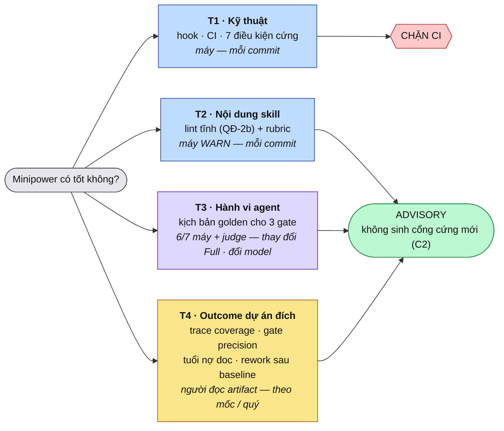
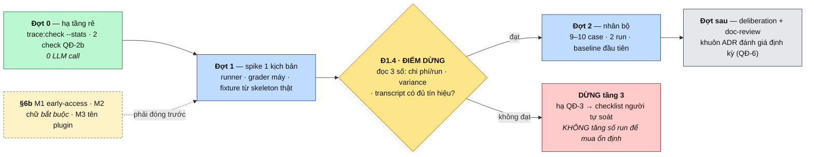
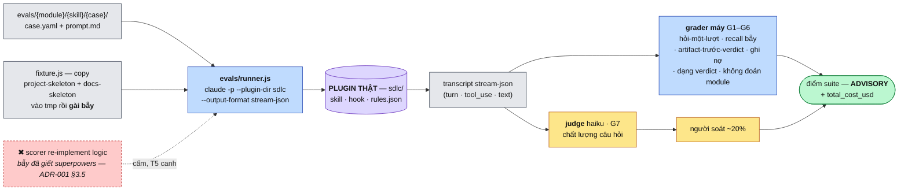

# Phương pháp đánh giá chất lượng Minipower — khung 4 tầng + eval hành vi cho 3 gate

| | |
|---|---|
| **Ngày** | 2026-08-27 |
| **Trạng thái** | chốt 2026-08-29 (§6) — đang triển khai Đợt 0 |
| **Phạm vi** | Định nghĩa *phương pháp luận đánh giá chất lượng* của toàn bộ minipower (sdlc · backend · ops · hooks · contracts) — cái gì đo, đo bằng gì, nhịp nào. Đợt triển khai đầu chỉ đụng `evals/` (**mới, ở gốc repo** — Q5) + `sdlc/hooks/` (advisory check mới) |
| **Ngoài phạm vi** | Đánh giá *một lần* hiện trạng (đã có tiền lệ ADR-001); xây hạ tầng eval ngoài repo (dashboard, DB metric — trái ADR-022 QĐ-12); eval cho dự án đích cụ thể |
| **Nối tiếp** | [ADR-001](ADR-001-2026-07-17-danh-gia-minipower-va-chien-luoc-phat-trien.md) (tiền lệ đánh giá + bài học §3.5) · [ADR-020](ADR-020-2026-08-20-minipower-3-che-do-du-an-gate-bang-hook.md) (QĐ-11 gate mềm, "cứng bằng máy mềm bằng lời") · [ADR-022](ADR-022-2026-08-24-minipower-nen-tang-cong-cu-ai-toan-cong-ty.md) (QĐ-1 model là engine thay được) |
| **Mục đích** | Biến "minipower có tốt không?" từ câu hỏi cảm tính / đánh giá one-off thành quy trình đo lặp lại được, đúng triết lý repo |
| **Ảnh hưởng** | `evals/` (**mới — tầng gốc**, ngang `contracts/` · `ADRs/`; kịch bản golden + rubric cho **mọi** module) · `sdlc/hooks/` (QĐ-2b: check advisory độ dài SKILL / chữ "bắt buộc") · `AGENTS.md` §thư mục · `ADRs/` (khuôn ADR đánh giá định kỳ) |

---

## §1. Bối cảnh

Hiện trạng năng lực kiểm định của repo (đối chiếu 2026-08-27):

- **Đã mạnh ở tầng máy:** 23 test file trong `sdlc/hooks/test/`, 432 test; 4 gate CI (`gen:check` · `trace:check` · `link:check` · install-parity); cả 7 điều kiện cứng đều có test canh.
- **Đã có tiền lệ đánh giá:** ADR-001 là một lần đánh giá toàn diện (so với superpowers-optimized) — nhưng là **one-off**, không có khung lặp lại; và chủ yếu đánh giá *cấu trúc*, không đánh giá *hành vi agent khi chạy skill*.
- **Chưa có gì đo tầng giá trị lõi:** toàn bộ giá trị của minipower tập trung ở 3 gate (deliberation · readiness-gate · doc-review) và kỷ luật quy trình — nhưng chưa có bất kỳ cơ chế nào kiểm *agent thật có làm đúng như skill dạy không* (có hỏi trọn gói một lượt không, có nhảy giải pháp sớm không, verdict có ra trước artifact không).
- **Bài học định hình (ADR-001 §3.5):** superpowers chết vì eval script **re-implement** logic production rồi hai bản lệch nhau — họ tune keyword chống lại một scorer không phải thứ đang chạy. Repo này đã né đúng bẫy đó ở tầng hook (test `import` hàm production); phương pháp đánh giá mới phải giữ nguyên luật ấy ở mọi tầng.
- **Công cụ sẵn có:** Claude Code có `claude plugin eval` (eval suite cho plugin, chạy sandbox, có report JSON, chạy được CI) — repo đã là plugin (`minipower-sdlc`, ADR-011 🟢).

## §2. Vấn đề

| # | Vấn đề | Hệ quả |
|---|---|---|
| P1 | Không có định nghĩa "chất lượng minipower" đo được — mỗi lần hỏi lại đánh giá cảm tính từ đầu | Không biết một thay đổi (sửa SKILL, đổi rules.json, đổi model) làm pack tốt lên hay tệ đi |
| P2 | Giá trị lõi (3 gate, kỷ luật quy trình) hoàn toàn không được đo — chỉ tầng hook có test | Sửa SKILL.md của gate là "bay mù": regression ngữ nghĩa không ai phát hiện cho đến khi dự án đích trả giá |
| P3 | Định vị "model là engine thay được" (ADR-022 QĐ-1) chưa có bằng chứng | Đổi model = rủi ro không định lượng được; tuyên bố model-agnostic chỉ là lời nói |
| P4 | Không có tín hiệu ngược từ dự án đích (gate có bắt được lỗi thật không, nợ doc có được trả không) | Quy trình có thể "đẹp trên giấy" mà không ai biết |

## §3. Ràng buộc

| # | Ràng buộc |
|---|---|
| C1 | **"Cứng bằng máy, mềm bằng lời"** (ADR-020) áp cho chính việc đánh giá: chỉ máy-chấm cái máy kiểm được không cần phán đoán; tiêu chí ngữ nghĩa → rubric cho người/LLM-judge, kết quả là **advisory**, không thành điều kiện chặn CI |
| C2 | Gate mềm (ADR-020 QĐ-11) không mở lại — eval đo *chất lượng* gate, không biến kết quả eval thành gate cứng mới |
| C3 | **Eval phải chạy chính artifact production** (bài học ADR-001 §3.5): import hàm thật, load skill thật, chạy plugin thật — cấm mọi scorer re-implement logic |
| C4 | Không xây hạ tầng ngoài repo (ADR-022 QĐ-12): metric tầng outcome sinh từ artifact có sẵn của dự án đích (`trace:check`, `doc-debt.md`, DEC), không dựng dashboard/DB |
| C5 | Chi phí tương xứng (phân tầng micro/light/full): eval hành vi tốn LLM call — không chạy mỗi commit |

## §4. Phương án

| # | Phương án | Ưu | Nhược | |
|---|---|---|---|---|
| O1 | Đánh giá định kỳ thủ công (lặp lại kiểu ADR-001 mỗi quý) | Không tốn hạ tầng | Cảm tính, không so sánh được giữa hai lần, không bắt regression theo commit | ❌ |
| O2 | Máy-hoá tối đa: đưa mọi tiêu chí vào CI chặn | Khách quan bề ngoài | Trái C1 — ép tiêu chí ngữ nghĩa thành số là giả khách quan; lặp lại sai lầm "gate cứng trên verdict" mà QĐ-11 đã bỏ | ❌ |
| O3 | **Khung 4 tầng**: tầng nào máy kiểm được thì CI, tầng ngữ nghĩa thì golden scenario + rubric (advisory), tầng outcome thì đo từ artifact dự án đích, tổng hợp theo nhịp thành ADR đánh giá | Đúng triết lý repo, mỗi loại chất lượng có thước đo đúng bản chất | Nhiều mảnh, cần kỷ luật nhịp; tầng 3 tốn LLM call | ✅ chọn |

## §5. Quyết định

| # | Quyết định | Chi tiết |
|---|---|---|
| QĐ-1 | **Khung 4 tầng** là định nghĩa chính thức của "chất lượng minipower" | **T1 Kỹ thuật** (máy, mỗi commit) · **T2 Nội dung skill** (lint tĩnh + rubric) · **T3 Hành vi agent** (golden scenario, theo thay đổi Full + đổi model) · **T4 Outcome dự án đích** (từ artifact, theo mốc). Chi tiết từng tầng: QĐ-2…QĐ-5 |
| QĐ-2 | **Tầng 1 — duy trì, không mở rộng**: mọi điều kiện cứng mới phải kèm test trong cùng commit (đã là thực hành, nay thành luật) | Metric: CI xanh + tỉ lệ điều kiện cứng có test canh = 100%. **QĐ-2b (tuỳ chọn, Q3):** thêm 2 check *advisory* vào `npm run gen:check` hoặc script riêng: (a) SKILL.md > 150 dòng → WARN (giữ lợi thế kỷ luật token, ADR-001 §1.4); (b) chữ "bắt buộc" trong markdown không kèm tham chiếu check máy → WARN (phép thử QĐ-3 ADR-020 tự động hoá một nửa) |
| QĐ-3 | **Tầng 3 — bộ kịch bản golden cho 3 gate**, đặt tại **`evals/{module}/{skill}/{case}/`** ở gốc repo (Q5) | Mỗi kịch bản = 3 phần: **(1) fixture** — skeleton dự án giả lập + `profile.json` (đủ 3 mode) + prompt đầu vào; **(2) hành vi kỳ vọng** — checklist quan sát được trên transcript, viết dạng CÓ/KHÔNG (vd readiness-gate: "liệt kê ≥ N thiếu sót đã gài trong MỘT lượt trả lời", "không sinh artifact trước verdict", "thiếu sót được hoãn có ghi vào `doc-debt.md`"); **(3) bẫy** — mỗi kịch bản gài lỗi biết trước để đo recall. Đợt đầu: **readiness-gate làm mẫu** (~6–8 kịch bản × 3 mode), sau đó nhân ra deliberation + doc-review. Chấm: LLM-as-judge theo checklist + **người soát xác suất ~20%**; điểm là advisory (C1, C2) |
| QĐ-4 | **Nhịp chạy tầng 3 theo phân tầng chi phí + theo model** | Chạy khi: (a) thay đổi **Full** đụng SKILL.md của gate / router / `rules.json` routing; (b) **đổi model engine** — chạy toàn bộ suite, kết quả là bằng chứng cho tuyên bố model-agnostic (P3); (c) trước khi tag release plugin. KHÔNG chạy cho micro/light (C5). Harness: ưu tiên `claude plugin eval` (đã có sandbox + report + CI); nếu thực nghiệm cho thấy không khớp (Q2) thì rơi về harness `node --test` tự viết gọi `claude -p` — nhưng luôn chạy plugin thật (C3) |
| QĐ-5 | **Tầng 4 — 4 metric outcome, sinh từ artifact dự án đích, không hạ tầng mới** (C4) | (1) **Trace coverage**: % FR có AC, % chuỗi UC→FR→AC→Test nối thông — nâng `trace:check` từ pass/fail thành in số liệu (thêm `--stats`, không đổi hành vi exit code); (2) **Gate precision**: tỉ lệ finding doc-review được người review chấp nhận / tỉ lệ verdict RESHAPE·STOP thật sự đổi hướng (đếm tay từ DEC — nếu 100% PROCEED thì gate đang là hình thức); (3) **Tuổi nợ doc**: tuổi trung bình mục mở trong `doc-debt.md` / `open-questions.md`; (4) **Rework sau baseline**: số CR mở vì thiếu sót lẽ ra gate phải bắt. Tổng hợp khi dự án đích qua mốc baseline hoặc theo quý |
| QĐ-6 | **Kết quả đánh giá định kỳ ghi thành ADR** — biến tiền lệ ADR-001 từ one-off thành nhịp | Mỗi kỳ (quý, hoặc sau mốc baseline đầu tiên của một dự án đích dùng minipower): một ADR ngắn ghi số liệu 4 tầng + kết luận + việc rút ra. So sánh được giữa hai kỳ vì cùng khung QĐ-1 |

**Sơ đồ — khung 4 tầng: mỗi loại chất lượng một thước đo, một nhịp**

Đọc sơ đồ: **chỉ T1 được chặn**. Ba tầng còn lại là số để người đọc — đúng ADR-020 QĐ-11 (gate mềm), và là lý do O2 bị loại ở §4.

## §6. Confirm

**Chốt 2026-08-29** (chủ repo duyệt hướng sau vòng thực nghiệm §6a).

| # | Câu hỏi | Trả lời |
|---|---|---|
| Q1 | Duyệt khung 4 tầng + 6 QĐ? | **Duyệt.** QĐ-1…QĐ-6 giữ nguyên; §7 viết lại theo 3 đợt, QĐ-3 bổ sung tách grader **máy / judge** (§7b) |
| Q2 | Harness tầng 3: `claude plugin eval` hay `node --test` + `claude -p` tự viết? | **Runner tự viết** (`node --test` + `claude -p --output-format stream-json`) là chính thức. Hai lý do cộng dồn: `plugin eval` **early access** chưa bật (§6a), **và** Q5 đặt `evals/` ở gốc trong khi `--eval-dir` đòi thư mục **nằm dưới plugin** ⇒ đường lai *bật-được-thì-đổi-runner* **không còn miễn phí**. Vẫn **giữ schema `plugin eval`** (`case.yaml` + `prompt.md` + `graders/*.md`) vì đó là schema tốt sẵn có — không phải để đổi runner |
| Q3 | Làm QĐ-2b trong đợt này? | **Có, và làm TRƯỚC.** Thuần máy, không phụ thuộc tầng 3, cho tầng 2 có cái chạy ngay (Đợt 0) |
| Q4 | Đợt đầu chỉ readiness-gate? | **Chỉ readiness-gate**, và **6 kịch bản** với ma trận mode **thưa** — chỉ nhân theo `project_mode` ở kịch bản mà mode thật sự đổi hành vi (file ghi nợ `open-questions.md` ↔ `doc-debt.md`; `maintain`+`implement` không đòi tiền đề). "6–8 × 3 mode = 24 case" ở QĐ-3 là chi phí giả, **bỏ** |
| Q5 | Đặt thư mục eval ở đâu? | **`evals/` ở gốc repo**, ngang `contracts/` · `ADRs/` — chủ repo chốt 2026-08-29. Lý do: §Phạm vi của chính ADR này là *toàn bộ* minipower (sdlc · backend · ops · hooks · contracts) — đặt trong một module thì eval của `backend`/`ops` sau này không có nhà, và `sdlc/evals/backend/` là vô lý. Phân biệt module bằng thư mục con **`evals/{module}/`**. **Cái giá đã biết và chấp nhận:** mất khả năng gọi thẳng `claude plugin eval` (eval dir phải nằm dưới plugin) ⇒ Q2 đổi theo |

### §6a. Vòng thực nghiệm harness (chạy 2026-08-29, trước khi chốt Q2)

| Kiểm | Kết quả | Hệ quả |
|---|---|---|
| `claude plugin eval --help` | Có đủ: `case.yaml` / `prompt.md` + `graders/*.md`, `--ablation with-without`, `--json`, `--threshold`, `--judge-model` (mặc định haiku), `--max-cost-usd` | Schema đáng bám theo — nhưng… |
| `claude plugin eval init` | `"plugin eval is currently in early access"` | **Không dựng suite bằng nó được hôm nay** ⇒ Q2 đi đường lai |
| `claude -p --output-format json` headless | Chạy được; output có `total_cost_usd`; một call rỗng ≈ **$0.02** | Fallback khả thi ngay, và **tự đo được chi phí** cho QĐ-4 |
| `--plugin-dir sdlc` + `--setting-sources` | Có sẵn | C3 thoả tự nhiên: eval nạp **plugin thật**, không tồn tại bản copy logic |

### §6b. Ba điểm còn mở (không chặn Đợt 0, phải đóng trước Đợt 1)

| # | Điểm | Đề xuất |
|---|---|---|
| M1 | Early-access `plugin eval` có bật được không — và nếu bật, có đáng bắc cầu tới `evals/` ở gốc không? | **Không còn chặn gì** sau Q5: runner tự viết là chính thức. Muốn dùng `plugin eval` thì thử symlink `sdlc/evals → ../evals/sdlc` — **chưa xác minh nó resolve được**, đừng hứa trước khi thử |
| M2 | Check "chữ **bắt buộc** không kèm tham chiếu check máy" sẽ **kêu vào chính repo ngay** (vd `readiness-gate/SKILL.md` §Ba nguyên tắc vận hành) — sửa chữ hay whitelist? | **Sửa chữ** ở chỗ không có cổng máy; whitelist là cách nhanh nhất biến WARN thành tiếng ồn. Nếu không đóng điểm này, T4 *"0 false-positive trên repo hiện tại"* không đạt được |
| M3 | `.claude-plugin/plugin.json` khai `name: "minipower"`, không phải `minipower-sdlc` | Thống nhất **trước** khi kịch bản tham chiếu tên plugin (ADR-011 · ADR-022 QĐ-2) |

## §7. Việc triển khai — 3 đợt

Thứ tự đợt theo nguyên tắc: **cái rẻ và thuần máy trước · một kịch bản xuyên suốt trước khi nhân bộ**.

### Đợt 0 — hạ tầng rẻ (0 LLM call)

| Bước | Việc | Done khi |
|---|---|---|
| Đ0.1 | `trace:check --stats` — in trace coverage (% FR có AC, % chuỗi UC→FR→AC→Test nối thông), **không đổi exit code** + test canh | Số khớp đếm tay trên `docs-skeleton` + 1 fixture có ID thật; exit code y như trước |
| Đ0.2 | QĐ-2b: 2 check advisory — (a) SKILL.md > 150 dòng → WARN; (b) chữ "bắt buộc" không kèm tham chiếu check máy → WARN. **Đóng M2 trước khi viết check (b)** | WARN đúng case gài · **0 false-positive trên repo hiện tại** |
| Đ0.3 | Vòng bắt buộc khi chạm `lib/*` | `npm run gen` → `npm test` → `npm run gen:check` xanh cả ba |

### Đợt 1 — spike: **một** kịch bản xuyên suốt

Mục tiêu **không** phải có kịch bản, mà là biết ba số: chi phí/run · độ ổn định giữa các run · transcript có đủ tín hiệu để chấm bằng máy không.

| Bước | Việc | Done khi |
|---|---|---|
| Đ1.1 | `evals/runner.js` — spawn `claude -p --plugin-dir <repo>/sdlc --setting-sources project --output-format stream-json --max-turns 3`, ghi transcript + `total_cost_usd` | Chạy được từ `npm run eval`, không cần bật early-access |
| Đ1.2 | `evals/graders/machine.js` — G1…G6 (§7b), thuần đọc transcript JSON | Có test canh **trên transcript mẫu tĩnh** (grader tự nó cũng phải test được, không cần gọi model) |
| Đ1.3 | Kịch bản mẫu `evals/sdlc/readiness-gate/impl-thieu-doc/{case.yaml,prompt.md,fixture.js}`. **Fixture = copy `project-skeleton` + `docs-skeleton` vào tmp rồi gài thiếu**, không viết skeleton riêng | Fixture trôi theo skeleton thật (giữ C3); chạy 3 run cùng case ra kết quả đọc được |
| Đ1.4 | **Điểm dừng.** Đọc 3 số ở trên | G1/G3 đọc được từ transcript **và** variance đủ nhỏ để phân biệt regression với nhiễu → đi tiếp Đợt 2. **Không đạt → DỪNG**, hạ QĐ-3 xuống "checklist người tự soát"; **không** tăng số run để mua độ ổn định |

### Đợt 2 — nhân bộ + baseline

| Bước | Việc | Done khi |
|---|---|---|
| Đ2.1 | 6 kịch bản readiness-gate × ma trận mode thưa ≈ **9–10 case**, mỗi case 2 run, mỗi kịch bản có **bẫy gài sẵn** | Suite chạy hết một lượt, có **điểm baseline đầu tiên + chi phí thật** ghi lại trong `evals/` |
| Đ2.2 | Người soát xác suất ~20% kết quả judge (G7) | Ghi lại tỉ lệ người đồng ý với judge — đây là số hiệu chỉnh cho các kỳ sau |
| Đ2.3 | Một dòng vào AGENTS.md §thư mục: `evals/` là **tầng gốc thứ ba** bên cạnh `contracts/` + `ADRs/` — đọc trực tiếp, không cài, chứa eval cho **mọi** module (`evals/{module}/`) — nợ §9 | AGENTS.md khai đủ |

### Đợt sau (ngoài phạm vi đợt này, giữ làm cam kết)

Nhân kịch bản ra **deliberation** + **doc-review** (mỗi gate ≥ 5 kịch bản) · khuôn **"ADR đánh giá định kỳ"** (QĐ-6). Cả hai **để sau baseline đầu tiên**: nhân kịch bản trước khi biết grader có ổn định không là cách chắc chắn nhất để phải viết lại.

### §7b. Grader: **máy** trước, **judge** sau (chi tiết hoá QĐ-3)

Áp chính C1 *"cứng bằng máy, mềm bằng lời"* lên bản thân việc eval. Phần lớn hành vi của readiness-gate **deterministic được** trên transcript `stream-json` — đưa hết vào judge là bỏ phí và tự chuốc nhiễu.

**Sơ đồ — một lần chạy eval tầng 3 (nhấn C3: không tồn tại bản copy logic)**

| # | Hành vi kỳ vọng (nguồn: `readiness-gate/SKILL.md`) | Chấm bằng | Cách chấm |
|---|---|---|---|
| G1 | **Hỏi trọn gói, một lượt** | máy | đếm assistant turn trước lượt user kế tiếp = 1 |
| G2 | **Recall bẫy** | máy | fixture gài thiếu DOC-07/DOC-11/DOC-19 → tìm ID trong transcript; recall = hit / số bẫy gài |
| G3 | **Không sinh artifact trước verdict** | máy | không có `tool_use` Write/Edit nào trước dòng verdict |
| G4 | **Hoãn thì ghi nợ, đúng file theo mode** | máy | `open-questions.md` (standard) ↔ `doc-debt.md` (mvp · maintain) |
| G5 | Verdict đúng dạng | máy | đúng **một** trong ✅ / ⏸️ / ⛔ |
| G6 | **Không đoán module** khi prompt không nêu | máy | không xuất hiện ID module không có trong fixture |
| G7 | Chất lượng câu hỏi (đúng trọng tâm, không bịa tiền đề) | **judge** (haiku) + người soát 20% | rubric ngắn |

6/7 tiêu chí là máy ⇒ suite ổn định, rẻ, ít nhiễu judge. Điểm **vẫn advisory** — không có cổng cứng mới nào sinh ra từ đây (C2, giữ ADR-020 QĐ-11).

### §7c. Chi phí & nhịp

Số đo duy nhất đang có là **$0.02/call rỗng** (§6a). Ước một case readiness-gate thật (nạp skill + fixture, 2–3 turn) ≈ **$0.15–0.40**; suite 10 case × 2 run ≈ **$3–8/lượt** — **con số này phải đo ở Đợt 1, không ước trong ADR**. Với mức đó, nhịp QĐ-4 giữ nguyên (Full đụng SKILL gate / router / routing · đổi model · trước tag release), không cần siết thêm.

## §8. Xác minh (định nghĩa xong)

| # | Loại | Case | Expect | Trạng thái |
|---|---|---|---|---|
| T1 | Smoke | Chạy suite readiness-gate (Đ2.1) trên plugin thật, model hiện hành | Có report điểm; kịch bản gài bẫy bị bắt ≥ 80%; người soát 20% đồng ý với judge | 🔴 |
| T2 | Smoke | `trace:check --stats` trên fixture có ID | Số coverage đúng với đếm tay; exit code không đổi so với trước | 🔴 |
| T3 | Regression | `npm test` + `gen:check` + `link:check` 0 gãy mới | xanh | 🟡 |
| T4 | Mới | test canh 2 check advisory: case WARN đúng + repo hiện tại 0 false-positive | xanh | 🔴 |
| T5 | Smoke | Kịch bản "scorer lệch" cố ý: xác nhận eval gọi plugin/hàm production, không có bản copy logic nào trong `evals/` (grep không thấy re-implement routing/gate) | 0 hit | 🔴 |

Icon: 🟢 xong · 🟡 có sẵn, cần giữ xanh · 🔴 chưa có. **Không 🟢 Done khi còn T đỏ.**

## §9. Hệ quả

| Hướng | Hệ quả |
|---|---|
| Tốt | "Chất lượng minipower" có định nghĩa đo được, so được giữa hai kỳ; sửa SKILL của gate hết "bay mù" (P2); đổi model có bằng chứng thay vì niềm tin (P3); giữ được lợi thế kỷ luật token bằng số thay vì bằng trí nhớ |
| Xấu / chi phí | Tầng 3 tốn LLM call mỗi lần chạy (giới hạn bằng nhịp QĐ-4); viết + bảo trì kịch bản golden là công việc thật — kịch bản lỗi thời khi SKILL đổi lớn; LLM-judge có nhiễu, phải giữ kỷ luật người-soát-20% |
| Trung lập | `evals/` là **tầng gốc mới** (không phải skill, không phải hook, không phải module cài được) — cần một dòng trong AGENTS.md §thư mục khi đợt đầu xong; đổi lại nó **không** đi kèm plugin khi cài bằng `--plugin-dir sdlc`; điểm eval là advisory nên giá trị phụ thuộc người có đọc nó không — đúng tinh thần gate mềm |
