# Hình dạng gốc repo — `src/` cho module, `cli/` cho code cài đặt

| | |
|---|---|
| **Ngày** | 2026-09-03 |
| **Trạng thái** | đề xuất, chờ Confirm §6 (Q1–Q2 · Q6 mở lại sau §5a) — trạng thái việc xem [README index](README.md) |
| **Phạm vi** | Vị trí thư mục ở **gốc repo**: gom 5 module cài được vào `src/`, tách code cài đặt ra `cli/`. Đụng: đường dẫn thư mục · 298 link markdown · hằng `MODULES` + path join trong test · `settings.fragment.json` · CI path filter · `README.md` + `AGENTS.md` |
| **Ngoài phạm vi** | **Không** đổi tên module · **không** đổi tên skill đăng ký (QĐ-4) · không đổi nội dung skill/hook/template một chữ · không mở module mới ([ADR-030](ADR-030-2026-08-29-mo-module-presales-skill-uoc-luong-ulnl.md)) · không quyết vị trí `evals/` (đã chốt [ADR-026](ADR-026-2026-08-27-phuong-phap-danh-gia-chat-luong-minipower.md) Q5) · không viết CLI (việc của [ADR-031](ADR-031-2026-09-01-cli-install-init-thay-llm-thi-hanh.md) — ADR này chỉ **chừa chỗ** cho nó) |
| **Nối tiếp** | [ADR-022](ADR-022-2026-08-24-minipower-nen-tang-cong-cu-ai-toan-cong-ty.md) QĐ-2/QĐ-4 (hệ tên hai tầng — **không** đụng) · [ADR-031](ADR-031-2026-09-01-cli-install-init-thay-llm-thi-hanh.md) (CLI — `cli/` là nhà của nó) · [ADR-011](ADR-011-2026-07-26-minipower-claude-code-plugin.md) (`--plugin-dir …/sdlc` đã smoke PASS — đường dẫn đổi, **cơ chế không được đổi**) · [ADR-026](ADR-026-2026-08-27-phuong-phap-danh-gia-chat-luong-minipower.md) Q5 · [ADR-030](ADR-030-2026-08-29-mo-module-presales-skill-uoc-luong-ulnl.md) |
| **Mục đích** | Ghi lại **hình dạng gốc repo**: nhìn vào cây thư mục phải biết ngay thứ nào cài được, thứ nào là code cài đặt, thứ nào chỉ đọc, thứ nào là kho nội bộ |
| **Ảnh hưởng** | `src/{sdlc,backend,ops,toolbox,presales}/` (đích di trú) · `cli/{claude,cursor,opencode}/` + `cli/minipower.mjs` (nhà của [ADR-031](ADR-031-2026-09-01-cli-install-init-thay-llm-thi-hanh.md)) · [`README.md`](../README.md) + [`AGENTS.md`](../AGENTS.md) · `src/sdlc/hooks/test/pack-manifest.test.js` (hằng `MODULES`) + 5 test pack · [`settings.fragment.json`](../sdlc/install/claude/settings.fragment.json) · [`minipower-hooks.yml`](../.github/workflows/minipower-hooks.yml) · `link-check.baseline.txt` |

---

## §1. Bối cảnh

Số liệu đọc trực tiếp **2026-09-03**:

- **Gốc repo có 8 mục** (`ADRs` · `backend` · `contracts` · `ops` · `sdlc` · `staging` · `toolbox` + file lẻ), đang thành **10**: [ADR-026](ADR-026-2026-08-27-phuong-phap-danh-gia-chat-luong-minipower.md) Q5 thêm `evals/`, [ADR-030](ADR-030-2026-08-29-mo-module-presales-skill-uoc-luong-ulnl.md) thêm `presales/`. Chúng thuộc **ba loại khác bản chất** nhưng cây thư mục không nói ra.
- **Code cài đặt đang nằm nhầm chỗ:** `sdlc/install/{claude,cursor,opencode}/` cài **toàn bộ** minipower nhưng lại trú trong *một* module — đúng lỗi mà `sdlc/evals/` vừa mắc và đã sửa ở ADR-026 Q5. [ADR-031](ADR-031-2026-09-01-cli-install-init-thay-llm-thi-hanh.md) sắp thêm `minipower.mjs` vào đúng chỗ nhầm đó.
- **Chi phí di trú (grep):**

  | Hạng mục | Số đo |
  |---|---|
  | Link markdown trỏ tên module | **298** (`sdlc` 257 · `backend` 27 · `ops` 12 · `toolbox` 11) trong **44 file** |
  | — trong đó trỏ `sdlc/hooks/` | **48** |
  | — trong đó trỏ `sdlc/install/` | **6** |
  | Hard-code trong `.js/.mjs/.json/.yml` | **17 chỗ / 9 file** |
  | Điểm tập trung sẵn có | `pack-manifest.test.js:15` — `const MODULES = ["sdlc","backend","ops","toolbox"]` |

- **Chưa có bản cài thật nào ngoài repo** (chủ repo xác nhận 2026-09-03) — chỉ smoke test tạm. Đây là **cửa sổ rẻ nhất** để đổi hình dạng: hook path trong `.claude/settings.json` là **tuyệt đối**, mỗi bản cài thật sẽ là một ca sửa tay.

## §2. Vấn đề

| # | Vấn đề | Hệ quả |
|---|---|---|
| P1 | Gốc repo trộn ba loại thư mục khác bản chất mà tên không nói ra | Người mới không biết cài cái gì; agent phải học thuộc bảng trong AGENTS.md thay vì đọc được từ cấu trúc |
| P2 | Số mục ở gốc **tăng tuyến tính theo số module** | Càng để lâu càng đắt: chi phí di trú tỉ lệ với số module × số link |
| P3 | **Code cài đặt trú trong một module** (`sdlc/install/`) dù nó cài cho cả repo | Cùng loại lỗi với `sdlc/evals/`; ADR-031 sắp bồi thêm CLI vào đó |

## §3. Ràng buộc

| # | Ràng buộc |
|---|---|
| C1 | **Hệ tên hai tầng không mở lại** ([ADR-022](ADR-022-2026-08-24-minipower-nen-tang-cong-cu-ai-toan-cong-ty.md) QĐ-2/QĐ-4): tên skill `minipower-{module}-{capability}` **độc lập với đường dẫn** — đổi thư mục **không** kéo theo đổi tên skill |
| C2 | Ba (sắp bốn) kênh cài khai **cùng bộ guard** ([ADR-020](ADR-020-2026-08-20-minipower-3-che-do-du-an-gate-bang-hook.md) QĐ-4, có test parity) — di trú không được làm lệch kênh nào, và **không được làm chết kênh plugin** đã smoke PASS ([ADR-011](ADR-011-2026-07-26-minipower-claude-code-plugin.md)) |
| C3 | **Co lại trước khi mở rộng**: tổng số mục ở gốc phải **giảm**, không tăng |
| C4 | ADR đã chốt **không rewrite** — chỉ sửa **href**, giữ nguyên chữ (khuôn [ADR-022](ADR-022-2026-08-24-minipower-nen-tang-cong-cu-ai-toan-cong-ty.md) QĐ-11) |
| C5 | `link:check` về **0 gãy mới**; `link-check.baseline.txt` chỉ đụng bằng `--update-baseline` sau khi soát diff |

## §4. Phương án

| # | Phương án | Ưu | Nhược | |
|---|---|---|---|---|
| O1 | Giữ nguyên, chỉ viết rõ ba loại vào README/AGENTS | Miễn phí | Không giải quyết P2/P3; bản đồ bằng chữ chỉ đúng khi có người đọc | ❌ |
| O2 | Gộp module vào một thư mục **và** tách `cli/` — **làm ngay**, vì chưa có bản cài thật nào | Trả giá ở lúc rẻ nhất; đóng cả P1·P2·P3 trong một đợt | Một đợt sửa 298 link + smoke lại kênh plugin | ✅ chọn |
| O3 | Gộp + symlink `sdlc → src/sdlc` cho tương thích ngược | Không breaking | Vô nghĩa khi chưa ai cài; hai đường dẫn cùng hợp lệ vô thời hạn là nợ không có ngày hết hạn | ❌ |
| O4 | Gộp nhưng **chờ** [ADR-031](ADR-031-2026-09-01-cli-install-init-thay-llm-thi-hanh.md) (CLI sửa path hộ) | Rẻ hơn *nếu* đã có bản cài thật | Không có bản cài thật ⇒ CLI không cứu được gì; chờ chỉ khiến `presales/` + `evals/` sinh ra ở gốc rồi phải dọn hai lần | ❌ |

## §5. Quyết định

| # | Quyết định | Chi tiết |
|---|---|---|
| QĐ-1 | **Gốc repo còn bốn loại, mỗi loại tự khai vai** | (1) **`src/`** — module cài được: `sdlc` · `backend` · `ops` · `toolbox` · `presales`; (2) **`cli/`** — code cài đặt (QĐ-8); (3) **tầng nền đọc trực tiếp** — `contracts/` · `ADRs/`; (4) **kho & công cụ nội bộ** — `evals/` · `staging/`. Gốc: **10 → 6 mục** (C3 thoả) |
| QĐ-2 | **Làm ngay, không chờ [ADR-031](ADR-031-2026-09-01-cli-install-init-thay-llm-thi-hanh.md)** (chủ repo chốt 2026-09-03) | Căn cứ: **chưa có bản cài thật nào ngoài repo**. CLI chỉ giúp khi *đã có* bản cài cần sửa path — không có thì chờ là mua đắt: mỗi tuần chờ, `presales/` + `evals/` lại sinh thêm ở gốc và phải dọn hai lần |
| QĐ-3 | **Không symlink tương thích ngược** | Đường dẫn cũ chết hẳn. Không ai đang trỏ vào nó ⇒ không có gì để tương thích |
| QĐ-4 | **Tên skill đăng ký KHÔNG đổi** | `minipower-{module}-{capability}[-{stack}]` giữ nguyên từng ký tự (C1). Thư mục là *chỗ để file*, tên skill là *namespace*. Có hàng **T4** canh |
| QĐ-5 | **Di trú bằng script, không sửa tay** | `git mv` + script thay chuỗi, rồi để **`link:check` + `npm test` làm trọng tài**. Sửa tay 44 file là cách chắc chắn nhất để sót |
| QĐ-6 | Bản đồ **bốn loại** viết vào [README.md](../README.md) + [AGENTS.md](../AGENTS.md) **trong cùng đợt** | Là **quy ước, không có cổng máy** — không viết chữ "bắt buộc" (phép thử [ADR-020](ADR-020-2026-08-20-minipower-3-che-do-du-an-gate-bang-hook.md) QĐ-3) |
| QĐ-7 | `presales/` ([ADR-030](ADR-030-2026-08-29-mo-module-presales-skill-uoc-luong-ulnl.md)) và ADR này **không chặn nhau** | Ra trước thì đặt ở gốc theo quy ước hiện hành, di trú cùng đợt; ra sau thì sinh thẳng vào `src/` |
| QĐ-8 | **`cli/` = code cài đặt**: `cli/{claude,cursor,opencode}/` + `cli/minipower.mjs` ([ADR-031](ADR-031-2026-09-01-cli-install-init-thay-llm-thi-hanh.md)). **`hooks/` ở lại `src/sdlc/hooks/`** | Chủ repo đề xuất `cli/` chứa **cả** `hooks/`; §5a là dữ kiện phát hiện sau đó — gộp `hooks/` vào `cli/` **làm chết kênh plugin**. QĐ-8 là phương án duy nhất không phải đánh đổi C2. **Q6 để chủ repo lật lại nếu vẫn muốn gộp** |

### §5a. Vì sao `hooks/` **không** đi cùng `cli/` — dữ kiện, không phải thẩm mỹ

`sdlc/hooks/hooks.json` khai 6 shim dạng:

```json
"command": "node \"${CLAUDE_PLUGIN_ROOT}/hooks/bin/token-guard.js\""
```

`${CLAUDE_PLUGIN_ROOT}` = thư mục chứa `.claude-plugin/`, tức **`src/sdlc/`**. Đưa `hooks/` sang `cli/hooks/` thì cả 6 shim trỏ vào chỗ không tồn tại ⇒ **kênh plugin chết** — đúng kênh mà [ADR-011](ADR-011-2026-07-26-minipower-claude-code-plugin.md) đã smoke PASS và `plugin-hooks.test.js` đang canh (13 tham chiếu `CLAUDE_PLUGIN_ROOT` trong repo).

Hai đường thoát, cả hai đều đắt hơn cái được:

| Đường | Cách | Giá |
|---|---|---|
| E1 | Dời `.claude-plugin/` lên **gốc repo** → plugin root = gốc → `${CLAUDE_PLUGIN_ROOT}/cli/hooks/bin/` | Plugin gói **cả repo** (`ADRs/`, `staging/`, `evals/`); và skill nằm ở `src/sdlc/skills/` chứ không ở `skills/` dưới plugin root — **chưa xác minh** loader có thấy không. Rủi ro cao, đổi lấy thẩm mỹ |
| E2 | Giữ `.claude-plugin/` ở `src/sdlc/`, symlink `src/sdlc/hooks → ../../cli/hooks` | Mâu thuẫn thẳng QĐ-3 (vừa bác symlink); test parity + `link:check` phải hiểu symlink |

Ngoài ra `hooks/` **không phải code cài đặt**: `hooks/bin/*` chạy **mỗi prompt** (5 `UserPromptSubmit` + 1 `PreToolUse`), `hooks/lib/rules.json` là **SSOT sinh ra các bảng generated bên trong `src/sdlc/`**. Nó là **runtime của module `sdlc`**, không phải công cụ cài. Số đo cũng nói vậy: `cli/` chỉ động tới **6 link**, kéo `hooks/` theo là **48 link** nữa cho không lợi ích nào.

> Có **một** phần trong `hooks/` đúng là của cả repo, không riêng `sdlc`: `test/{backend,ops,toolbox,pack-manifest}-pack.test.js`. Đây là điểm lệch **có thật nhưng nhỏ** — ghi lại để không quên, **không** xử lý trong ADR này (tách test-runner ra là một đợt riêng, và nó không đổi kết luận QĐ-8).

**Sơ đồ — trước / sau**

```mermaid
flowchart LR
  subgraph B["HIỆN NAY — 10 mục ở gốc, các loại lẫn nhau"]
    direction TB
    b1["sdlc/<br/><i>(chứa cả install/ — cài cho TOÀN repo)</i>"]:::mod
    b2["backend/ · ops/ · toolbox/ · presales/"]:::mod
    b3["contracts/ · ADRs/"]:::nen
    b4["staging/ · evals/"]:::kho
  end

  subgraph A["SAU — 6 mục, mỗi loại tự khai vai"]
    direction TB
    a1["<b>src/</b><br/>sdlc (kèm hooks/) · backend · ops<br/>toolbox · presales<br/><i>cài được vào workspace khác</i>"]:::mod
    a2["<b>cli/</b><br/>claude · cursor · opencode<br/>minipower.mjs (ADR-031)<br/><i>code cài đặt</i>"]:::cli
    a3["<b>contracts/</b> · <b>ADRs/</b><br/><i>tầng nền — đọc trực tiếp, không cài</i>"]:::nen
    a4["<b>evals/</b> · <b>staging/</b><br/><i>kho &amp; công cụ nội bộ</i>"]:::kho
  end

  B ==>|"một đợt, làm ngay (QĐ-2)"| A

  classDef mod fill:#bfdbfe,stroke:#1e40af,color:#111
  classDef cli fill:#ddd6fe,stroke:#5b21b6,color:#111
  classDef nen fill:#e5e7eb,stroke:#374151,color:#111
  classDef kho fill:#fde68a,stroke:#b45309,color:#111
```



## §6. Confirm *(bắt buộc trước khi thi hành)*

| # | Câu hỏi | Trả lời |
|---|---|---|
| Q1 | Duyệt QĐ-1…QĐ-8? | |
| Q2 | Tên thư mục gom module | **`src/`** — chủ repo chốt 2026-09-03. *Ghi nhận một quan ngại, chủ repo đã nghe và giữ nguyên:* repo này là **bộ skill + tài liệu**, không phải codebase biên dịch (AGENTS.md: *"Repo này là bản thân bộ công cụ… không phải một sản phẩm ứng dụng"*, và cố ý **không có build step**) — `src/` thường khiến người đọc đi tìm `dist/`. Đổi lại, `src/` ngắn, quen mắt, và **không** đụng tên skill (QĐ-4) |
| Q3 | Thời điểm | **Làm ngay, không chờ ADR-031** — chủ repo chốt 2026-09-03 (→ QĐ-2) |
| Q4 | Có nơi nào ngoài repo đang trỏ `…/sdlc/hooks/bin/`? | **Không — chưa cài đâu thật sự** (2026-09-03). Đây là căn cứ của QĐ-2 và QĐ-3 |
| Q5 | Bản đồ bốn loại vào README + AGENTS | Làm **trong cùng đợt** (→ QĐ-6) |
| **Q6** | **`cli/` có kéo `hooks/` theo không?** Chủ repo đã chọn *"cả install lẫn hooks"*, nhưng §5a là dữ kiện tìm ra **sau** câu trả lời đó: gộp `hooks/` làm chết kênh plugin (`${CLAUDE_PLUGIN_ROOT}/hooks/bin/`), và hai đường thoát E1/E2 đều đắt hơn cái được. QĐ-8 hiện viết theo **`cli/` chỉ chứa install**. Giữ QĐ-8, hay vẫn gộp và chấp nhận E1 (kèm một vòng thực nghiệm xem loader có thấy skill ở `src/sdlc/skills/` không)? | |

Chốt xong: ghi ngày vào **Trạng thái** + cập nhật ghi chú index.

## §7. Việc triển khai — một đợt

| Bước | Việc | Done khi | Phụ thuộc |
|---|---|---|---|
| 1 | `git mv` 4 module hiện có → `src/`; `git mv sdlc/install` → `cli/` | Cây thư mục đúng QĐ-1; `git status` thấy toàn `R` (rename), không `D`+`A` | Q1, Q6 |
| 2 | Script thay chuỗi đường dẫn: 298 link md + 17 hard-code + hằng `MODULES` + CI path filter + `settings.fragment.json` (placeholder `…/minipower/sdlc` → `…/minipower/src/sdlc`) | `npm test` xanh · `gen:check` xanh · `link:check` **0 gãy mới** | 1 |
| 3 | Sửa `PACK_ROOT` trong [install.mjs](../sdlc/install/claude/install.mjs) — hiện là `resolve(HERE,"..","..")` (= `sdlc/`), sau khi dời sẽ trỏ **gốc repo**, phải trỏ `src/sdlc` | `install.mjs --print` in ra path đúng; smoke 6 shim chạy | 2 |
| 4 | Bản đồ **bốn loại** vào [README.md](../README.md) + [AGENTS.md](../AGENTS.md) (QĐ-6) + mục Build/Test/Run đổi `sdlc/hooks/` → `src/sdlc/hooks/` | README/AGENTS khai đủ, không dùng chữ "bắt buộc" | 2 |
| 5 | Soát `link-check.baseline.txt`: 27 nợ phải **đổi tiền tố chứ không biến mất** | Diff baseline chỉ thay đường dẫn; số nợ không giảm bất thường | 2 |
| 6 | Sửa **href** trong ADR cũ, **giữ nguyên chữ** (C4) | grep đường dẫn cũ = 0 hit ngoài câu cố ý nhắc lịch sử | 2 |
| 7 | Thêm test canh: hằng `MODULES` khớp cây `src/` thật — thêm module = sửa **một** chỗ | Test đỏ khi thêm thư mục vào `src/` mà quên khai | 2 |

## §8. Xác minh (định nghĩa xong)

| # | Loại | Case | Expect | Trạng thái |
|---|---|---|---|---|
| T1 | Smoke | `claude --plugin-dir <repo>/src/sdlc` từ thư mục sạch | Plugin nạp, skill namespaced hiện đủ, **6 hook chạy** (lặp lại smoke [ADR-011](ADR-011-2026-07-26-minipower-claude-code-plugin.md) ở path mới) — **chủ repo tự chạy** | 🔴 |
| T2 | Smoke | `node cli/claude/install.mjs --print` trên một dự án trống | In JSON trỏ `…/src/sdlc/hooks/bin/*`, 6 shim đủ | 🔴 |
| T3 | Regression | `npm test` + `gen:check` + `link:check` 0 gãy mới + grep đường dẫn cũ = 0 hit | xanh | 🔴 |
| T4 | Regression | Tên skill đăng ký **không đổi một ký tự** (C1, QĐ-4) | `git diff` trên mọi `name:` của SKILL.md = rỗng | 🔴 |
| T5 | Mới | Test canh hằng `MODULES` ↔ cây `src/` | xanh; cố tình thêm thư mục lạ → đỏ đúng chỗ | 🔴 |

Icon: 🟢 xong · 🟡 có sẵn, cần giữ xanh · 🔴 chưa có. **Không 🟢 Done khi còn T đỏ.**

## §9. Hệ quả

| Hướng | Hệ quả |
|---|---|
| Tốt | Gốc repo tự khai vai (P1); thêm module không làm phình gốc (P2); code cài đặt về đúng nhà và [ADR-031](ADR-031-2026-09-01-cli-install-init-thay-llm-thi-hanh.md) sinh thẳng vào `cli/` thay vì sinh vào chỗ nhầm rồi dọn sau (P3); trả giá đúng lúc **chưa ai cài** — rẻ nhất có thể |
| Xấu / chi phí | Một đợt đụng 298 link + 17 hard-code (script làm, `link:check` canh); mọi smoke test kênh plugin/CLI phải chạy lại; ADR cũ sửa href thêm một lượt; `src/` gợi liên tưởng codebase biên dịch trong khi repo cố ý không có build step (Q2 — chủ repo đã cân nhắc và giữ) |
| Trung lập | Thuần **hình dạng repo** — không đụng một dòng logic, không đổi một tên skill; `hooks/test/*-pack.test.js` vẫn là điểm lệch nhỏ đã ghi ở §5a, để đợt sau |
