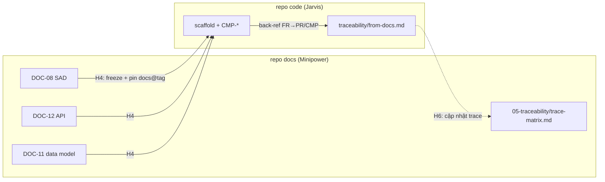

# Coordination Contract — hợp đồng phối hợp liên-pack

**Version:** 0.1 (draft) · **Status:** đề xuất — chưa áp dụng vào pack
**SSOT:** file này. Sửa contract tại đây; pack không định nghĩa lại.

> Mục tiêu: nhiều pack skill (mỗi pack phục vụ một/vài **vai trò** trong công ty) **hoạt động và phối hợp được với nhau** — kể cả khi chạy trên **repo khác nhau** (repo tài liệu vs repo code).
>
> Nền tảng: 5 primitive điều phối của [Minipower](minipower/) (trace, memory, decision-log, ownership, sync) được **nâng thành chuẩn chung** cho mọi pack. Đây không phải cơ chế mới đè lên Minipower — mà là tổng quát hóa cái đã chạy tốt trong một repo ra nhiều repo.

---

## 0. Phạm vi & nguyên tắc nền

| # | Nguyên tắc | Ý nghĩa |
|---|------------|---------|
| 1 | **Pack ≠ vai trò cứng** | Một pack có thể gom nhiều vai trò (Minipower = BA+SA+TPM) nếu chúng chia sẻ hạ tầng. Không xé pack chỉ để "mỗi role một folder". |
| 2 | **ID là tiền tệ** | Mọi phối hợp diễn ra qua **ID ổn định**, không qua "đọc lại toàn bộ tài liệu". Artifact nào cũng trace được về một FR/AC. |
| 3 | **Handoff có tên + mức tối thiểu** | Bàn giao xảy ra tại **boundary có tên** (H1…H6), mỗi boundary khai báo *input tối thiểu* — không chờ "xong hết". |
| 4 | **Một ngôn ngữ chung** | memory schema · decision-log schema · versioning · ownership giống nhau ở mọi pack. |
| 5 | **Liên repo qua con trỏ pin, không copy tay** | Artifact vượt biên repo bằng version pin (tag/submodule/rsync) + back-reference, không chỉnh tay hai nơi. |

---

## 1. Trace spine mở rộng (xương sống ID)

Minipower trace `Goal → … → AC → Test`. Contract **kéo dài xuống code + ops** để pack downstream (backend, frontend, QA, ops) cắm vào cùng một xương sống.

```text
Goal → Stakeholder → BR → UC → FR → AC ─┬→ Design → Code → Test → Deploy
DOC-01   DOC-02    04   05   06   07    │  09/11/12  CMP   TEST   17
                                         └→ NFR(13) ───────────→ Test
```

### 1.1 ID hiện có — giữ nguyên

| ID | Ý nghĩa | Nguồn |
|----|---------|-------|
| `DOC-NN` | Tài liệu chuẩn (01–18) | Minipower templates |
| `{MOD}-UC-NNN` · `-FR-` · `-BR-` · `-AC-` | Artifact theo module | [requirements skill](minipower/skills/requirements/SKILL.md) |
| `DEC-{PHASE}-NNN` | Quyết định + phương án bị loại | [decision-log.md](minipower/docs/decision-log.md) |
| `ADR-NNN` | Quyết định kiến trúc formal | DOC-09 |

### 1.2 ID thêm mới — cho downstream trace ngược

| ID | Ý nghĩa | Ai tạo | Trace về |
|----|---------|--------|----------|
| `{MOD}-CMP-NNN` | Component / module code | Backend/Frontend pack | `{MOD}-FR-*` |
| `{MOD}-TEST-NNN` | Test case | QA pack | `{MOD}-AC-*` |
| `{MOD}-DEPLOY-NNN` | Đơn vị triển khai (service, job, pipeline) | Ops/Delivery pack | DOC-17 · `{MOD}-CMP-*` |

**Luật chung (nâng từ Minipower nguyên tắc #7):** *mọi artifact trace được về một FR/AC.* Ví dụ ràng buộc thực thi:
- Commit/PR ở repo code nhắc ID upstream: `feat(billing): retry policy — BILL-FR-021`.
- Test nhắc AC: `BILL-TEST-004 → BILL-AC-005`.

---

## 2. Handoff boundaries (điểm bàn giao)

Tổng quát bảng *"Mức tối thiểu để dev bắt đầu"* của [parallel-work.md](minipower/docs/parallel-work.md) thành boundary có tên. Mỗi boundary = một hợp đồng: **producer đóng gói input tối thiểu → consumer bắt đầu**.

| ID | Từ → đến | Input tối thiểu | Liên repo |
|----|----------|-----------------|:---------:|
| **H1** | Discovery → Requirements | DOC-03 scope đã review; module đăng ký trong BRD | — |
| **H2** | Requirements → Architecture | DOC-06 + DOC-13 draft (theo module thiết kế) | — |
| **H3** | Requirements → Planning | DOC-06 Must-have (từng module) | — |
| **H4** | Architecture → **Implementation** | DOC-08 + DOC-11 + DOC-12 API slice (theo module) | **✅ docs→code** |
| **H5** | Requirements/Delivery → **QA** | DOC-07 AC + DOC-16 test strategy | tùy |
| **H6** | Implementation → **Delivery/Ops** | build artifact + DOC-17 deployment guide | **✅ code→ops** |

**H4** và **H6** là hai điểm nối liên repo — chỗ Minipower (repo docs) bắt tay Jarvis (repo code). Xem [§4](#4-cross-repo-bridge).

### 2.1 Quy tắc boundary

| # | Quy tắc |
|---|---------|
| 1 | **Một boundary — một producer owner.** Chỉ owner đóng băng artifact bàn giao. |
| 2 | **Input tối thiểu là hợp đồng, không phải "toàn bộ".** Consumer bắt đầu khi đủ mức tối thiểu; phần thiếu → producer ghi `TBD`/assumption. |
| 3 | **Thiếu thì TBD, không bịa.** (Minipower nguyên tắc #2.) |
| 4 | **Đổi artifact đã bàn giao qua baseline → CR.** Không sửa trực tiếp snapshot đã ký. |

---

## 3. Lingua franca (quy ước dùng chung)

Mọi pack — bất kể repo — "nói cùng ngôn ngữ". Đây là phần khiến agent ở pack A hiểu output của pack B mà không cần đọc lại từ đầu.

| Primitive | Nguồn (đã có) | Chuẩn chung |
|-----------|---------------|-------------|
| `memory/{role-or-phase}/` | Minipower | Đọc **đầu phiên**, ghi **cuối phiên**; index theo chủ đề, không nhồi `memory.md` gốc |
| `decision-log.md` | [schema](minipower/docs/decision-log.md) | Prefix ID mở rộng theo vai trò: `DEC-BE-`, `DEC-FE-`, `DEC-QA-`, `DEC-OPS-` (bên cạnh `DEC-DIS/REQ/ARC/PLN/DLV/CHG`) |
| Versioning | [doc-versioning](minipower/docs-skeleton/00-governance/doc-versioning.md) | `Version` chỉ sau sign-off; trước đó `—` + Draft — áp cho mọi artifact có baseline |
| Ownership | [parallel-work.md](minipower/docs/parallel-work.md) | Một module — một owner; một boundary — một producer |
| Anatomy skill | jarvis + minipower | Mọi pack: `SKILL.md` (agent) + `README.md` (người) + `workflows/` + `templates/` |

### 3.1 decision-log — schema chung (nhắc lại từ Minipower)

```text
### DEC-{ROLE|PHASE}-NNN — <tiêu đề> · [YYYY-MM-DD]
- Status: proposed | accepted | superseded-by DEC-xxx
- Context / Options / Decision / Why (loại B,C vì) / Consequences
- Trace: DOC-XX · {MOD}-FR-xxx · ADR-xxx · {MOD}-CMP-xxx
- Confidence: cao | vừa | thấp
```

Quyết định kiến trúc nặng → nâng lên ADR (DOC-09). Decision-log là bản nhẹ cho **mọi** pack.

---

## 4. Cross-repo bridge

Bài toán: DOC-08/11/12 sống ở **repo docs** (Minipower); pack code (Jarvis) đọc ở **repo code**. Contract định nghĩa cầu hai chiều.



### 4.1 Chiều xuống (docs → code) — tại H4

- SA **đóng băng** DOC-08/11/12 → repo code nhận qua **con trỏ có version**: `docs@<tag>` (submodule / rsync / release script). **Tái dùng đúng cơ chế publish Jarvis đã có** ([jarvis/README.md — publish](jarvis/README.md)) — không phát minh cơ chế mới.
- Không copy tay từng đoạn spec vào code. Chỉ pin version + đọc.

### 4.2 Chiều lên (code → docs) — tại H6

- Repo code giữ `traceability/from-docs.md`: bảng map `{MOD}-FR → PR/file/{MOD}-CMP`.
- Đây là đầu nối để **trace-matrix** của Minipower "nhìn thấy" code — khép kín `FR → Code → Test → Deploy`.

### 4.3 Pin version

- Bump có chủ đích: `DOCS_REF=v1.4.0` (tag repo docs) — giống `JARVIS_SKILLS_REF` hiện có.
- Đổi spec sau baseline → CR ở repo docs → bump ref ở repo code, không sửa lệch.

---

## 5. Pack manifest (khai báo phối hợp)

Mỗi pack thêm **một khai báo nhỏ** (`PACK.md` ở root pack, hoặc frontmatter) để agent bất kỳ trả lời được *"input của tôi từ đâu, output giao cho ai, theo boundary nào"*. Đây là cơ chế khiến pack **tự phối hợp**.

### 5.1 Schema

```yaml
pack: <tên-pack>
roles: [<vai trò>, ...]          # bố trí theo vị trí công ty
stage: discovery | requirements | architecture | planning
       | implementation | qa | delivery | ops | cross-cutting
repo: docs | code | any          # pack tác động lên loại repo nào
consumes: [<ID hoặc pattern>, ...]   # artifact đầu vào
produces: [<ID hoặc pattern>, ...]   # artifact đầu ra
handoff-in:  [<boundary>, ...]   # nhận tại boundary nào (H1…H6)
handoff-out: [<boundary>, ...]   # giao tại boundary nào
memory: memory/<namespace>/      # nơi ghi/đọc context
```

### 5.2 Ví dụ — Minipower

```yaml
pack: minipower
roles: [business-analyst, solution-architect, technical-pm]
stage: [discovery, requirements, architecture, planning, delivery, change-control]
repo: docs
consumes: [assets/*, "khách hàng: khảo sát, biên bản"]
produces: [DOC-01..18, "{MOD}-UC/FR/BR/AC-*", ADR-*, "trace-matrix"]
handoff-out: [H2, H3, H4, H5, H6]
memory: memory/{phase}/
```

### 5.3 Ví dụ — Jarvis

```yaml
pack: jarvis
roles: [backend-dotnet]
stage: implementation
repo: code
consumes: [DOC-08, DOC-11, DOC-12, "{MOD}-FR-*", "{MOD}-AC-*"]
produces: ["{MOD}-CMP-*", "source traced to {MOD}-FR-*", "traceability/from-docs.md"]
handoff-in:  [H4]
handoff-out: [H6]
memory: memory/backend/
```

### 5.4 Ví dụ — pack tương lai (khung để mở rộng)

```yaml
# frontend-react
pack: frontend-react
roles: [frontend-react]
stage: implementation
repo: code
consumes: [DOC-12, "{MOD}-UC-*", "{MOD}-AC-*"]
produces: ["{MOD}-CMP-*"]
handoff-in: [H4]
handoff-out: [H6]

# qa
pack: qa
roles: [qa-tester]
stage: qa
repo: any
consumes: [DOC-07, DOC-16, "{MOD}-AC-*"]
produces: ["{MOD}-TEST-*"]
handoff-in: [H5]
```

---

## 6. Vòng đời end-to-end (ví dụ một module)

```text
BA:   BILL-FR-021, BILL-AC-005        (repo docs, H2→)
SA:   DOC-08 §billing, DOC-12 /billing/retry, ADR-005   (H4 freeze + pin)
BE:   BILL-CMP-003 (RetryHandler) — PR nhắc BILL-FR-021 (repo code, H4→)
QA:   BILL-TEST-004 → BILL-AC-005     (H5)
Ops:  BILL-DEPLOY-001 theo DOC-17     (H6, back-ref về trace-matrix)
```

Mọi mắt xích trace ngược về `BILL-FR-021`/`BILL-AC-005` → khép kín xương sống §1.

---

## 7. Việc còn lại (sau khi contract này được duyệt)

- [ ] `PACK.md` cho `minipower` và `jarvis` (§5)
- [ ] Mở rộng trace spine trong Minipower: thêm `CMP/TEST/DEPLOY` vào trace-matrix template
- [ ] Ghi boundary H4/H6 vào `minipower/skills/architecture` + `delivery`
- [ ] `traceability/from-docs.md` mẫu ở phía repo code (Jarvis)
- [ ] README gốc trỏ tới file này (bản đồ vai trò + contract)
- [ ] Pack vai trò mới khi cần: frontend-react, qa, ops (theo khung §5.4)

---

*Liên quan:* [Minipower pipeline](minipower/docs/pipeline.md) · [parallel-work](minipower/docs/parallel-work.md) · [decision-log](minipower/docs/decision-log.md) · [Jarvis publish](jarvis/README.md)
