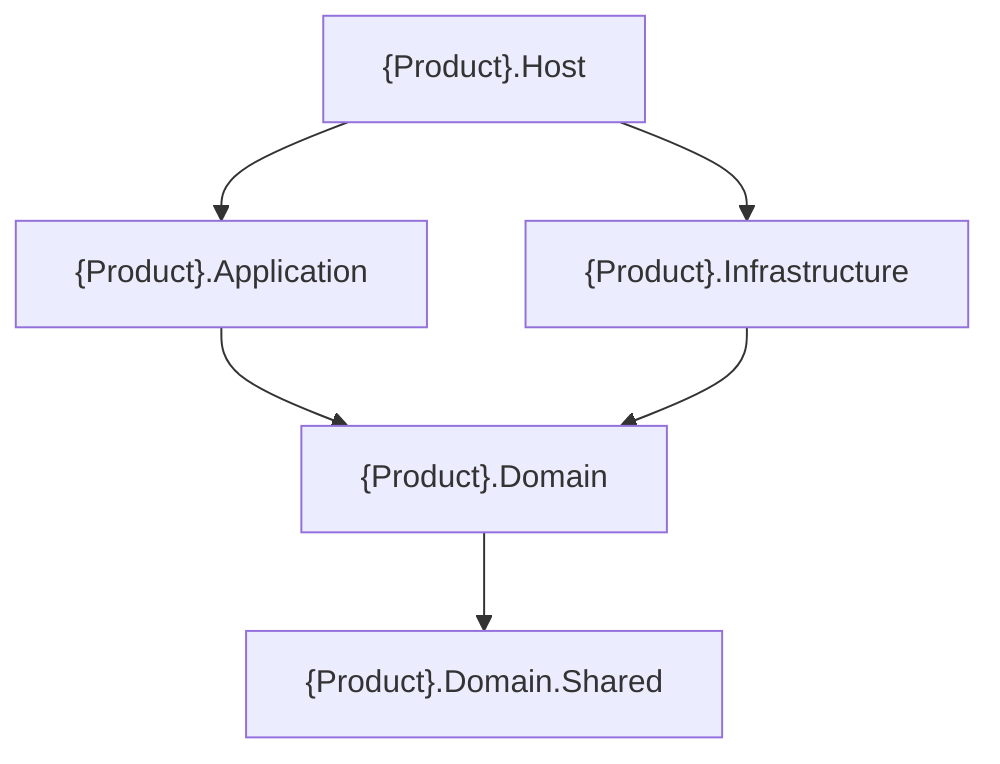

# Skill cấu trúc solution .NET — khởi tạo solution mới

Tài liệu mô tả **cấu trúc solution**, **cây thư mục** và **quy trình scaffold** cho dự án .NET phân lớp. Không gắn với một nghiệp vụ hay repository cụ thể.

**Tài liệu liên quan:**

- **Clean Architecture** (Dependency Rule, project, code, test): `skills/dotnet-clean-architecture.md`
- **DDD** (strategic/tactical, repository, events, use case, testing): `skills/dotnet-ddd.md`

## Mục lục

| Mục | Nội dung |
|-----|----------|
| **1** | [Mục đích](#1-mục-đích) |
| **4** | [Cấu trúc solution điển hình](#4-cấu-trúc-solution-điển-hình-phân-lớp) |
| **5** | [Cấu trúc thư mục & quy trình scaffold](#5-cấu-trúc-thư-mục-folder-structure): **5.1–5.8** cây thư mục + convention; **5.9** câu hỏi định hướng; **5.10** quy trình tuần tự; **5.11** sơ đồ phụ thuộc project |

*(Liên kết mục lục dùng anchor theo tiêu đề Markdown; nếu renderer không hỗ trợ, dùng số mục để tìm trong file.)*

---

## 1. Mục đích

- Cung cấp **cấu trúc solution** (mục 4), **cấu trúc thư mục và thứ tự project** (mục 5) để AI hoặc người mới scaffold đúng ranh giới lớp.
- Làm **khung tái sử dụng** khi tạo repo mới: tách project, thứ tự reference, vị trí composition root và extension `Add*Layer`.
- Ranh giới phụ thuộc chi tiết và quy tắc DDD xem tại hai skill trên (không lặp lại trong file này).

---

## 4. Cấu trúc solution điển hình (phân lớp)

Quan hệ phụ thuộc **mã nguồn** (mũi tên: layer dưới phụ thuộc layer trên):

```
{Product}.Domain.Shared
        ↑
{Product}.Domain
        ↑
{Product}.Application
        ↑
{Product}.Infrastructure
        ↑
{Product}.Host
```

- **Host** → **Application**, **Infrastructure** (API/worker mỏng, composition root).  
- **Application** → **Domain** (use case, không reference Infrastructure).  
- **Domain** → **Domain.Shared** (shared kernel tối thiểu).  
- **Infrastructure** → **Domain** (adapter, persistence; `AddInfrastructureLayer` gọi `AddDomainLayer` rồi DbContext/repository).  

Thứ tự tạo project và reference: **mục 5.2**. Sơ đồ Mermaid: **mục 5.11**. Giải thích Dependency Rule và quy tắc từng layer: **dotnet-clean-architecture.md**.

---

## 5. Cấu trúc thư mục (folder structure)

Phần này để **con người hoặc AI** scaffold solution nhất quán với **mục 4**. Dùng placeholder `{Product}` (ví dụ `Acme`) và `{product}` viết thường cho namespace/file path. **Trước khi tạo solution mới:** làm **mục 5.9** (câu hỏi định hướng), sau đó **mục 5.10** (quy trình tuần tự) và **mục 5.11** (sơ đồ reference).

### 5.1. Gốc repository (monorepo)

**Convention mặc định** (đặt tên repo theo sản phẩm hoặc bounded context chính):

```
{product}-backend/
├── README.md
├── docs/
│   └── Architecture.md               # kiến trúc, context map, ADR (nếu có)
├── src/
│   └── {Product}.sln
├── tests/
│   ├── {Product}.Domain.Tests/
│   └── {Product}.Application.Tests/
└── build/                            # pipeline, Dockerfile — khi có CI/CD
```

- **`src/`:** toàn bộ assembly chạy production (`Host` nằm trong `src/`).  
- **`tests/`:** luôn có **Domain.Tests** và **Application.Tests**; thêm **Infrastructure.Tests** khi **mục 5.9 (Q6)**.  
- **`build/`:** tạo khi team đã có quy ước CI/CD; không bắt buộc ngày đầu.

### 5.2. Cây `src/` — multi-project (.NET / tương tự)

```
src/
├── {Product}.Domain.Shared/
├── {Product}.Domain/
├── {Product}.Application/
├── {Product}.Infrastructure/
└── {Product}.Host/                   # ASP.NET Core — Web API mặc định (Controllers)
```

**Project references (thứ tự tạo khi dùng .NET):**

1. `Domain.Shared` — không reference project nào trong solution (chỉ package framework tối thiểu).
2. `Domain` → `Domain.Shared`.
3. `Application` → `Domain`.
4. `Infrastructure` → `Domain` (`AddInfrastructureLayer` gọi `AddDomainLayer` rồi đăng ký persistence — xem **mục 5.11**). Thêm reference `Application` chỉ khi implementation cần kiểu/port đặt trong Application.
5. `Host` → `Application`, `Infrastructure`.

### 5.3. `{Product}.Domain.Shared` (shared kernel)

**Cây thư mục mặc định:**

```
{Product}.Domain.Shared/
├── Enums/
├── Constants/
└── GlobalUsings.cs                 # tuỳ chọn
```

- Thêm **`Exceptions/`** hoặc **`Configuration/`** chỉ sau khi đã xác nhận nhu cầu qua **mục 5.9** (exception/marker dùng chung; hợp đồng cấu hình thật sự cross-cutting).  
- **Quy tắc nội dung:** **không** logic nghiệp vụ, entity, aggregate, DTO use case, command/query. **Chỉ** enum, constant, extension primitive, exception marker, interface kỹ thuật chung **không** gắn một use case cụ thể.  
- **Package:** chỉ `System.*` / BCL (ngoại lệ phải ghi rõ trong quy ước team).  
- **Phình to** → tách shared kernel theo bounded context hoặc đưa nội dung về `Domain` / `Application` cho đúng ownership (chiến lược DDD: **dotnet-ddd.md** mục 6.A).

### 5.4. `{Product}.Domain`

**Cây thư mục mặc định** (một bounded context trong solution — xác nhận quy mô tại **mục 5.9**):

```
{Product}.Domain/
├── Entities/                       # aggregate root + entity con (vd. Order.cs)
├── ValueObjects/
├── Repositories/                   # I*Repository.cs — chỉ aggregate root
├── Events/                         # IDomainEvent, *Occurred records
├── Services/                       # domain service stateless (khi có)
└── DependencyInjection/
    └── DomainLayerExtension.cs     # AddDomainLayer — quy ước **mục 5.5**
```

- Entity phức tạp có thể nhóm con: `Entities/Orders/Order.cs` (cùng namespace hoặc `{Product}.Domain.Entities.Orders`).  
- **Không** thêm `Features/<Context>/` trong Domain trừ khi **mục 5.9 (Q1)** xác định **nhiều bounded context** trong cùng solution — khi đó mỗi context một nhánh `Features/<ContextName>/` (Entities, Repositories, … của context đó).  
- Thêm **`Specifications/`** chỉ khi **mục 5.9 (Q5)** / **dotnet-ddd.md mục 6.F**.

### 5.5. `{Product}.Application`

**Cây thư mục mặc định** (CQRS nhẹ + handler theo feature):

```
{Product}.Application/
├── Commands/
│   └── <Feature>/                  # vd. Orders/CreateOrderCommand.cs
├── Queries/
│   └── <Feature>/
├── DTOs/
│   └── <Feature>/
├── Interfaces/                     # ICommandHandler, IQueryHandler, I*Port…
├── Features/
│   └── <Feature>/                  # vd. Orders/CreateOrder/CreateOrderHandler.cs
│       └── <UseCase>/
└── DependencyInjection/
    └── ApplicationLayerExtension.cs   # AddApplicationLayer
```

- Command/query **immutable**; **không** reference Infrastructure.  
- Handlers dưới `Features/<Feature>/<UseCase>/`; command/query/DTO tách file dưới `Commands/`, `Queries/`, `DTOs/` theo cùng tên feature.  
- Thêm **`Mappings/`** (profile AutoMapper) khi **mục 5.9 (Q4)** xác nhận dùng **AutoMapper**. **Không** dùng MediatR trong convention tài liệu này — use case qua handler/service đăng ký trực tiếp trong `AddApplicationLayer`.  
- **Không** tách `Application.Contracts` — solution giữ **một** project `Application` gồm command/query/DTO/handler.

**Quy ước DependencyInjection (`*LayerExtension`) — mọi layer có đăng ký DI:**

| Quy tắc | Chi tiết |
|---------|----------|
| Vị trí | Thư mục **`DependencyInjection/`** trong đúng project |
| Tên file | Hậu tố **`Extension`**, vd. `ApplicationLayerExtension.cs` |
| Tên class | Static, trùng tên file |
| Method | **`Add{Layer}Layer`** trên `IHostApplicationBuilder` hoặc `IServiceCollection` |
| Composition | `AddHostLayer` gọi **`AddApplicationLayer`** rồi **`AddInfrastructureLayer`** + **`AddControllers`**. `AddInfrastructureLayer` gọi `AddDomainLayer` rồi persistence/adapters — **không** gọi `AddApplicationLayer`. |

Thứ tự gọi tại composition root: **Application → Infrastructure** (bên trong Infrastructure: **Domain** trước persistence), sau đó pipeline Host.

### 5.6. `{Product}.Infrastructure`

**Cây thư mục mặc định:**

```
{Product}.Infrastructure/
├── Persistence/
│   ├── Configurations/             # EF Fluent API (hoặc mapping tương đương)
│   ├── Migrations/
│   └── Repositories/               # triển khai I*Repository
├── DependencyInjection/
│   └── InfrastructureLayerExtension.cs   # AddInfrastructureLayer
└── Mapping/                        # chỉ khi tách persistence model khác domain
```

- Thêm **`ExternalServices/<Vendor>/`** khi tích hợp HTTP/gRPC/SDK bên thứ ba (**mục 5.9**).  
- Thêm **`AntiCorruption/`** khi thiết kế có ACL (**dotnet-ddd.md** mục 6.A), không cần hàng trong 5.9.  
- Thêm **`Messaging/`**, **`Caching/`**, **`Storage/`**, **`Time/`**, **`UnitOfWork.cs`** khi có bus/outbox, cache, blob, clock hệ thống, hoặc UoW tách class — xác nhận tại **mục 5.9 (Q3)**.

### 5.7. `{Product}.Host` (composition root)

**Mặc định — ASP.NET Core Web API (Controllers):**

```
{Product}.Host/
├── Program.cs
├── appsettings.json
├── appsettings.Development.json
├── Controllers/
├── DependencyInjection/
│   └── HostLayerExtension.cs       # AddHostLayer → AddInfrastructureLayer + AddControllers
├── Properties/
├── Middleware/                     # khi có middleware tùy chỉnh
└── Filters/                        # khi có filter MVC
```

- API luôn dùng **`Controllers/`** (ASP.NET Core MVC).  
- **`Workers/`** — khi **mục 5.9 (Q2)** xác nhận cần `BackgroundService` / hosted job cùng process; tách process → project `{Product}.Worker` (Host riêng). Chi tiết đặt code: xem **Q2** trong 5.9.  

**Composition root:** `Host.AddHostLayer` → `Application.AddApplicationLayer` → `Infrastructure.AddInfrastructureLayer` (gọi `AddDomainLayer`, persistence) — **mục 5.11**.

### 5.8. Tests (mirror `src/`)

```
tests/{Product}.Domain.Tests/
├── Entities/
├── ValueObjects/
├── Services/
└── Events/

tests/{Product}.Application.Tests/
├── Features/
└── Commands/                       # mirror namespace tùy cách đặt test
```

- **`Infrastructure.Tests`:** thêm khi có integration test DB/message bus; cấu trúc mirror `Infrastructure/Persistence/…`.  
- Chiến lược test theo layer: **dotnet-clean-architecture.md** mục 3.4; góc DDD: **dotnet-ddd.md** mục 6.G.

### 5.9. Câu hỏi định hướng (trước khi scaffold)

**Trả lời trước** khi tạo solution mới hoặc khi AI scaffold — từ đó suy ra folder và project phát sinh. Convention tài liệu này: **solution đơn giản** — một project `Application` (không `Application.Contracts`), API luôn **Controllers**, **không** dùng MediatR; có thể dùng **AutoMapper** khi cần map DTO.

| # | Câu hỏi | Nếu có / Đúng → hành động cấu trúc |
|---|---------|-------------------------------------|
| Q1 | Solution này có **một** bounded context hay **nhiều** context cùng ubiquitous language rõ ràng? | Nhiều context → cân nhắc solution/module tách hoặc `Domain/Features/<Context>/…` (**mục 5.4**); một context → cây **5.4** mặc định. |
| Q2 | Có cần **BackgroundService / hosted job** (cùng process với API hoặc worker riêng)? | **Có** → thêm `Host/Workers/`, đăng ký `IHostedService` trong `AddHostLayer` (hoặc extension Host). **Tách tiến trình** → project `{Product}.Worker` (cùng pattern reference như Host). **Quyết định đặt code:** xem **đoạn “Phân tích Worker”** ngay dưới bảng. |
| Q3 | Có bus, outbox, cache, blob, clock infra riêng? | Có từng loại → thêm `Messaging/`, `Caching/`, `Storage/`, `Time/` tương ứng (**mục 5.6**). |
| Q4 | Có dùng **AutoMapper** (map Domain ↔ DTO / request-response)? | Có → thêm **`Mappings/`** + profile, đăng ký trong `AddApplicationLayer`. **Không** dùng MediatR theo tài liệu này. |
| Q5 | Có **Specification pattern** (Ardalis hoặc tự triển khai)? | Có → thêm `Domain/Specifications/` và wiring ở Infrastructure (**dotnet-ddd.md** mục **6.F**). |
| Q6 | Có integration test **DB / bus**? | Có → thêm `{Product}.Infrastructure.Tests` và mirror `Persistence/` (**mục 5.8**). |
| Q7 | Shared kernel có cần **Exceptions/** hoặc **Configuration/** dùng chung thật sự tối thiểu? | Có → thêm folder tương ứng trong `Domain.Shared` (**mục 5.3**). |

**Phân tích Worker — nên đặt ở Host hay Application?**

- **`IHostedService` / `BackgroundService`** là **cơ chế vận hành** của .NET: vòng đời trong process, `StartAsync` / `StopAsync`, `CancellationToken`, lặp theo timer/queue. Đó là **mối quan tâm của host / delivery**, không phải bản thân một use case nghiệp vụ.
- **Application** giữ **điều phối use case** (gọi repository qua interface, handler, domain) — **không** nên phụ thuộc `Microsoft.Extensions.Hosting` để tránh lẫn “chạy nền” với “luật nghiệp vụ”, và để Application vẫn test được mà không cần host.
- **Kết luận convention:** class kế thừa `BackgroundService` đặt trong **`{Product}.Host/Workers/`** (hoặc trong Host của `{Product}.Worker` nếu tách process). Lớp đó **mỏng**: inject `ICommandHandler<…>`, `IQueryHandler<…>` hoặc application service đã đăng ký từ **Application**, chỉ gọi `HandleAsync` / method tương đương — **cùng kiểu** Controller nhưng kích hoạt theo lịch/sự kiện nền thay vì HTTP.
- **Không** đặt implementation `BackgroundService` trong project **Application**. Nếu cần logic dùng chung giữa HTTP và nền, đặt logic đó trong **handler/service Application**; Host và Worker chỉ là hai “adapter” vào cùng use case đó.

### 5.10. Quy trình tuần tự khi tạo solution mới (.NET)

0. **Hoàn thành mục 5.9** — Ghi lại câu trả lời (ngắn) để scaffold không nhánh mơ hồ.

1. **Đặt tên và solution** — `{Product}`; `{Product}.sln` trong `src/` (hoặc gốc repo); một quy ước namespace (`{Product}.Domain`, …).

2. **Tạo project và reference** (**mục 5.2**): `Domain.Shared` → `Domain` → `Application` → `Infrastructure` → `Host` (ASP.NET Core Web API, **Controllers**).

3. **Tạo cây thư mục** theo **5.3–5.7** + phần bổ sung đã quyết ở **5.9** (không thêm folder “dự phòng” ngoài bảng trên).

4. **Ranh giới reference** — `Domain` và `Domain.Shared` không reference `Application` / `Infrastructure` / `Host` (chi tiết: **dotnet-clean-architecture.md**).

5. **DI** — Tạo `DependencyInjection/*LayerExtension.cs` theo **mục 5.5**: `AddHostLayer` gọi `AddApplicationLayer` + `AddInfrastructureLayer` + `AddControllers`; `AddInfrastructureLayer` gọi `AddDomainLayer` rồi persistence. Nếu **Q2**: đăng ký thêm hosted service trong Host.

6. **`Program.cs`** — Gọi `builder.AddHostLayer()` (hoặc tương đương).

7. **Tests** — Tạo `Domain.Tests` và `Application.Tests`; thêm `Infrastructure.Tests` nếu **Q6**.

8. **Build** — `dotnet build`; không có vòng phụ thuộc giữa project.

9. **Use case mới** — Command/query/DTO + handler trong `Application`; repository interface trong `Domain` nếu cần; implementation + cấu hình ORM trong `Infrastructure.Persistence`; đăng ký trong `AddApplicationLayer` (use case & DDD: **dotnet-ddd.md**).

*(Stack khác: giữ cùng ranh giới module — `com.acme.domain`, `com.acme.application`, … — map với **5.3–5.7**.)*

### 5.11. Sơ đồ phụ thuộc (project)

Mũi tên `A --> B`: **A** reference **B**. `{Product}` ví dụ `OrderService`.



*Ghi chú .NET:* `Host` reference **Application** và **Infrastructure**; trong `AddHostLayer` gọi **`AddApplicationLayer`** rồi **`AddInfrastructureLayer`**. `Infrastructure` reference **Domain** (mặc định không cần reference Application nếu mọi port persistence nằm trong Domain). `Host` reference `Application` để controller inject handler/DTO. Nếu adapter implement interface chỉ có trong Application, có thể thêm `Infrastructure` → `Application`.

---
