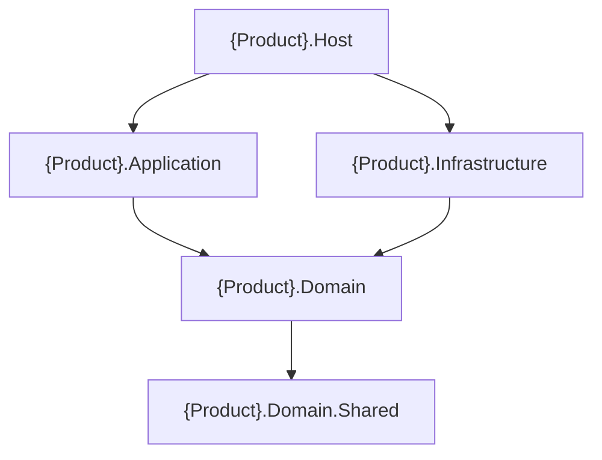

# Cấu trúc solution .NET phân lớp + Jarvis

Khung scaffold cho repo mới. Ranh giới Clean Architecture / DDD chi tiết: [minipower-backend-architecture-dotnet](../../minipower-backend-architecture-dotnet/README.md) — [clean-architecture.md](../../minipower-backend-architecture-dotnet/reference/clean-architecture.md) (quy tắc phụ thuộc) · [ddd-tactical.md](../../minipower-backend-architecture-dotnet/reference/ddd-tactical.md) (entity, aggregate, event).

## Dependency flow

```text
{Product}.Domain.Shared
        ↑
{Product}.Domain
        ↑
{Product}.Application
        ↑
{Product}.Infrastructure
        ↑
{Product}.Host
```

- **Host** → Application, Infrastructure (composition root).
- **Application** → Domain (use case; không reference Infrastructure).
- **Infrastructure** → Domain (adapter, persistence).
- **Domain** → Domain.Shared.

## Gốc repository

```text
{product}-backend/
├── README.md
├── docs/
│   └── Architecture.md
├── src/
│   └── {Product}.sln
├── tests/
│   ├── {Product}.Domain.Tests/
│   └── {Product}.Application.Tests/
└── build/                    # khi có CI/CD
```

## Jarvis package → layer

Cross-cutting packages (Mvc, EF, Caching, Auth, Blob, Notification, OTEL, HealthChecks, Swashbuckle, Common) nằm trong `{JarvisRoot}/frameworks/`. Domain / Application (DDD) cũng nằm trong `{JarvisRoot}/frameworks/`.

| Layer product | Jarvis packages (NuGet / ProjectReference) |
|---|---|
| Domain.Shared | `Jarvis.DDD.Domain.Shared` (tùy chọn — error/response base) |
| Domain | *(không bắt buộc Jarvis — giữ domain thuần)* |
| Application | `Jarvis.DDD.Application`, `Jarvis.DDD.Application.Contracts` |
| Infrastructure | `Jarvis.EntityFramework`, `Jarvis.Caching` (bắt buộc trước EF), `Jarvis.Caching.Redis`, `Jarvis.BlobStoring.*`, `Jarvis.Notification.*` → `{JarvisRoot}/frameworks/...` |
| Host | `Jarvis.Mvc`, `Jarvis.Swashbuckle`, `Jarvis.HealthChecks`, `Jarvis.OpenTelemetry`, `Jarvis.Authentications.*` → `{JarvisRoot}/frameworks/...`; `Jarvis.DDD.Domain` → `{JarvisRoot}/frameworks/` |

## DI convention

| Layer | File | Method |
|---|---|---|
| Domain | `DependencyInjection/DomainLayerExtension.cs` | `AddDomainLayer` |
| Application | `DependencyInjection/ApplicationLayerExtension.cs` | `AddApplicationLayer` |
| Infrastructure | `DependencyInjection/InfrastructureLayerExtension.cs` | `AddInfrastructureLayer` → gọi `AddDomainLayer` + persistence |
| Host | `DependencyInjection/HostLayerExtension.cs` | `AddHostLayer` → Application + Infrastructure + pipeline |

`Program.cs` chỉ gọi:

```csharp
builder.AddHostLayer();
// ...
app.UseHostLayer();
```

## Quy tắc nội dung từng project

Cây thư mục đầy đủ: [templates/solution-tree.txt](../templates/solution-tree.txt). Dưới đây là **luật nội dung** — cái gì được vào, cái gì không.

| Project | Có gì | Không có gì |
|---|---|---|
| `Domain.Shared` | enum, constant, extension primitive, exception marker, interface kỹ thuật chung | logic nghiệp vụ, entity, aggregate, DTO use case, command/query. Phình to ⇒ tách theo bounded context hoặc trả về đúng chủ |
| `Domain` | `Entities/` (aggregate root + entity con), `ValueObjects/`, `Repositories/` (chỉ root), `Events/`, `Services/`, `DependencyInjection/` | EF Core. Thêm `Specifications/` chỉ khi Q5. `Features/<Context>/` chỉ khi Q1 xác định **nhiều** bounded context |
| `Application` | `Commands/<Feature>/`, `Queries/`, `DTOs/`, `Features/<Feature>/<UseCase>/` (handler), `Interfaces/`, `DependencyInjection/` | reference Infrastructure · `FrameworkReference Microsoft.AspNetCore.App` · `BackgroundService`. Thêm `Mappings/` khi Q4 (AutoMapper). **Không** MediatR. **Không** tách `Application.Contracts` phía product |
| `Infrastructure` | `Persistence/{Configurations,Migrations,Repositories}`, `DependencyInjection/` | Thêm `ExternalServices/<Vendor>/` khi tích hợp HTTP/gRPC/SDK · `AntiCorruption/` khi có ACL · `Messaging/`, `Caching/`, `Storage/`, `Time/` khi Q3 |
| `Host` | `Program.cs`, `Controllers/`, `Services/`, `DependencyInjection/`, `Properties/` | logic nghiệp vụ. Thêm `Middleware/`, `Filters/` khi có; `Workers/` khi Q2 |

Command/query **immutable**; handler dưới `Features/<Feature>/<UseCase>/`, command/query/DTO tách file cùng tên feature.

**Quy ước `*LayerExtension`** — mọi layer có đăng ký DI:

| Quy tắc | Chi tiết |
|---|---|
| Vị trí | thư mục `DependencyInjection/` trong đúng project |
| Tên file / class | hậu tố `Extension`, class static trùng tên file |
| Method | `Add{Layer}Layer` trên `IHostApplicationBuilder` hoặc `IServiceCollection` |
| Composition | `AddHostLayer` gọi `AddApplicationLayer` rồi `AddInfrastructureLayer`; `AddInfrastructureLayer` gọi `AddDomainLayer` rồi persistence — **không** gọi ngược `AddApplicationLayer` |

## Worker đặt ở Host, không đặt ở Application

`IHostedService` / `BackgroundService` là **cơ chế vận hành** của .NET — vòng đời trong process, `StartAsync`/`StopAsync`, lặp theo timer/queue. Đó là mối quan tâm của **host/delivery**, không phải bản thân một use case.

Application giữ **điều phối use case**; cho nó phụ thuộc `Microsoft.Extensions.Hosting` là lẫn "chạy nền" với "luật nghiệp vụ", và Application thôi test được nếu không dựng host.

**Kết luận:** class kế thừa `BackgroundService` đặt ở `{Product}.Host/Workers/` (hoặc Host của `{Product}.Worker` khi tách process), **mỏng** — inject handler/service đã đăng ký từ Application rồi gọi `HandleAsync`. Cùng vai Controller, chỉ khác cách kích hoạt. Logic dùng chung giữa HTTP và nền nằm ở **handler Application**; Host và Worker là hai adapter vào cùng use case.

## Tests mirror `src/`

```text
tests/{Product}.Domain.Tests/        Entities/ · ValueObjects/ · Services/ · Events/
tests/{Product}.Application.Tests/   Features/ · Commands/
tests/{Product}.ArchitectureTests/   luật R1–R7, chạy dotnet test -c Debug
```

`Infrastructure.Tests` thêm khi Q6 (integration test DB/bus), mirror `Persistence/`. Chiến lược test theo layer: [clean-architecture.md](../../minipower-backend-architecture-dotnet/reference/clean-architecture.md) mục 4.

## Sơ đồ phụ thuộc project

Mũi tên `A --> B`: **A** reference **B**.



`Infrastructure` mặc định **không** cần reference `Application` — mọi port persistence nằm ở `Domain`. Chỉ thêm khi adapter phải implement interface chỉ tồn tại trong Application.

## Câu hỏi trước scaffold

| # | Câu hỏi | Hành động |
|---|---|---|
| Q1 | Một hay nhiều bounded context? | Nhiều → cân nhắc tách solution/module, hoặc `Domain/Features/<Context>/` |
| Q2 | BackgroundService? | `Host/Workers/` (cùng process) hoặc project `{Product}.Worker` — xem mục *Worker đặt ở Host* |
| Q3 | Bus/cache/blob? | Folder trong Infrastructure |
| Q4 | AutoMapper? | `Application/Mappings/` + profile, đăng ký trong `AddApplicationLayer`. **Không** MediatR |
| Q5 | Specification? | `Domain/Specifications/` |
| Q6 | Integration test DB / bus? | thêm `{Product}.Infrastructure.Tests`, mirror `Persistence/` |
| Q7 | Exceptions shared? | `Domain.Shared/Exceptions/` |

Scaffold mặc định skill: **một context**, **Web API Controllers**, **không MediatR**, **PostgreSQL**, **Swagger + OTEL + HealthChecks** tối thiểu, **`AddJarvisCaching()` trước `AddEntityFramework()`** (cache connection string resolver).

## Thứ tự DI quan trọng (Infrastructure)

```csharp
builder.AddJarvisCaching();   // bắt buộc trước EF (develop: CachingTenantConnectionStringResolver)
builder.AddEntityFramework();
builder.AddCoreDbContext<AppDbContext, ...>(...);
```

Chi tiết multitenancy + batch job: [minipower-backend-entityframework-dotnet/README.md](../../minipower-backend-entityframework-dotnet/README.md).

Bản đồ scaffold → skill: [templates/SKILLS.md](../templates/SKILLS.md).

## Background worker + OTEL

Cron job kế thừa `Jarvis.OpenTelemetry.HostedServices.BaseWorker` — mỗi tick có trace và log scope riêng. Tham chiếu: `Sample/Multitenancy/MultitenancyEfTestHostedService.cs`.
