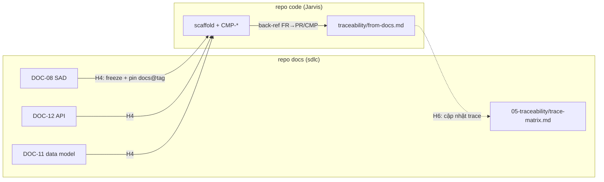

# Cross-repo bridge — cầu hai chiều docs ↔ code (CƠ CHẾ)

**Trạng thái:** ⚪ Thiết kế — **kích hoạt khi tài liệu dự án đích tách thành repo riêng** (triển khai dạng submodule trong repo chính — kế hoạch đã xác nhận 2026-08-24; khi có MCP thì đẩy nền tảng lưu trữ chung như Outline).

Bài toán: DOC-08/11/12 sống ở **repo docs**; pack code đọc ở **repo code** (Jarvis). Cầu hai chiều:

## 1. Chiều xuống (docs → code) — tại H4

- SA **đóng băng** DOC-08/11/12 → repo code nhận qua **con trỏ có version**: `docs@<tag>` (submodule / rsync / release script). **Tái dùng đúng cơ chế publish đã có** ([backend/README.md — publish](../backend/README.md)) — không phát minh cơ chế mới.
- Không copy tay từng đoạn spec vào code. Chỉ pin version + đọc.

## 2. Chiều lên (code → docs) — tại H6

- Repo code giữ `traceability/from-docs.md`: bảng map `{MOD}-FR → PR/file/{MOD}-CMP`.
- Đây là đầu nối để **trace-matrix** của `sdlc` "nhìn thấy" code — khép kín `FR → Code → Test → Deploy`.

## 3. Pin version

- Bump có chủ đích: `DOCS_REF=v1.4.0` (tag repo docs) — giống `JARVIS_SKILLS_REF` hiện có.
- Đổi spec sau baseline → CR ở repo docs → bump ref ở repo code, không sửa lệch.

---

*Liên quan:* [handoff.md](handoff.md) (H4/H6) · [trace-spine.md](trace-spine.md) (`CMP` trace về FR) · [backend/README.md](../backend/README.md) (cơ chế publish submodule/rsync)
