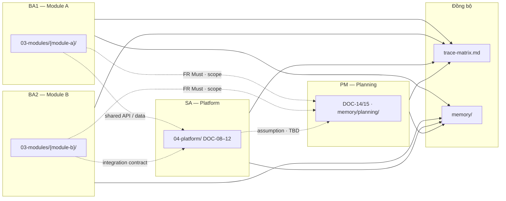

# Minipower — Skill pack

**Một folder** — router + skill con + template + skeleton.

```
minipower/
├── SKILL.md                 ← Skill duy nhất trong menu / của Cursor
├── skills/                  ← Phase con (file hướng dẫn, không có lệnh / riêng)
│   ├── discovery/SKILL.md
│   ├── requirements/SKILL.md
│   ├── architecture/SKILL.md
│   ├── planning/SKILL.md
│   ├── delivery/SKILL.md
│   └── change-control/SKILL.md
├── project-skeleton/        ← Khung dự án: memory, assets, brainstorm
├── templates/               ← Khung 18 DOC
└── docs-skeleton/           ← Khung folder docs/ (artifact)
```

---

## Pipeline nghiệp vụ

Minipower mô hình hóa vòng đời dự án hệ thống doanh nghiệp theo thứ tự **nghiệp vụ trước — giải pháp sau**:

```text
Business Goal → Stakeholder → Process → Requirement → Solution → Planning → Delivery
```

| Giai đoạn | Vai trò chính | Đầu ra chính |
|-----------|---------------|--------------|
| Discovery | BA, PM | Phạm vi, stakeholder, BRD, danh sách module |
| Requirements | BA (theo module) | UC, BR, FR, AC, NFR |
| Architecture | SA | SAD, ADR, tích hợp, data model, API |
| Planning | PM, BA lead | WBS, ước lượng, kế hoạch, roadmap |
| Delivery | QA, BA, DevOps | Test strategy, triển khai, go-live |
| Change control | BA, SA, PM | CR, delta, re-baseline |

Pipeline **không bắt buộc tuần tự tuyệt đối** sau khi đã có scope (DOC-03): nhiều module requirements và phần platform có thể tiến **song song** nếu tuân quy tắc ownership và điểm đồng bộ bên dưới.

## Nguyên tắc

| # | Nguyên tắc | Ý nghĩa |
|---|------------|---------|
| 1 | **Không nhảy giải pháp sớm** | Chưa rõ scope / FR thì không chốt kiến trúc chi tiết |
| 2 | **Ghi assumption** | Mọi giả định ghi rõ; đánh dấu TBD thay vì bịa |
| 3 | **Tìm requirement thiếu** | Chủ động hỏi negative case, edge case, NFR |
| 4 | **Đánh giá rủi ro** | Mỗi phase nêu rủi ro và phụ thuộc |
| 5 | **Một module — một owner** | Tránh nhiều người sửa cùng folder module |
| 6 | **Distill, không nhồi draft** | Brainstorm/memory = working; `docs/` = artifact chính thức |
| 7 | **Trace xuyên suốt** | UC → FR → AC → test; cập nhật trace matrix khi có thay đổi |
| 8 | **Baseline có kiểm soát** | Sau ký — mọi thay đổi qua CR, không sửa trực tiếp snapshot |

## Luồng artifact

```text
assets/  →  brainstorm/  →  docs/  →  02-baseline/
                                    ↘  06-changes/CR-xxx/  (sau baseline)
```

| Bước | Thư mục | Ai làm | Mô tả |
|------|---------|--------|--------|
| 1 | `assets/` | PM, BA | Lưu bản gốc khảo sát, biên bản — **không sửa** |
| 2 | `brainstorm/` | BA, SA | Draft, trao đổi, decision log — file theo ngày |
| 3 | `memory/{phase}/` | BA, SA, PM | Tóm tắt context **theo chủ đề** — index nhanh |
| 4 | `docs/` | BA, SA | Artifact chính thức — distill từ brainstorm/memory |
| 5 | `docs/02-baseline/` | PM, sponsor | Snapshot đã sign-off — **chỉ đọc** |
| 6 | `docs/06-changes/` | BA, SA | CR và delta sau baseline |

### Phase → DOC

| Phase | Skill / prompt | Memory | Docs | DOC |
|-------|----------------|--------|------|-----|
| Discovery | `Phase: discovery` | `memory/discovery/` | `docs/01-project/` | 01–03 |
| Requirements | `Phase: requirements` | `memory/requirements/` | `docs/03-modules/{module}/` | 04–07 |
| Architecture | `Phase: architecture` | `memory/architecture/` | `docs/04-platform/` | 08–12 |
| Planning | `Phase: planning` | `memory/planning/` | `00-governance/`, `04-platform/` | 14–15 |
| Delivery | `Phase: delivery` | `memory/delivery/` | `03-modules/`, `04-platform/` | 16–17 |
| Change control | `Phase: change-control` | `memory/change-control/` | `docs/06-changes/` | 18 |

**Tiên quyết phase:**

- Requirements: DOC-03 scope đã review; module đăng ký trong BRD
- Architecture: DOC-06 + DOC-13 **draft tối thiểu** theo module đang thiết kế
- Planning: DOC-03 + đủ FR Must-have (ít nhất sơ bộ) để ước lượng
- Baseline: DOC-01–07 + trace matrix + review DOC-08–12

### Luồng trong một module (BA)

```text
DOC-04 BR  →  DOC-05 UC  →  DOC-06 FR  →  DOC-07 AC
                    ↓
         docs/05-traceability/trace-matrix.md
```

### Luồng kiến trúc (SA)

```text
DOC-08 SAD  →  DOC-09 ADR  →  DOC-10 Integration  →  DOC-11 Data Model  →  DOC-12 API
       ↑ trace FR/UC từ 03-modules/                              ↑
       └──────────── thống nhất biên module ─────────────────────┘
```

## Làm việc song song (multi-BA / SA / PM)

Dự án lớn thường chia **theo bounded context (module)** và **theo vai trò**. Minipower hỗ trợ song song khi có **hợp đồng tại biên** (integration spec, entity dùng chung, API contract).

### Phân vai mẫu

| Vai trò | Phase chính | Folder sở hữu | Ví dụ công việc |
|---------|-------------|---------------|-----------------|
| **BA1** | Requirements | `docs/03-modules/{module-a}/` | Thu thập, phân tích module A |
| **BA2** | Requirements | `docs/03-modules/{module-b}/` | Thu thập, phân tích module B |
| **SA** | Architecture | `docs/04-platform/` | SAD, ERD, API, integration — phần dùng chung |
| **PM** | Discovery, Planning | `docs/00-governance/`, `memory/planning/` | Scope, WBS, timeline, milestone |



### SA không cần chờ BA xong toàn bộ

Trong lúc BA đang elicit từng module, SA có thể **song song** thiết kế:

| Hạng mục | Khi nào làm | Ghi chú |
|----------|-------------|---------|
| **Core base** | Sớm — sau DOC-03 + vài FR Must đầu tiên | Auth, tenant, logging, error model, pattern API chung |
| **Shared data model** | Khi có FR Must từ ≥1 module | Entity dùng chung; phần chưa rõ → **TBD** trong `memory/architecture/` |
| **Integration contract** | Khi 2 module cần gọi nhau | DOC-10 / sequence trong `brainstorm/` hoặc `04-platform/` |
| **API slice theo module** | Khi module có DOC-06 Must | OpenAPI từng phần — không chờ hết 18 DOC |

SA **không ghi đè** requirements trong `03-modules/` — thiếu FR thì ghi assumption / TBD, yêu cầu BA bổ sung.

### PM estimate & plan

PM **không cần chờ** toàn bộ SRS hoàn chỉnh để bắt đầu planning sơ bộ:

| Input từ | Dùng cho |
|----------|----------|
| DOC-03 scope + danh sách module | WBS khung, phân phase |
| DOC-06 Must-have (từng module) | Estimate từng khối |
| SA assumption / TBD platform | Buffer rủi ro kiến trúc |
| Complexity (planning skill) | Roadmap, milestone |

Cập nhật `memory/planning/` và DOC-14/15 **lặp lại** khi BA/SA làm rõ thêm — plan là living document đến trước baseline.

### Quy tắc song song

| # | Quy tắc |
|---|---------|
| 1 | **Một module = một owner** — chỉ owner sửa DOC-04–07 trong folder module đó |
| 2 | **SA chỉ `04-platform/`** — không sửa FR/UC của BA; thiếu thì TBD + note |
| 3 | **File dùng chung — tránh sửa cùng lúc:** DOC-03, `trace-matrix.md`, `doc-registry.md` |
| 4 | **Cross-module** — thống nhất qua `memory/architecture/`, DOC-10, không meeting dài không ghi |
| 5 | **MOD prefix cố định** — khai báo trong README module (`{MOD}-FR-001`, …) |
| 6 | **Đăng ký module mới** — thêm vào DOC-03 trước khi tạo folder `03-modules/{id}/` |

### Điểm đồng bộ (sync)

| File / nơi | Vai trò |
|------------|---------|
| `memory/memory.md` | Phase hiện tại, link chủ đề |
| `memory/{phase}/` | Tóm tắt theo BA/SA/PM phụ trách |
| `docs/05-traceability/trace-matrix.md` | Trace UC → FR → AC |
| `docs/05-traceability/doc-registry.md` | Version, owner từng DOC |
| `docs/01-project/DOC-03-brd.md` | Module index, in/out scope |

**Sync ngắn định kỳ (~15 phút):** module nào đã có FR Must? Module mới trong DOC-03? SA có assumption cần BA xác nhận? Ai cập nhật trace matrix hôm nay?

### Mức tối thiểu để dev bắt đầu (không chờ hết 18 DOC)

| Mức | Artifact | Đủ cho |
|-----|----------|--------|
| 1 | DOC-06 FR + DOC-07 AC (một module) | Dev implement module đó |
| 2 | DOC-12 API slice (theo module) | Hai module gọi nhau qua contract |
| 3 | DOC-10 sequence hoặc DOC-08 process view | UC cross-module phức tạp |

### Xung đột thường gặp

| Tình huống | Sai | Đúng |
|------------|-----|------|
| Hai BA cùng sửa trace matrix | Conflict | Mỗi người thêm dòng module mình; sync cuối ngày |
| SA chốt API trước FR | Lệch nghiệp vụ | Chờ FR liên quan hoặc draft + TBD + assumption |
| Dev cần contract giữa 2 module | Chờ SAD đầy đủ | SA xuất sequence / DOC-10 slice |
| Thay đổi UC đã baseline | Sửa trực tiếp DOC-05 | Mở CR trong `06-changes/CR-xxx/` |

### Ví dụ prompt song song

```text
/minipower
Phase: requirements — module {module-a}, cập nhật DOC-05/06, owner BA1
```

```text
/minipower
Phase: architecture — shared data model + API contract giữa {module-a} và {module-b};
đọc FR Must hiện có, phần chưa rõ ghi TBD trong memory/architecture/
```

```text
/minipower
Phase: planning — WBS sơ bộ từ DOC-03 và FR Must đã có; ghi assumption vào memory/planning/
```

---

## Hướng dẫn dùng trong Cursor

Cursor chỉ đăng ký skill ở **`.cursor/skills/{tên-skill}/SKILL.md`** (một cấp). Skill con nằm trong `skills/` **không** xuất hiện trong menu **`/`** — đó là hành vi bình thường, không phải lỗi cấu hình.

### Cách 1 — Lệnh `/` + nói rõ phase (khuyên dùng)

1. Gõ **`/minipower`** (hoặc chọn skill trong menu `/`).
2. Trong cùng prompt, ghi phase cần làm — agent sẽ đọc file skill con tương ứng:

| Bạn muốn | Ghi trong prompt (ví dụ) |
|----------|---------------------------|
| Khám phá / scope | `Phase: discovery` · `Làm bước 1–2` · `Brainstorm scope` |
| Phân tích yêu cầu | `Phase: requirements` · `Phân tích UC, FR, AC` |
| Kiến trúc | `Phase: architecture` · `Thiết kế SAD, API` |
| Estimate / plan | `Phase: planning` · `WBS, roadmap` |
| Test / deploy | `Phase: delivery` · `Test strategy, cutover` |
| Change Request | `Phase: change-control` · `Tạo CR sau baseline` |

**Ví dụ prompt đầy đủ:**

```text
/minipower
Phase: requirements — elicit use case cho module billing, output DOC-05/06
```

### Cách 2 — `@` gắn file skill con (khi chỉ làm một phase)

Trong ô chat, gõ **`@`** → chọn file (không dùng `/`):

| Phase | File cần @ |
|-------|------------|
| Discovery | `.cursor/skills/minipower/skills/discovery/SKILL.md` |
| Requirements | `…/skills/requirements/SKILL.md` |
| Architecture | `…/skills/architecture/SKILL.md` |
| Planning | `…/skills/planning/SKILL.md` |
| Delivery | `…/skills/delivery/SKILL.md` |
| Change control | `…/skills/change-control/SKILL.md` |

Có thể @ **cả hai**: skill cha + skill con (cha = context chung, con = workflow chi tiết).

**Ví dụ:**

```text
@skills/requirements/SKILL.md
Phân tích FR cho đăng nhập SSO — module auth
```

### Cách 3 — Chỉ `/minipower`, không chỉ phase

Dùng khi **chưa rõ phase** hoặc cần **overview end-to-end**. Agent hỏi ngắn phase hiện tại hoặc đề xuất bước tiếp theo theo pipeline.

---

## Bảng tra nhanh

| Việc | Cách gọi trong Cursor |
|------|------------------------|
| Overview / full pipeline | `/minipower` |
| Một phase cụ thể | `/minipower` + `Phase: …` **hoặc** `@skills/…/SKILL.md` |
| Template DOC | `@templates/DOC-06-srs.md` (hoặc file template khác) |
| Khởi tạo dự án | `/minipower` + `Init project` — xem [SKILL.md](SKILL.md#khởi-tạo-cấu-trúc-dự-án-mặc-định) |
| Khởi tạo thủ công | Copy `project-skeleton/` + `docs-skeleton/` → `{project}/` |

---

## Skill con — nội dung từng file

| File | Mục đích | Bước | DOC |
|------|----------|------|-----|
| [skills/discovery/SKILL.md](skills/discovery/SKILL.md) | Khám phá, scope, stakeholder | 1–2 | 01–03 |
| [skills/requirements/SKILL.md](skills/requirements/SKILL.md) | UC, FR, BR, NFR, AC | 3–8 | 04–07, 13 |
| [skills/architecture/SKILL.md](skills/architecture/SKILL.md) | SAD, ADR, API, data | 9 | 08–12 |
| [skills/planning/SKILL.md](skills/planning/SKILL.md) | WBS, estimate, roadmap | 10–12 | 14–15 |
| [skills/delivery/SKILL.md](skills/delivery/SKILL.md) | Test, deployment | — | 16–17 |
| [skills/change-control/SKILL.md](skills/change-control/SKILL.md) | CR sau baseline | — | 18 |

Router chi tiết: [SKILL.md](SKILL.md)

---

## Muốn skill con có lệnh `/` riêng?

Cursor **không** hỗ trợ skill lồng nhau trong menu `/`. Nếu bắt buộc cần `/minipower-requirements`, … phải **tách** mỗi phase thành folder riêng `.cursor/skills/minipower-requirements/SKILL.md` (mất lợi thế “một bộ gom pack”). Pack hiện tại ưu tiên **một bộ tài nguyên chung** + gọi phase bằng **`Phase:`** hoặc **`@` file**.
