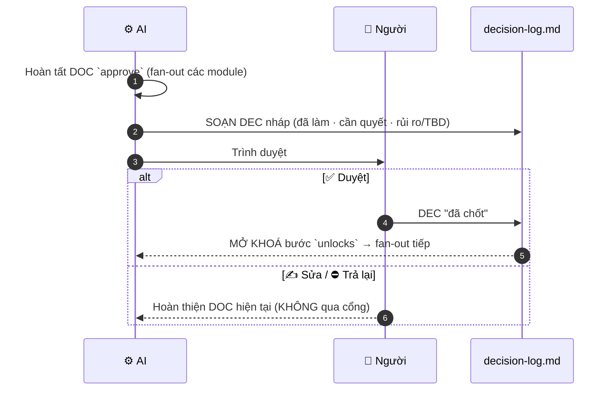

# Approval Gate — cổng người-chốt giữa các bước

Markdown thuần — guardrail cho **mô hình Gated Fan-out Execution** (ADR [2026-07-20 gated-fanout](../../ADRs/2026-07-20-minipower-gated-fanout-execution.md) §0/§3-A2). **Con người quyết tại mỗi cổng; AI fan-out song song *giữa* hai cổng.** Bảng cổng là **dữ liệu**, SSOT ở [hooks/lib/rules.json](../hooks/lib/rules.json) (`approval_gates`). Bảng dưới **sinh tự động** (`npm run gen`).

## Bảng cổng

<!-- BEGIN generated: approval-gates (nguồn: hooks/lib/rules.json — chạy `npm run gen`) -->

| # | Cổng (người chốt) | DOC duyệt | Mở khoá bước sau |
|---|-------------------|-----------|------------------|
| 1 | **Chốt BRD** | DOC-03 (BRD) | Business Rules — fan-out theo module |
| 2 | **Chốt Business Rules** | DOC-04 (Business Rules) | Prototype / Wireframe — fan-out theo module |
| 3 | **Chốt Prototype / Wireframe** | DOC-19 (Prototype / Wireframe) | SRS — fan-out theo module |
| 4 | **Chốt SRS** | DOC-06 (SRS) | Architecture (SAD / Data model / API) |
| 5 | **Chốt Architecture** | DOC-08 (SAD) | Epic / Story / Task → tạo task (Lark) |
| 6 | **Chốt Project Plan** | DOC-15 (Project Plan) | Test case + Code |
| 7 | **Chốt Test case** | DOC-16 (Test Strategy) | Code + Unit test → cập nhật task |

<!-- END generated: approval-gates -->

## Giao thức tại mỗi cổng (Q3 — AI soạn, người duyệt)

Ranh giới bất biến: **tất cả do AI thực hiện, con người chỉ review**. Cụ thể mỗi cổng:



Diễn giải:

```
AI hoàn tất DOC `approve` (fan-out các module nếu có)
  → AI SOẠN một DEC nháp trong memory/{phase}/decision-log.md
        (tóm tắt cái đã làm · điểm cần người quyết · rủi ro/assumption/TBD)
  → Người REVIEW: ✅ duyệt · ✍️ sửa · ⛔ trả lại
  → Duyệt ⇒ DEC ghi "đã chốt" (người xác nhận) ⇒ MỞ KHOÁ bước `unlocks`
  → Chưa duyệt ⇒ AI KHÔNG tự sang bước sau (chỉ tiếp tục hoàn thiện DOC hiện tại)
```

- **Không có DEC chốt cho cổng = không qua.** AI tự soạn nháp để người bấm duyệt nhanh — **không** để người tự viết từ đầu (khác pain hỏi-đáp lắt nhắt).
- **Fan-out chỉ nằm giữa hai cổng.** Ví dụ sau cổng *Chốt BRD*, AI mới được fan-out sinh Business Rules cho **tất cả module song song**; trước đó thì không.
- **Ngưỡng "đủ chấp nhận được".** Cổng không phải rào nhị phân tuyệt đối — người có thể duyệt kèm *ghi nợ* (mục hoãn vào `open-questions.md`), khớp [readiness-gate](../skills/readiness-gate/SKILL.md).

## Agent — dùng thế nào

1. Suy ra phase + intent (qua [auto-routing](auto-routing.md) / [project-state](project-state.md)).
2. Trước khi chuyển sang bước sau (theo cột **Mở khoá**), kiểm tra đã có **DEC chốt** cho DOC `approve` của cổng chưa.
3. Chưa có → soạn DEC nháp, trình người duyệt (giao thức trên). **Không tự qua cổng.**
4. Có → chạy [readiness-gate](../skills/readiness-gate/SKILL.md) (tiền đề đầu vào đủ chưa) → [context-load](context-load.md) → thực thi fan-out.

**Phân biệt hai gate:** *approval-gate* soát **người đã chốt bước trước chưa** (DEC); *readiness-gate* soát **tiền đề đầu vào đã đủ để bắt đầu chưa** (bảng `prereq_by_intent`). Hai cái bổ trợ, không thay nhau.
