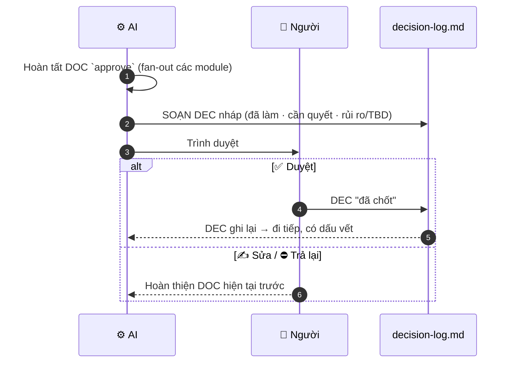

# Approval Gate — điểm chốt của người (advisory)

Markdown thuần — **danh sách điểm nên có người chốt**, không phải rào chặn.

> ⚠️ **Không hook nào enforce bảng này** ([ADR-020](../../ADRs/ADR-020-2026-08-20-minipower-3-che-do-du-an-gate-bang-hook.md) QĐ-11). Chữ ký thôi làm điều kiện máy kiểm: hook `dec-gate` đã bị bỏ. Con người là **người ra lệnh** — yêu cầu làm SRS khi BRD chưa chốt thì hệ chỉ **cảnh báo**, người xác nhận là chạy.
>
> Cái *máy* kiểm được là **tồn tại DOC tiền đề**, theo từng module (`prereq-gate` — C2), và cả nó cũng mở bằng `BYPASS`.

Bảng là **dữ liệu tham chiếu**, SSOT ở [hooks/lib/rules.json](../hooks/lib/rules.json) (`approval_gates`). Bảng dưới **sinh tự động** (`npm run gen`).

## Bảng điểm chốt

<!-- BEGIN generated: approval-gates (nguồn: hooks/lib/rules.json — chạy `npm run gen`) -->

| # | Cổng (người chốt) | DOC duyệt | Mở khoá bước sau |
|---|-------------------|-----------|------------------|
| 1 | **Chốt BRD** | DOC-03 (BRD) | Business Rules — fan-out theo module |
| 2 | **Chốt Business Rules** | DOC-04 (Business Rules) | Prototype / Wireframe — fan-out theo module |
| 3 | **Chốt Prototype / Wireframe** | DOC-19 (Prototype / Wireframe) | SRS — fan-out theo module |
| 4 | **Chốt SRS** | DOC-06 (SRS) | Architecture (SAD / Data model / API) |
| 5 | **Chốt Architecture** | DOC-08 (SAD) | Epic / Story / Task → tạo task (Lark) |
| 6 | **Chốt Project Plan** | DOC-15 (Project Plan) | Test case + Code |
| 7 | **Chốt Test case** | DOC-16 (Test Strategy) | Code + Unit test → cập nhật task |

<!-- END generated: approval-gates -->

## Giao thức tại mỗi cổng (Q3 — AI soạn, người duyệt)

Ranh giới bất biến: **tất cả do AI thực hiện, con người chỉ review**. Cụ thể mỗi cổng:


```mermaid
sequenceDiagram
  autonumber
  participant AI as ⚙️ AI
  participant H as 👤 Người
  participant D as decision-log.md
  AI->>AI: Hoàn tất DOC `approve` (fan-out các module)
  AI->>D: SOẠN DEC nháp (đã làm · cần quyết · rủi ro/TBD)
  AI->>H: Trình duyệt
  alt ✅ Duyệt
    H->>D: DEC "đã chốt"
    D-->>AI: DEC ghi lại → đi tiếp, có dấu vết
  else ✍️ Sửa / ⛔ Trả lại
    H-->>AI: Hoàn thiện DOC hiện tại trước
  end
```

Diễn giải:

```
AI hoàn tất DOC `approve` (fan-out các module nếu có)
  → AI SOẠN một DEC nháp trong memory/{phase}/decision-log.md
        (tóm tắt cái đã làm · điểm cần người quyết · rủi ro/assumption/TBD)
  → Người REVIEW: ✅ duyệt · ✍️ sửa · ⛔ trả lại
  → Duyệt ⇒ DEC ghi "đã chốt" (người xác nhận) ⇒ đi tiếp, quyết định có dấu vết
  → Chưa duyệt ⇒ AI NÓI RA và hỏi: chốt bây giờ, hay đi tiếp và ghi nợ? (không tự dừng việc của người)
```

- **DEC là bản ghi, không phải rào.** AI soạn nháp để người bấm duyệt nhanh — **không** để người tự viết từ đầu. Không có DEC thì thiếu *dấu vết quyết định*, không phải "không được đi tiếp".
- **Mỗi module một nhịp** (QĐ-14). Chốt BRD cho `ORD` không phải điều kiện để `INV` chạy, và ngược lại. Không có vạch đích chung.
- **Ngưỡng "đủ chấp nhận được".** Người có thể chốt kèm *ghi nợ* — hoãn vào `open-questions.md` hoặc `memory/doc-debt.md`, khớp [readiness-gate](../skills/readiness-gate/SKILL.md).

## Agent — dùng thế nào

1. Suy ra phase + intent (qua [auto-routing](auto-routing.md) / [project-state](project-state.md)).
2. Tới một điểm chốt (cột **Mở khoá**): xem đã có DEC cho DOC `approve` chưa.
3. Chưa có → **nói ra**, soạn DEC nháp, hỏi người: chốt bây giờ hay đi tiếp và ghi nợ. **Không tự dừng việc của người.**
4. Đi tiếp → [context-load](context-load.md) → fan-out. `prereq-gate` sẽ nhắc/chặn nếu thiếu DOC tiền đề *của đúng module đó*.

**Phân biệt hai thứ:** *approval-gate* (file này) là **danh sách điểm nên chốt** — advisory, không máy kiểm. *[readiness-gate](../skills/readiness-gate/SKILL.md)* soát **tiền đề đầu vào** và có hook `prereq-gate` đứng sau — máy kiểm được vì chỉ cần hỏi *file có tồn tại không*.
