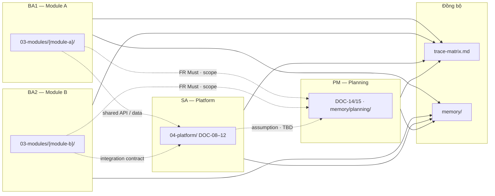

# Làm việc song song (multi-BA / SA / PM)

[← Pipeline](pipeline.md) · [README](../README.md)

Dự án lớn thường chia **theo bounded context (module)** và **theo vai trò**. Minipower hỗ trợ song song khi có **hợp đồng tại biên** (integration spec, entity dùng chung, API contract).

> **Hai kiểu song song:** (1) **nhiều người** (multi-BA/SA/PM) — trang này; (2) **AI fan-out** giữa hai cổng người-chốt — điều phối bởi [skills/fan-out](../skills/fan-out/SKILL.md) (ADR gated-fanout). Cả hai **dùng chung** quy tắc bên dưới: một module = một owner, tránh sửa file chung đồng thời.

## Phân vai mẫu

| Vai trò | Phase chính | Folder sở hữu | Ví dụ công việc |
|---------|-------------|---------------|-----------------|
| **BA1** | Requirements | `docs/03-modules/{module-a}/` | Thu thập, phân tích module A |
| **BA2** | Requirements | `docs/03-modules/{module-b}/` | Thu thập, phân tích module B |
| **SA** | Architecture | `docs/04-platform/` | SAD, ERD, API, integration — phần dùng chung |
| **PM** | Discovery, Planning | `docs/00-governance/`, `memory/planning/` | Scope, WBS, timeline, milestone |



## SA không cần chờ BA xong toàn bộ

Trong lúc BA đang elicit từng module, SA có thể **song song** thiết kế:

| Hạng mục | Khi nào làm | Ghi chú |
|----------|-------------|---------|
| **Core base** | Sớm — sau DOC-03 + vài FR Must đầu tiên | Auth, tenant, logging, error model, pattern API chung |
| **Shared data model** | Khi có FR Must từ ≥1 module | Entity dùng chung; phần chưa rõ → **TBD** trong `memory/architecture/` |
| **Integration contract** | Khi 2 module cần gọi nhau | DOC-10 / sequence trong `brainstorm/` hoặc `04-platform/` |
| **API slice theo module** | Khi module có DOC-06 Must | OpenAPI từng phần — không chờ hết 18 DOC |

SA **không ghi đè** requirements trong `03-modules/` — thiếu FR thì ghi assumption / TBD, yêu cầu BA bổ sung.

## PM estimate & plan

PM **không cần chờ** toàn bộ SRS hoàn chỉnh để bắt đầu planning sơ bộ:

| Input từ | Dùng cho |
|----------|----------|
| DOC-03 scope + danh sách module | WBS khung, phân phase |
| DOC-06 Must-have (từng module) | Estimate từng khối |
| SA assumption / TBD platform | Buffer rủi ro kiến trúc |
| Complexity (planning skill) | Roadmap, milestone |

Cập nhật `memory/planning/` và DOC-14/15 **lặp lại** khi BA/SA làm rõ thêm — plan là living document đến trước baseline.

## Quy tắc song song

| # | Quy tắc |
|---|---------|
| 1 | **Một module = một owner** — chỉ owner sửa DOC-04–07 trong folder module đó |
| 2 | **SA chỉ `04-platform/`** — không sửa FR/UC của BA; thiếu thì TBD + note |
| 3 | **File dùng chung — tránh sửa cùng lúc:** DOC-03, `overview.md`, `trace-matrix.md`, `doc-registry.md` |
| 4 | **Cross-module** — thống nhất qua `memory/architecture/`, DOC-10, không meeting dài không ghi |
| 5 | **MOD prefix cố định** — khai báo trong README module (`{MOD}-FR-001`, …) |
| 6 | **Đăng ký module mới** — thêm vào DOC-03 trước khi tạo folder `03-modules/{id}/` |
| 7 | **DOC versioning** — Version chỉ sau REQ owner sign-off; trước đó `—` + Draft — [`doc-versioning.md`](../docs-skeleton/00-governance/doc-versioning.md) |

## Điểm đồng bộ (sync)

| File / nơi | Vai trò |
|------------|---------|
| `memory/memory.md` | Phase hiện tại, link chủ đề |
| `memory/{phase}/` | Tóm tắt theo BA/SA/PM phụ trách |
| `docs/05-traceability/overview.md` | Tổng quan 30s — phase, pipeline module, blocker |
| `docs/05-traceability/trace-matrix.md` | Trace UC → FR → AC |
| `docs/05-traceability/doc-registry.md` | Version, owner từng DOC |
| `docs/01-project/DOC-03-brd.md` | Module index, in/out scope |

**Sync ngắn định kỳ (~15 phút):** module nào đã có FR Must? Module mới trong DOC-03? SA có assumption cần BA xác nhận? Ai cập nhật trace matrix hôm nay?

## Mức tối thiểu để dev bắt đầu (không chờ hết 18 DOC)

| Mức | Artifact | Đủ cho |
|-----|----------|--------|
| 1 | DOC-06 FR + DOC-07 AC (một module) | Dev implement module đó |
| 2 | DOC-12 API slice (theo module) | Hai module gọi nhau qua contract |
| 3 | DOC-10 sequence hoặc DOC-08 process view | UC cross-module phức tạp |

## Xung đột thường gặp

| Tình huống | Sai | Đúng |
|------------|-----|------|
| Hai BA cùng sửa trace matrix | Conflict | Mỗi người thêm dòng module mình; sync cuối ngày |
| SA chốt API trước FR | Lệch nghiệp vụ | Chờ FR liên quan hoặc draft + TBD + assumption |
| Dev cần contract giữa 2 module | Chờ SAD đầy đủ | SA xuất sequence / DOC-10 slice |
| Thay đổi UC đã baseline | Sửa trực tiếp DOC-05 | Mở CR trong `06-changes/CR-xxx/` |

## Ví dụ prompt song song

```text
/minipower
Phase: requirements — module {module-a}, cập nhật DOC-05/06, owner BA1
```

```text
/minipower
Phase: architecture — shared data model + API contract giữa {module-a} và {module-b};
đọc FR Must hiện có, phần chưa rõ ghi TBD trong memory/architecture/
```

```text
/minipower
Phase: planning — WBS sơ bộ từ DOC-03 và FR Must đã có; ghi assumption vào memory/planning/
```
