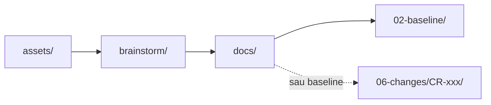
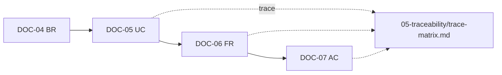
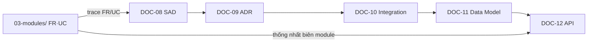

# Pipeline & luồng artifact

[← README](../README.md) · Tiếp: [Làm việc song song](parallel-work.md)

Minipower mô hình hóa vòng đời dự án hệ thống doanh nghiệp theo thứ tự **nghiệp vụ trước — giải pháp sau**:

```text
Business Goal → Stakeholder → Process → Requirement → Solution → Planning → Delivery
```

| Giai đoạn | Vai trò chính | Đầu ra chính |
|-----------|---------------|--------------|
| Discovery | BA, PM | Phạm vi, stakeholder, BRD, danh sách module |
| Requirements | BA (theo module) | UC, BR, FR, AC, NFR |
| Architecture | SA | SAD, ADR, tích hợp, data model, API |
| Planning | PM, BA lead | WBS, ước lượng, kế hoạch, roadmap |
| Delivery | QA, BA, DevOps | Test strategy, triển khai, go-live |
| Change control | BA, SA, PM | CR, delta, re-baseline |

Pipeline **không bắt buộc tuần tự tuyệt đối** sau khi đã có scope (DOC-03): nhiều module requirements và phần platform có thể tiến **song song** nếu tuân quy tắc ownership và điểm đồng bộ — xem [parallel-work.md](parallel-work.md).

## Nguyên tắc

| # | Nguyên tắc | Ý nghĩa |
|---|------------|---------|
| 1 | **Không nhảy giải pháp sớm** | Chưa rõ scope / FR thì không chốt kiến trúc chi tiết |
| 2 | **Ghi assumption** | Mọi giả định ghi rõ; đánh dấu TBD thay vì bịa |
| 3 | **Tìm requirement thiếu** | Chủ động hỏi negative case, edge case, NFR |
| 4 | **Đánh giá rủi ro** | Mỗi phase nêu rủi ro và phụ thuộc |
| 5 | **Một module — một owner** | Tránh nhiều người sửa cùng folder module |
| 6 | **Distill, không nhồi draft** | Brainstorm/memory = working; `docs/` = artifact chính thức |
| 7 | **Trace xuyên suốt** | UC → FR → AC → test; cập nhật trace matrix khi có thay đổi |
| 8 | **Baseline có kiểm soát** | Sau ký — mọi thay đổi qua CR, không sửa trực tiếp snapshot |

## Luồng artifact



| Bước | Thư mục | Ai làm | Mô tả |
|------|---------|--------|--------|
| 1 | `assets/` | PM, BA | Lưu bản gốc khảo sát, biên bản — **không sửa** |
| 2 | `brainstorm/` | BA, SA | Draft, trao đổi, decision log — file theo ngày |
| 3 | `memory/{phase}/` | BA, SA, PM | Tóm tắt context **theo chủ đề** — index nhanh |
| 4 | `docs/` | BA, SA | Artifact chính thức — distill từ brainstorm/memory |
| 5 | `docs/02-baseline/` | PM, sponsor | Snapshot đã sign-off — **chỉ đọc** |
| 6 | `docs/06-changes/` | BA, SA | CR và delta sau baseline |

## Phase → DOC

| Phase | Skill / prompt | Memory | Docs | DOC |
|-------|----------------|--------|------|-----|
| Discovery | `Phase: discovery` | `memory/discovery/` | `docs/01-project/` | 01–03 |
| Requirements | `Phase: requirements` | `memory/requirements/` | `docs/03-modules/{module}/` | 04–07 |
| Architecture | `Phase: architecture` | `memory/architecture/` | `docs/04-platform/` | 08–12 |
| Planning | `Phase: planning` | `memory/planning/` | `00-governance/`, `04-platform/` | 14–15 |
| Delivery | `Phase: delivery` | `memory/delivery/` | `03-modules/`, `04-platform/` | 16–17 |
| Change control | `Phase: change-control` | `memory/change-control/` | `docs/06-changes/` | 18 |

**Tiên quyết phase:**

- Requirements: DOC-03 scope đã review; module đăng ký trong BRD
- Architecture: DOC-06 + DOC-13 **draft tối thiểu** theo module đang thiết kế
- Planning: DOC-03 + đủ FR Must-have (ít nhất sơ bộ) để ước lượng
- Baseline: DOC-01–07 + trace matrix + review DOC-08–12

## Luồng trong một module (BA)



## Luồng kiến trúc (SA)


