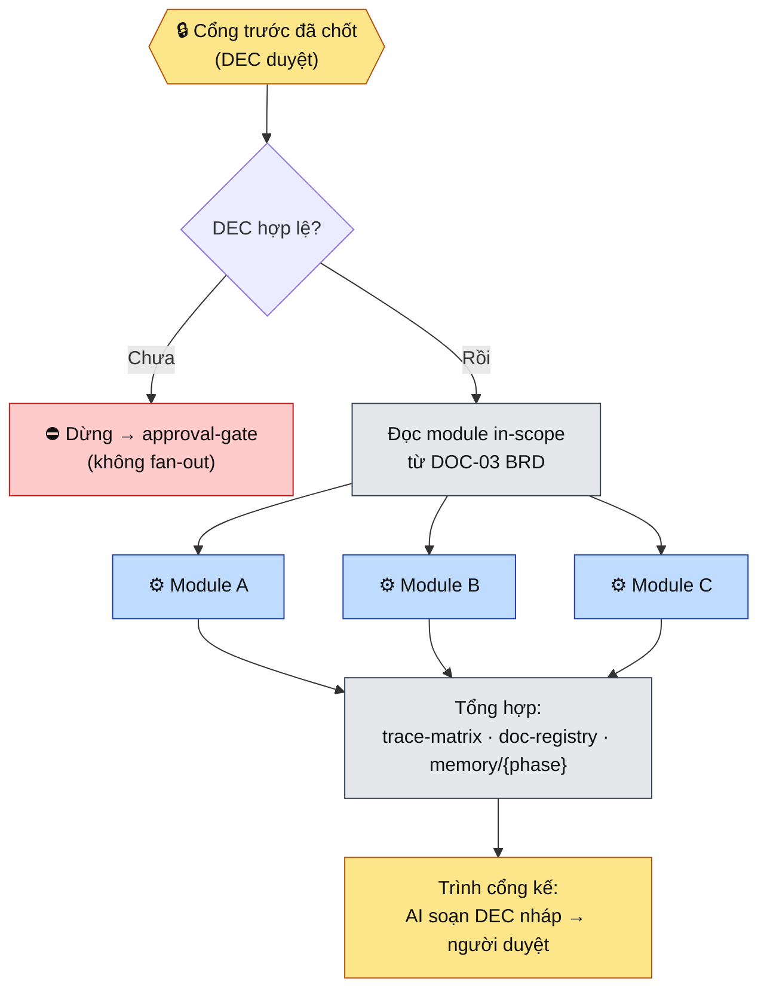

# Fan-out — sinh artifact song song theo module

**Pack:** minipower · **Loại:** skill cross-phase (điều phối, **không** thay phase con) · **Không** tự sáng tác nội dung — **điều phối** phase skill + template sinh cho từng module.

Đây là cơ chế cốt lõi của **Gated Fan-out Execution** (ADR [gated-fanout](../../../ADRs/2026-07-20-minipower-gated-fanout-execution.md) §0). Ranh giới bất biến: **fan-out chỉ chạy GIỮA hai cổng người-chốt.** Trước cổng chưa chốt → không fan-out; xem [approval-gate](../../agents/approval-gate.md).

> **Không phải người chọn skill** (Q6). Router ([SKILL.md](../../SKILL.md)) tự gọi khi intent là "sinh {BR/Prototype/SRS} cho các module".

---

## Áp dụng cho (cùng một cơ chế — tái dùng)

| Bước | Artifact | DOC | Phase skill uỷ quyền |
|------|----------|-----|----------------------|
| B1 | Business Rules | DOC-04 | [requirements](../requirements/SKILL.md) |
| C | Prototype / Wireframe | DOC-19 | [requirements](../requirements/SKILL.md) + template DOC-19 |
| B2 | SRS (FR) | DOC-06 | [requirements](../requirements/SKILL.md) |

> Mở rộng sau (cùng khung): test case (DOC-16), code+unit test — giai đoạn D/E.

## Sơ đồ

## Quy trình

1. **Xác định target.** Từ intent → bước nào (BR / Prototype / SRS) → DOC target + cổng trước cần chốt (tra [approval-gate](../../agents/approval-gate.md)).
2. **Kiểm cổng (bắt buộc).** Có **DEC "đã chốt"** cho DOC upstream trong `memory/{phase}/decision-log.md`? Chưa → **dừng**, không sinh gì, trỏ người qua approval-gate. (Đây là ranh giới §0 — không được bỏ.)
3. **Lấy danh sách module.** Đọc module index in-scope trong `docs/01-project/DOC-03-brd.md`. Không có module nào đăng ký → hỏi người bổ sung DOC-03 trước (quy tắc parallel-work #6).
4. **Fan-out — một artifact, một owner.** Mỗi module một luồng độc lập sinh/cập nhật DOC target trong `docs/03-modules/{module-id}/`, theo phase skill + template tương ứng. Nếu host hỗ trợ sub-agent → chạy **song song thật**; nếu không → tuần tự từng module, **vẫn giữ ranh giới owner** (không trộn context giữa module).
5. **Tuân quy tắc song song** ([parallel-work.md](../../docs/parallel-work.md)): chỉ owner sửa DOC-04–07/19 của module mình; **tránh** sửa đồng thời file chung (DOC-03, `overview.md`, `trace-matrix.md`, `doc-registry.md`) — mỗi module chỉ **thêm dòng của mình**; prefix ID cố định `{MOD}-…`.
6. **Tổng hợp.** Sau khi các module xong: cập nhật `05-traceability/trace-matrix.md` (UC→FR→AC), `doc-registry.md` (version/owner), `overview.md` (pipeline module), và tóm tắt vào `memory/{phase}/`.
7. **Trình cổng kế.** AI **soạn DEC nháp** (đã làm gì mỗi module · điểm cần người quyết · assumption/TBD/rủi ro) → người duyệt (giao thức [approval-gate](../../agents/approval-gate.md)). Duyệt → mở khoá bước sau; chưa → hoàn thiện tiếp, **không tự qua cổng**.

## Đặc thù Prototype (C) — HTML wireframe HOÃN

- Fan-out DOC-19 hiện chỉ sinh **khung**: danh sách màn hình, luồng điều hướng (mermaid), trace về BR/UC — **chừa chỗ** nhúng wireframe ở mục 3 của template.
- **Bản vẽ HTML wireframe do MCP ngoài** đảm nhận (ADR §6 Q2 — tích hợp sau). Chưa có MCP → ghi `TBD: wireframe (chờ MCP)` vào `memory/requirements/open-questions.md`, đi tiếp bằng mô tả text/mermaid (hoãn có ghi nợ — khớp readiness-gate).

## Ranh giới (KHÔNG làm)

- **Không** fan-out khi cổng trước chưa có DEC chốt (vi phạm §0).
- **Không** tự sang cổng kế — chỉ soạn DEC nháp để người duyệt.
- **Không** để một luồng module ghi đè DOC/trace của module khác.
- **Không** bịa module không có trong DOC-03; thiếu thì xin bổ sung scope trước.

## Exit criteria

- [ ] DEC cổng trước đã chốt (đã kiểm, không bỏ qua)
- [ ] Mỗi module in-scope có DOC target (hoặc TBD ghi nợ rõ)
- [ ] `trace-matrix.md` + `doc-registry.md` cập nhật, không xung đột file chung
- [ ] DEC nháp cho cổng kế đã soạn, trình người duyệt
- [ ] (Prototype) mục wireframe = link MCP **hoặc** `TBD: wireframe (chờ MCP)` trong open-questions

## Anti-patterns

- Fan-out "chui" khi người chưa chốt cổng trước · tự động qua cổng kế không chờ duyệt
- Nhồi mọi module vào một luồng/context (mất ranh giới owner, dễ lệch trace)
- Sinh SRS trước khi Prototype được chốt (sai thứ tự `BR → Prototype → SRS`)
- Sửa `trace-matrix.md` đồng thời nhiều module gây conflict (đúng: mỗi module thêm dòng, sync cuối)
