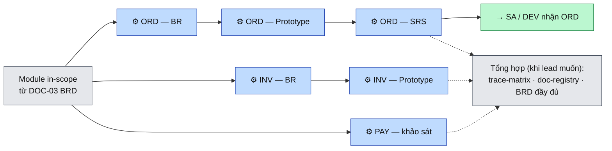

# Fan-out — sinh artifact song song theo module

**Pack:** minipower · **Loại:** skill cross-phase (điều phối, **không** thay phase con) · **Không** tự sáng tác nội dung — **điều phối** phase skill + template sinh cho từng module.

**Mô hình: pipeline theo module, không phải barrier** ([ADR-020](../../../ADRs/ADR-020-2026-08-20-minipower-3-che-do-du-an-gate-bang-hook.md) QĐ-14). Mỗi module đi chuỗi của nó theo nhịp của nó. `ORD` xong Business Rules thì làm SRS cho `ORD` **ngay**, trong khi `INV` còn đang khảo sát. Module lệch nhịp là trạng thái **đúng**, không phải lỗi cần đồng bộ.

> **Người quyết từng nhánh.** Không hook nào, không skill nào tự phán module đã "đủ để chảy tiếp". `prereq-gate` chỉ **nhắc** khi thiếu DOC tiền đề *của đúng module đó* — bạn xác nhận là chạy. Không có agent bàn giao cho agent.

> **Không phải người chọn skill.** Router ([SKILL.md](../../SKILL.md)) tự gọi khi intent là "sinh {BR/Prototype/SRS} cho các module".

---

## Áp dụng cho (cùng một cơ chế — tái dùng)

| Bước | Artifact | DOC | Phase skill uỷ quyền |
|------|----------|-----|----------------------|
| B1 | Business Rules | DOC-04 | [requirements](../requirements/SKILL.md) |
| C | Prototype / Wireframe | DOC-19 | [requirements](../requirements/SKILL.md) + template DOC-19 |
| B2 | SRS (FR) | DOC-06 | [requirements](../requirements/SKILL.md) |

> Mở rộng cùng khung: test case (DOC-16), code + unit test.

## Sơ đồ

```mermaid
flowchart LR
  MODS["Module in-scope<br/>từ DOC-03 BRD"]:::doc

  MODS --> A1["⚙️ ORD — BR"]:::ai --> A2["⚙️ ORD — Prototype"]:::ai --> A3["⚙️ ORD — SRS"]:::ai --> A4["→ SA / DEV nhận ORD"]:::done
  MODS --> B1["⚙️ INV — BR"]:::ai --> B2["⚙️ INV — Prototype"]:::ai
  MODS --> C1["⚙️ PAY — khảo sát"]:::ai

  A3 -.-> TM["Tổng hợp (khi lead muốn):<br/>trace-matrix · doc-registry · BRD đầy đủ"]:::doc
  B2 -.-> TM
  C1 -.-> TM

  classDef ai fill:#bfdbfe,stroke:#1e40af,color:#111
  classDef doc fill:#e5e7eb,stroke:#374151,color:#111
  classDef done fill:#bbf7d0,stroke:#15803d,color:#111
```

Ba nhánh **không** gặp nhau ở vạch đích nào. Mũi tên đứt tới "Tổng hợp" là **tuỳ lúc** — lead gom khi cần bức tranh chung, không phải điều kiện chặn nhánh nào.

## Quy trình

1. **Xác định target.** Từ intent → bước nào (BR / Prototype / SRS) → DOC target.
2. **Lấy danh sách module.** Đọc module index in-scope trong `docs/01-project/DOC-03-brd.md`. Chưa module nào đăng ký → hỏi người bổ sung DOC-03 trước (quy tắc [parallel-work](../../docs/parallel-work.md) #6).
3. **Xác định nhịp từng module.** Mỗi module đang ở đâu trong chuỗi `BR → Prototype → SRS`? Trả bảng trạng thái để **người** nhìn và quyết nhánh nào chạy tiếp:

   | Module | BR | Prototype | SRS | Chạy tiếp được? |
   |--------|:--:|:---------:|:---:|-----------------|
   | ORD | ✅ | ✅ | — | SRS |
   | INV | ✅ | — | — | Prototype |
   | PAY | — | — | — | BR (đang khảo sát) |

4. **Fan-out — một artifact, một owner.** Mỗi module một luồng độc lập sinh/cập nhật DOC target trong `docs/03-modules/{module-id}/`. Host hỗ trợ sub-agent → chạy **song song thật**; không thì tuần tự, **vẫn giữ ranh giới owner** (không trộn context giữa module).
5. **Thiếu tiền đề thì nói ra, đừng tự chặn.** Module thiếu DOC upstream → báo rõ *"`INV` chưa có DOC-04"* và hỏi người: bổ sung trước, hay chạy tiếp và ghi nợ vào `memory/doc-debt.md`. **Không** tự dừng cả mẻ vì một module chưa sẵn sàng.
6. **Tuân quy tắc song song** ([parallel-work.md](../../docs/parallel-work.md)): chỉ owner sửa DOC-04–07/19 của module mình; **tránh** sửa đồng thời file chung (DOC-03, `overview.md`, `trace-matrix.md`, `doc-registry.md`) — mỗi module chỉ **thêm dòng của mình**; prefix ID cố định `{MOD}-…`.
7. **Tổng hợp — bước riêng, khi lead muốn.** Cập nhật `05-traceability/trace-matrix.md`, `doc-registry.md`, `overview.md`, tóm tắt vào `memory/{phase}/`; hợp nhất BRD đầy đủ nếu đến lúc. **Không** phải điều kiện để module nào đó đi tiếp.

## Theo chế độ dự án

Chế độ đọc từ `memory/profile.json`; định nghĩa ở [router § Chế độ dự án](../../SKILL.md#chế-độ-dự-án-project_mode) — **không lặp lại ở đây**.

| | `standard` | `mvp` | `maintain` |
|---|---|---|---|
| Chuỗi mỗi module | BR → Prototype → SRS | FR catalog + AC (bỏ Prototype nếu không cần) | theo **vùng chạm** của CR |
| Thiếu tiền đề | `prereq-gate` **chặn** — gõ `BYPASS` để đi tiếp | nhắc, ghi `doc-debt.md` | nhắc, ghi `doc-debt.md` |
| Tổng hợp | trước baseline | khi lên `standard` | theo CR |

## Ranh giới (KHÔNG làm)

- **Không** tự sang bước kế cho một module khi người chưa xác nhận — AI đề xuất, người mở đường.
- **Không** bắt module đã sẵn sàng chờ module chưa xong (đó là barrier — QĐ-14 bỏ).
- **Không** để một luồng module ghi đè DOC/trace của module khác.
- **Không** bịa module không có trong DOC-03; thiếu thì xin bổ sung scope trước.
- **Không** đoán module từ tên tiếng Việt mơ hồ — nêu `Module: {id}` hoặc đường dẫn cho chắc.

## Exit criteria

- [ ] Bảng trạng thái nhịp từng module đã trình người (bước 3)
- [ ] Mỗi module **được chọn chạy** có DOC target (hoặc TBD ghi nợ rõ)
- [ ] Module thiếu tiền đề đã được **nêu tên**, không im lặng bỏ qua
- [ ] `trace-matrix.md` + `doc-registry.md` cập nhật, không xung đột file chung
- [ ] (Prototype) mục wireframe = link MCP **hoặc** `TBD: wireframe (chờ MCP)` trong open-questions

## Anti-patterns

- Bắt cả mẻ dừng vì một module chưa đủ tiền đề (barrier — QĐ-14 bỏ)
- Tự quyết module đã "đủ" rồi chạy tiếp mà không hỏi người
- Nhồi mọi module vào một luồng/context (mất ranh giới owner, dễ lệch trace)
- Sửa `trace-matrix.md` đồng thời nhiều module gây conflict (đúng: mỗi module thêm dòng, sync cuối)
- Coi "tổng hợp" là cổng — nó là bước dọn dẹp, không phải điều kiện
