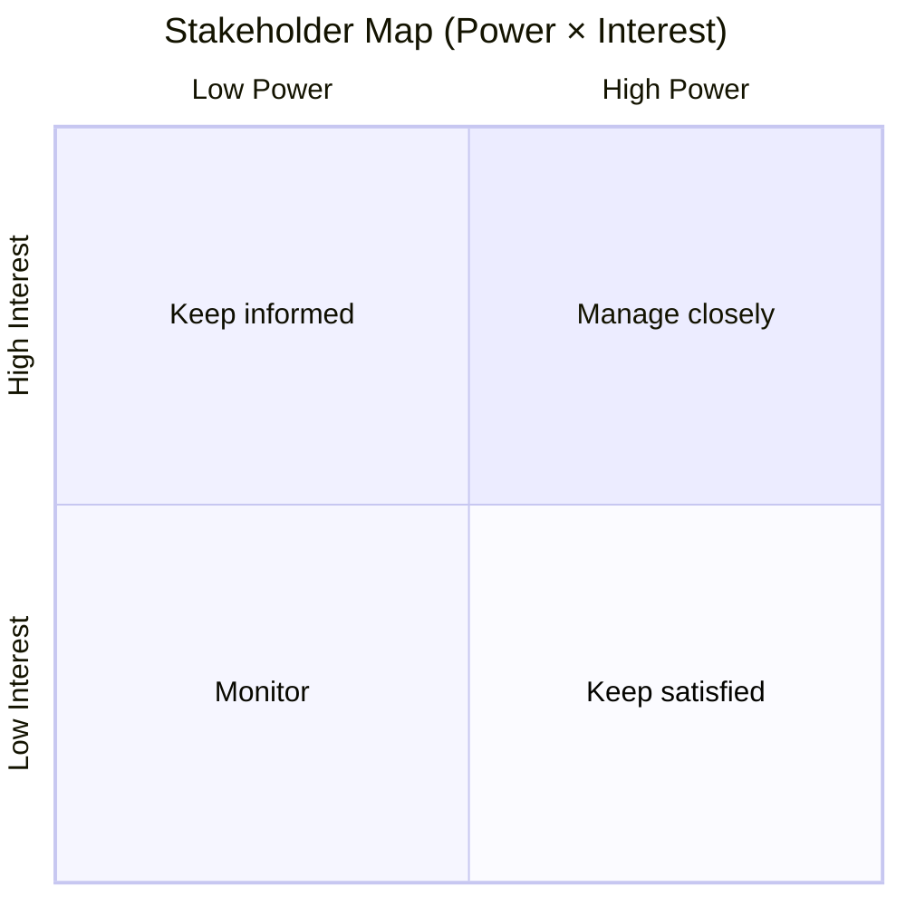

# DOC-02 — Phân tích stakeholder

| Phiên bản | Ngày | Tác giả | Trạng thái |
|-----------|------|---------|------------|
| 0.1 | YYYY-MM-DD | | Draft |

**Tiêu chuẩn tham khảo:** Stakeholder register (PMBOK, BABOK); thường là phần của BRD hoặc Quality/Communication Plan.

---

## 1. Mục đích

[Phạm vi phân tích stakeholder cho dự án / phase]

## 2. Đăng ký stakeholder

| ID | Stakeholder | Vai trò / Tổ chức | Quyền lợi | Mức ảnh hưởng | Mức quan tâm | Chiến lược |
|----|-------------|-------------------|-----------|---------------|--------------|------------|
| SH-001 | | | | H/M/L | H/M/L | Manage closely / Keep satisfied / Keep informed / Monitor |

**Legend ảnh hưởng / quan tâm:** High · Medium · Low

## 3. Bản đồ stakeholder (Quyền lực × Mức quan tâm)

| Quadrant | Stakeholder IDs |
|----------|-----------------|
| Manage closely | |
| Keep satisfied | |
| Keep informed | |
| Monitor | |

## 4. RACI (sơ bộ)

| Hoạt động / Deliverable | SH-001 | SH-002 | … |
|-------------------------|--------|--------|---|
| Approve BRD | R | A | |
| UAT sign-off | | | |

**R** = Responsible · **A** = Accountable · **C** = Consulted · **I** = Informed

## 5. Kế hoạch truyền thông (tóm tắt)

| Stakeholder | Nội dung | Tần suất | Kênh | Owner |
|-------------|----------|----------|------|-------|
| | | Weekly / Sprint / Gate | Email / Workshop | |

## 6. Giả định

| ID | Giả định |
|----|----------|
| | |
