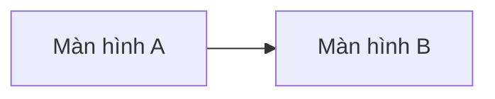

# DOC-19 — Prototype / Wireframe

| Phiên bản | Ngày | Tác giả | Trạng thái |
|-----------|------|---------|------------|
| 0.1 | YYYY-MM-DD | | Draft |

**Vị trí trong pipeline:** phase `requirements`, **sau** DOC-04 (Business Rules) và **trước** DOC-06 (SRS). Prototype chốt hình hài UI/luồng màn hình rồi mới đặc tả FR chi tiết. Là một **cổng người-chốt** — xem [agents/approval-gate.md](../agents/approval-gate.md).

> **Cơ chế sinh wireframe (HTML) — hiện HOÃN.** Bản vẽ HTML wireframe sẽ do **MCP ngoài** đảm nhận (tích hợp sau, ADR 2026-07-20 gated-fanout §6 Q2). Ở giai đoạn này DOC-19 chỉ **đăng ký** vào pipeline như một cổng + khung mô tả dưới đây; chưa build generator. Khi có MCP: nhúng link/asset wireframe vào mục 3.

---

## 1. Phạm vi prototype

| Trace (BR/UC) | Màn hình / luồng | Mục tiêu người dùng |
|---------------|------------------|---------------------|
| {MOD}-BR-001 · UC-001 | | |

## 2. Danh sách màn hình

| Screen ID | Tên màn hình | Actor chính | Trạng thái |
|-----------|--------------|-------------|------------|
| {MOD}-SCR-001 | | | Draft |

## 3. Wireframe / mockup

> Nhúng ảnh, link HTML wireframe (từ MCP ngoài), hoặc mô tả bố cục tạm bằng text/mermaid trong lúc chờ.

- {MOD}-SCR-001: _(link / asset / mô tả)_

## 4. Luồng điều hướng (navigation flow)

## 5. Ghi chú & câu hỏi mở

- TBD / assumption về UI — chuyển mục chưa rõ vào `memory/requirements/open-questions.md`.

## 6. Cổng chốt

- [ ] Người duyệt prototype (ghi **DEC** trong `memory/requirements/decision-log.md`) → mở khoá viết **SRS (DOC-06)**.
