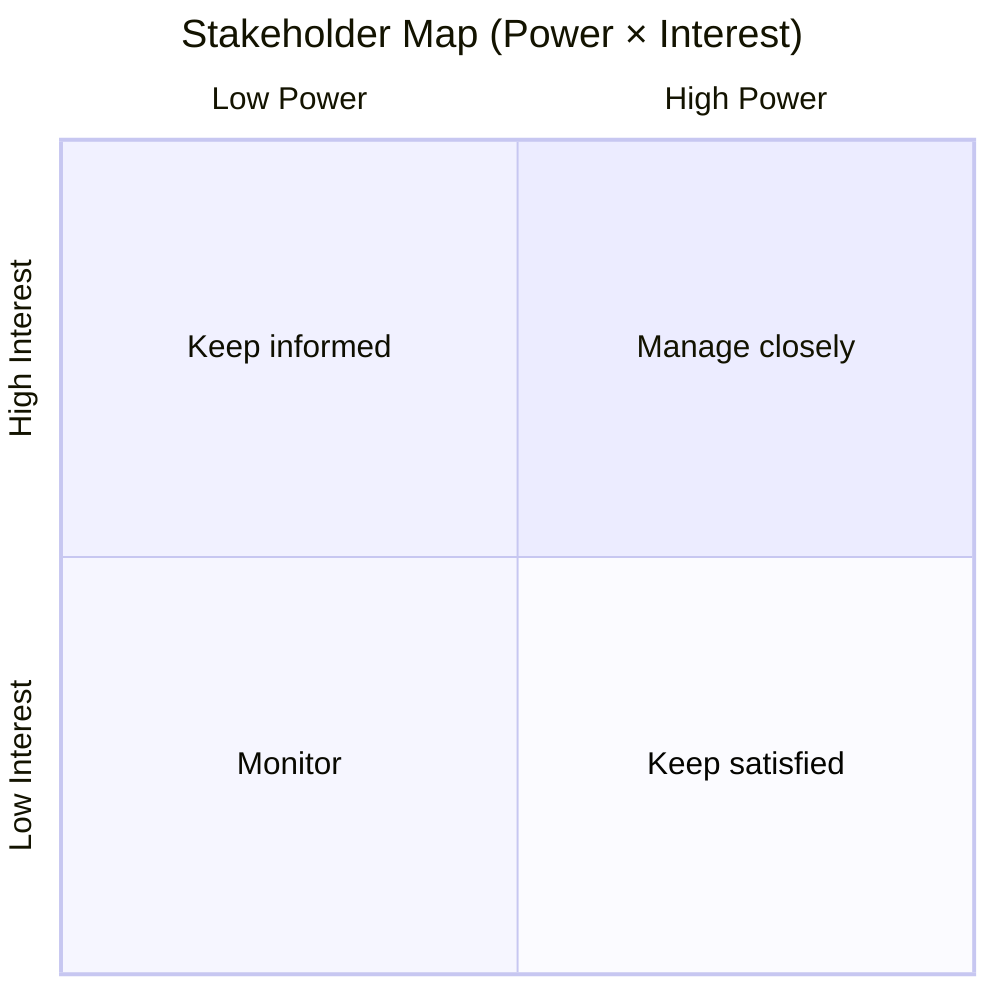

# DOC-02 — Stakeholder Analysis

| Version | Date | Author | Status |
|---------|------|--------|--------|
| 0.1 | 2026-05-31 | minipower / discovery | Draft |

**Nguồn:** discovery Phase 1 · *Stakeholder dưới đây suy ra từ domain — cần xác nhận tên/vai trò thực tế.*

---

## 1. Mục đích

Xác định stakeholder cho **Phase 1 ERP** (HRM, CRM, Matter, Shared) — doanh nghiệp luật đa pháp nhân Việt Nam.

## 2. Stakeholder Register

| ID | Stakeholder | Vai trò / Tổ chức | Quyền lợi | Ảnh hưởng | Quan tâm | Chiến lược |
|----|-------------|-------------------|-----------|-----------|----------|------------|
| SH-001 | Sponsor / Ban lãnh đạo | Quyết định đầu tư, scope | ROI, rủi ro nghề luật | H | M | Keep satisfied |
| SH-002 | Managing Partner | Chiến lược vụ việc | Matter-centric, bí mật | H | H | Manage closely |
| SH-003 | Trưởng phòng Nhân sự | HRM, payroll, BHXH | Đa pháp nhân, chính xác | H | H | Manage closely |
| SH-004 | Trưởng phòng Kinh doanh / BD | CRM, pipeline | Pre-matter, khách hàng | M | H | Manage closely |
| SH-005 | Trưởng nhóm vụ việc / PMO luật | Matter execution | Timeline, tài liệu, team | M | H | Manage closely |
| SH-006 | IT / CISO | Kiến trúc, bảo mật | RBAC/ABAC, audit log | H | M | Manage closely |
| SH-007 | Kế toán / Tài chính | Hóa đơn, thu phí | E-invoice VN, đa pháp nhân | M | M | Keep informed |
| SH-008 | Luật sư / Chuyên viên | End user Matter, CRM | UX, quyền xem vụ việc | L | H | Keep informed |
| SH-009 | Nhân viên HCNS | HRM master data | Hồ sơ NS, assignment | M | M | Keep informed |
| SH-010 | Vendor ERP / SI | Triển khai | Fit-gap, timeline | M | L | Monitor |

## 3. Stakeholder Map (Power × Interest)

| Quadrant | Stakeholder IDs |
|----------|-----------------|
| Manage closely | SH-002, SH-003, SH-004, SH-005, SH-006 |
| Keep satisfied | SH-001 |
| Keep informed | SH-007, SH-008, SH-009 |
| Monitor | SH-010 |

## 4. RACI (sơ bộ)

| Hoạt động / Deliverable | SH-001 | SH-002 | SH-003 | SH-006 |
|-------------------------|--------|--------|--------|--------|
| Approve DOC-01 Vision | A | C | I | I |
| Approve DOC-03 scope / MoSCoW | A | R | C | C |
| RBAC/ABAC policy outline | I | C | I | R/A |
| UAT Wave 1 Matter | I | A | C | C |

**R** = Responsible · **A** = Accountable · **C** = Consulted · **I** = Informed

## 5. Communication Plan (tóm tắt)

| Stakeholder | Nội dung | Tần suất | Kênh | Owner |
|-------------|----------|----------|------|-------|
| SH-001, SH-002 | Gate review, scope change | Milestone | Workshop | PM/BA |
| SH-003–005 | Capability / process | Sprint / 2 tuần | Workshop | BA |
| SH-006 | Security design | Theo ADR | Review doc | SA |
| SH-008 | UAT prep | Trước Wave cut | Training | BA |

## 6. Assumptions

| ID | Giả định |
|----|----------|
| AS-SH-01 | Một người có thể đảm nhiều vai SH-002/003/004 trong tổ chức nhỏ |
| AS-SH-02 | Danh sách trên thay thế bằng tên thật khi workshop |
