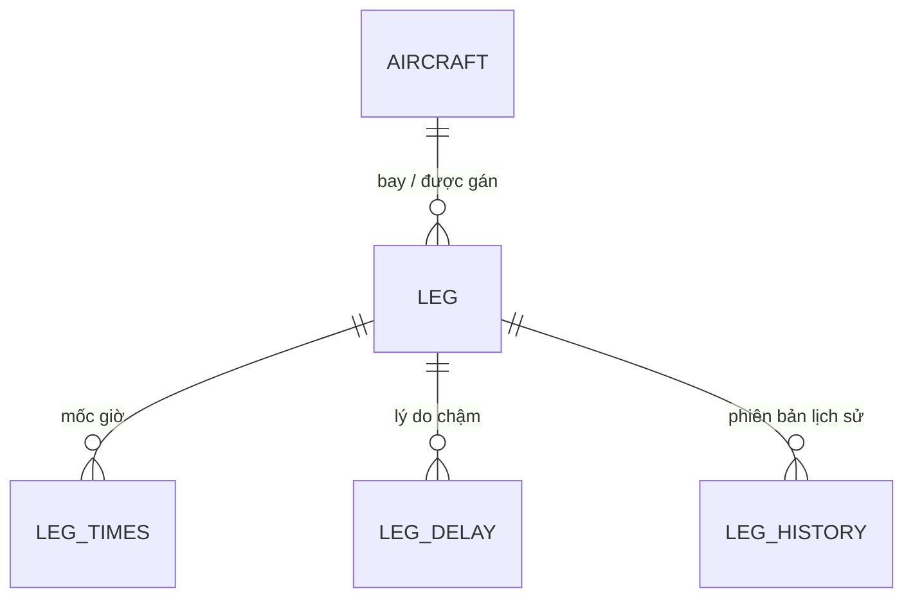
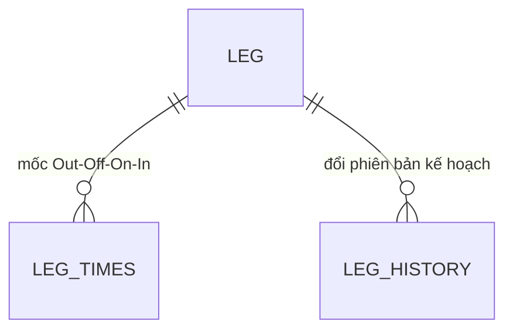
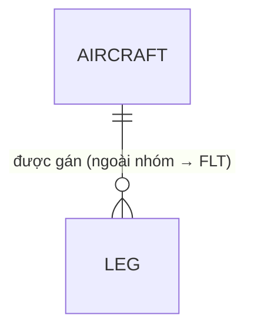
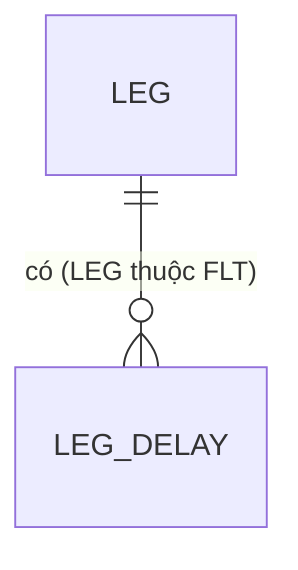

# Vietnam Airlines · Lakehouse

## Phiếu khảo sát 05 — Phân tích dữ liệu · Tổng quan dữ liệu nguồn

**Mục lục**
1. [Hướng dẫn khảo sát (GUIDE)](#1-hướng-dẫn-khảo-sát-guide)
2. [Thông tin khảo sát (INF)](#2-thông-tin-khảo-sát-inf)
3. [Tóm tắt dữ liệu và domain nghiệp vụ](#3-tóm-tắt-dữ-liệu-và-domain-nghiệp-vụ)
4. [Database](#4-database)
5. [Schema](#5-schema)
6. [ERD tổng quan](#6-erd-tổng-quan)
7. [Nhóm chức năng](#7-nhóm-chức-năng)
8. [Chi tiết theo nhóm chức năng](#8-chi-tiết-theo-nhóm-chức-năng)

## 1. Hướng dẫn khảo sát (GUIDE)

Phiếu này thu thập **mô hình dữ liệu nguồn** (database / schema / bảng / cột) cho **một hệ thống**, làm đầu vào phân tích và mapping nguồn → đích.

Không thay phiếu 02 (kết nối, CDC, tần suất), phiếu 03 (câu hỏi ngữ nghĩa), phiếu 04 (DQ / MDM / retention / bảo mật). Phiếu này ghi **inventory và từ điển** — từng DB, từng bảng, từng cột.

**Đối tượng điền:** DBA / technical lead hệ thống nguồn + SME nghiệp vụ (nhóm chức năng, loại nghiệp vụ, PII, cột bắt buộc, công thức).

### Bộ file — copy rồi điền, không điền vào template gốc

Bản điền cho SME / DBA là **Excel** (cùng tên, đuôi `.xlsx`). File Markdown giữ làm bản đọc / soạn.

| # | File template | Khi nào copy | Thành file điền |
| - | ------------- | ------------ | --------------- |
| 1 | [`survey-05-phan-tich-du-lieu-01-tong-quan-du-lieu-nguon.xlsx`](survey-05-phan-tich-du-lieu-01-tong-quan-du-lieu-nguon.xlsx) | **Một lần / một hệ thống** (file này) | `survey-05-phan-tich-du-lieu-01-tong-quan-du-lieu-nguon.xlsx` |
| 2 | [`survey-05-phan-tich-du-lieu-02-danh-sach-bang-view.xlsx`](survey-05-phan-tich-du-lieu-02-danh-sach-bang-view.xlsx) | **Mỗi database một file** | `survey-05-phan-tich-du-lieu-02-danh-sach-bang-view-{ten-db}.xlsx` |
| 3 | [`survey-05-phan-tich-du-lieu-03-danh-sach-field.xlsx`](survey-05-phan-tich-du-lieu-03-danh-sach-field.xlsx) | **Mỗi bảng / view một file** | `survey-05-phan-tich-du-lieu-03-{schema}.{ten-bang}.xlsx` |

**Ví dụ** hệ thống Netline, hai DB `SCHEDOPS` và `DWH_STG`:

```text
{he-thong}/
├── survey-05-phan-tich-du-lieu-01-tong-quan-du-lieu-nguon.xlsx
├── survey-05-phan-tich-du-lieu-02-danh-sach-bang-view-SCHEDOPS.xlsx
├── survey-05-phan-tich-du-lieu-02-danh-sach-bang-view-DWH_STG.xlsx
├── survey-05-phan-tich-du-lieu-03-SCHEDOPS.LEG.xlsx
├── survey-05-phan-tich-du-lieu-03-SCHEDOPS.LEG_TIMES.xlsx
└── survey-05-phan-tich-du-lieu-03-DWH_STG.V_LEG.xlsx
```

### Cách dùng

1. Điền **file 1** (file này) trước: tóm tắt dữ liệu, domain, DB / schema, ERD tổng quan, danh sách nhóm chức năng; rồi với mỗi nhóm — danh sách bảng + ERD nhóm.
2. Với **mỗi DB** trong phạm vi: copy file 2, đổi tên theo DB, liệt kê mọi bảng / view cần khảo sát.
3. Với **mỗi dòng bảng/view** ở file 2: copy file 3, đổi tên `{schema}.{ten-bang}`, điền **mọi cột** của bảng đó.
4. Không ghi mật khẩu / secret. Không copy dữ liệu thật; chỉ schema, định nghĩa, công thức, ví dụ giá trị mã.
5. Ô chưa biết ghi `Chưa rõ` — không để trống im lặng. Cột **Trạng thái xác nhận** đánh khi SME / DBA đã chốt dòng đó.

### Quy ước cột dùng chung (file 2 và file 3)

| Giá trị | Ý nghĩa |
| ------- | ------- |
| Mô tả (file 2) | Ý nghĩa nghiệp vụ của bảng/view (1–2 câu) |
| Loại (file 2) | `table` · `view` |
| Loại nghiệp vụ (file 2) | `master` · `transaction` · `snapshot` · `history` · `audit` · `other` |
| Ghi chú (file 2) | Ghi chú khác (mức bảng) |
| Allow Null (file 3) | `Y` · `N` |
| PK/FK (file 3) | `PK` · `FK` · `PK+FK` · để trống nếu không |
| PII (file 3) | `Y` · `N` · `Chưa rõ` |
| Loại PII (file 3) | `họ tên` · `định danh` · `liên lạc` · `tài chính` · `sức khỏe` · `khác` (ghi rõ) |
| Logic masking/encrypt PII (file 3) | Cách che / mã hoá trên nguồn hoặc yêu cầu khi tích hợp. VD: `mask 4 số cuối` · `hash SHA-256` · `encrypt AES` · `tokenize` · `N/A` nếu PII = `N` |
| Bắt buộc nghiệp vụ (file 3) | `Y` · `N` — record hợp lệ khi cột này có giá trị / thuộc miền cho phép; **khác** NOT NULL kỹ thuật |
| Ghi chú (file 3) | Cột JSON/XML/CLOB cần giữ nguyên bản: `JSON` · `XML` · `CLOB/BLOB` · ghi chú khác của cột |
| Trạng thái xác nhận | `Chưa xác nhận` · `Đã xác nhận` · `Cần làm rõ` |

Kiểu dữ liệu ghi đúng nguồn: `VARCHAR2(22)`, `NUMBER(10)`, `DATE`, `TIMESTAMP(6)`, `NUMBER(18,2)` — không ghi chung “string/number”.

### Phân biệt với phiếu khác

| File | Mức chi tiết |
| ---- | ------------ |
| `survey-02-ha-tang-moi-truong.md` | Kết nối, engine, CDC, tần suất — **không** từ điển cột |
| `survey-03-nghiep-vu-he-thong-nguon.md` | Ngữ nghĩa, phạm vi dữ liệu — **câu hỏi**, chưa bắt buộc từng cột |
| `survey-04-quan-tri-du-lieu.md` | DQ, MDM, retention, bảo mật |
| **Bộ phiếu này** (file 01 · 02 · 03) | Tổng quan nguồn · inventory bảng/view theo DB · từ điển cột theo từng bảng |

*Phiên bản 2.0 — tách 3 loại file; không gộp CALC/REL/phụ lục matrix vào một phiếu.*

## 2. Thông tin khảo sát (INF)

**Hệ thống:**
> Ví dụ: Netline — Phần mềm quản lý, xếp lịch chuyến bay

**Tên viết tắt:**
> Ví dụ: NETLINE

Copy **một file này cho một hệ thống**. Danh sách bảng → file 02 (mỗi DB một file). Từ điển cột → file 03 (mỗi bảng một file).

**Ngày khảo sát:**
> Ví dụ: 08/09/2026

**Hình thức khảo sát:**
- ☐ Họp trực tiếp · ☐ Online · ☐ Email / tài liệu · ☐ Đọc schema / data dictionary nguồn
> Nhập nếu là hình thức khảo sát khác

**Người khảo sát:**
- Họ tên:
> Ví dụ: Nguyễn Văn A
- Chức danh:
> Ví dụ: Business Analyst / Data Analyst
- Đơn vị:
> Ví dụ: IT / Data Platform
- Email:
> Ví dụ: nguyen.van.a@example.com
- Số điện thoại:
> Ví dụ: 09xx xxx xxx

**Người trả lời (kỹ thuật):**
- Họ tên:
- Chức danh:
> Ví dụ: DBA / Application Admin
- Đơn vị:
- Email:
- Số điện thoại:

**Người trả lời (nghiệp vụ):**
- Họ tên:
- Chức danh:
> Ví dụ: SME domain / Data Steward
- Đơn vị:
- Email:
- Số điện thoại:

**Tài liệu nguồn đã dùng:**

| Tài liệu | Vị trí | Phiên bản / ngày |
| -------- | ------ | ---------------- |
| ERD / data dictionary nguồn |  |  |
| Khác |  |  |

---

## 3. Tóm tắt dữ liệu và domain nghiệp vụ

**Tóm tắt dữ liệu hệ thống này cung cấp (1 đoạn):**
> Ví dụ: Lịch trình và thực hiện chặng bay (leg), mốc giờ Out–Off–On–In, tàu bay, lý do chậm / đổi chuyến. Grain: 1 chặng × 1 ngày × 1 phiên bản kế hoạch/thực hiện.

**Domain nghiệp vụ liên quan:**
- ☐ Khai thác · ☐ Thương mại · ☐ Dịch vụ · ☐ Kỹ thuật · ☐ An toàn · ☐ Quản lý chung
> Nhập nếu là domain khác

---

## 4. Database

*Mỗi dòng một DB. Mỗi DB trong phạm vi phải có **một file 02** tương ứng.*

| STT | Tên DB | Ý nghĩa | Loại DB | File 02 tương ứng | Ghi chú |
| --- | ------ | ------- | ------- | ----------------- | ------- |
| 1 |  |  | ☐ PostgreSQL · ☐ Oracle · ☐ SQL Server · ☐ MySQL · ☐ MariaDB · ☐ Khác: ____ | `survey-05-phan-tich-du-lieu-02-danh-sach-bang-view-________.xlsx` |  |
| 2 |  |  | ☐ PostgreSQL · ☐ Oracle · ☐ SQL Server · ☐ MySQL · ☐ MariaDB · ☐ Khác: ____ | `survey-05-phan-tich-du-lieu-02-danh-sach-bang-view-________.xlsx` |  |
| 3 |  |  | ☐ PostgreSQL · ☐ Oracle · ☐ SQL Server · ☐ MySQL · ☐ MariaDB · ☐ Khác: ____ | `survey-05-phan-tich-du-lieu-02-danh-sach-bang-view-________.xlsx` |  |

> Ví dụ loại DB: Oracle · PostgreSQL. Tên DB ghi tên logic (VD: `SCHEDOPS`), không ghi mật khẩu / connection string.

---

## 5. Schema

*Mỗi dòng một schema. Ghi schema thuộc DB nào (khớp cột Tên DB ở mục 4).*

| STT | Tên DB | Tên schema | Ý nghĩa | Ghi chú |
| --- | ------ | ---------- | ------- | ------- |
| 1 |  |  |  |  |
| 2 |  |  |  |  |
| 3 |  |  |  |  |
| 4 |  |  |  |  |

> Ví dụ: DB `DWH` · schema `STG_NETLINE` — bản copy Netline trên DWH, chưa chuẩn hóa KPI.

---

## 6. ERD tổng quan

*Vẽ quan hệ chính bằng Mermaid `erDiagram`. Chỉ giữ entity + quan hệ xuyên nhóm (không liệt kê hết cột — cột ở file 03). Chi tiết từng cụm → mục 8.*

**Mô tả quan hệ chính (1–N, bảng cầu nối):**
> Ví dụ: `AIRCRAFT` 1—N `LEG` 1—N `LEG_TIMES` ; `LEG` 1—N `LEG_DELAY` ; `LEG` 1—N `LEG_HISTORY`

**ERD tổng quan (Mermaid):**



**File ERD tổng quan đính kèm (nếu có):**
>

**Ghi chú / giới hạn của ERD hiện có:**
> Ví dụ: Chỉ có ERD logic, chưa có FK vật lý trên DB · thiếu bảng history

---

## 7. Nhóm chức năng

*Nhóm chức năng = cụm nghiệp vụ mà hệ thống phục vụ (không phải tên schema). Mỗi dòng ở đây → một khối chi tiết ở mục 8.*

| STT | Mã nhóm | Tên nhóm chức năng | Mô tả ngắn | Domain |
| --- | ------- | ------------------ | ---------- | ------ |
| 1 |  |  |  |  |
| 2 |  |  |  |  |
| 3 |  |  |  |  |
| 4 |  |  |  |  |
| 5 |  |  |  |  |

> Ví dụ: `FLT` Lịch / thực hiện chuyến · `AC` Danh mục tàu bay · `DLY` Chậm chuyến · `CREW` Tổ bay.

---

## 8. Chi tiết theo nhóm chức năng

*Copy khối dưới cho **mỗi mã nhóm** ở mục 7. Trong mỗi nhóm: (1) danh sách bảng/view · (2) ERD Mermaid. Số record / dung lượng ghi ở file 02, không lặp ở đây. Bảng ngoài nhóm chỉ ghi ở “join tới”, không vẽ hết vào sơ đồ nhóm.*

### 8.1. Nhóm: `________` — ________

**Mô tả ngắn / quan hệ trong nhóm:**
>

#### Danh sách bảng

| STT | Schema | Tên bảng / view | Mô tả |
| --- | ------ | --------------- | ----- |
| 1 |  |  |  |
| 2 |  |  |  |
| 3 |  |  |  |
| 4 |  |  |  |
| 5 |  |  |  |

*Thêm dòng cho đủ bảng thuộc nhóm này.*

#### ERD nhóm (Mermaid)



**File ERD đính kèm (nếu có):**
>

**Bảng ngoài nhóm mà nhóm này join tới:**
> Ví dụ: `LEG` (nhóm FLT) join `AIRCRAFT` (nhóm AC) theo `AC_REG`

---

### 8.2. Ví dụ — Netline (tham chiếu, không điền khi khảo sát thật)

*Copy khối 8.1 cho từng mã nhóm ở mục 7. Dưới đây minh họa cách tách khi bảng nhiều.*

#### `AC` — Danh mục tàu bay

**Danh sách bảng:** `AIRCRAFT`



#### `FLT` — Lịch / thực hiện chặng

**Danh sách bảng:** `LEG`, `LEG_TIMES`, `LEG_HISTORY`


#### `DLY` — Chậm chuyến

**Danh sách bảng:** `LEG_DELAY`



---

*Dán thêm khối 8.1 cho nhóm tiếp theo.*
